# Introdución

## 1. Que é a visualización de datos?

### Visualización de datos: entre a arte e a ciencia

A visualización de datos combina dúas dimensións complementarias:

**Ciencia**
- Garantir que os datos se representen con precisión
- Manter proporcións correctas entre valores
- Evitar distorsións ou interpretacións incorrectas

**Arte**
- Deseñar gráficos claros e agradables
- Empregar cores, tamaños e disposición adecuados
- Facilitar a comprensión da información

Unha boa visualización require combinar ambos enfoques: **precisión analítica (ciencia) e deseño claro (arte)**.

---

### Factores que poden prexudicar a interpretación

Un gráfico pode dificultar a comprensión da información por diferentes razóns:

- Escalas manipuladas ou mal definidas
- Proporcións incorrectas entre valores
- Exceso de cores ou cores pouco adecuadas
- Elementos decorativos innecesarios
- Exceso de información nun mesmo gráfico
- Falta de etiquetas ou títulos claros
- Mala elección do tipo de gráfico

Estes problemas poden provocar **interpretacións incorrectas dos datos**.

---

### Diferentes roles na creación de visualizacións

A visualización de datos adoita implicar diferentes perfís profesionais.

**Analistas ou científicos de datos**
- Coñecen os datos e o seu significado
- Adoitan representar correctamente a información
- Poden prestar menos atención ao deseño visual

**Deseñadores**
- Coidan a estética e a presentación visual
- Poden crear gráficos moi atractivos
- Ás veces poden priorizar o aspecto visual sobre a precisión dos datos

Unha boa visualización require **equilibrar ambos enfoques: precisión analítica e deseño claro**.

---

### Tipos de gráficos problemáticos

#### Gráficos feos

Son gráficos que representan correctamente os datos, pero teñen un deseño pouco coidado.

Características habituais:

- Cores demasiado intensas ou mal combinadas
- Fontes pouco lexibles
- Distribución desordenada dos elementos
- Exceso de efectos visuais

A información é correcta, pero o gráfico resulta difícil de interpretar.

---

#### Gráficos malos

Son gráficos que non comunican ben a información.

Problemas frecuentes:

- Elección incorrecta do tipo de gráfico
- Exceso de categorías ou elementos
- Falta de contexto ou etiquetas
- Uso innecesario de gráficos complexos

Neste caso os datos son correctos, pero a representación non axuda a entendelos.

---

#### Gráficos incorrectos

Son gráficos que **distorsionan os datos**.

Isto pode ocorrer cando:

- Se manipulan as escalas
- Non se respectan as proporcións
- Se presentan datos incompletos
- Se usan representacións que alteran a percepción dos valores

Un gráfico incorrecto pode levar a conclusións erróneas.

A seguinte figura mostra un exemplo clásico destes tres tipos de problemas.

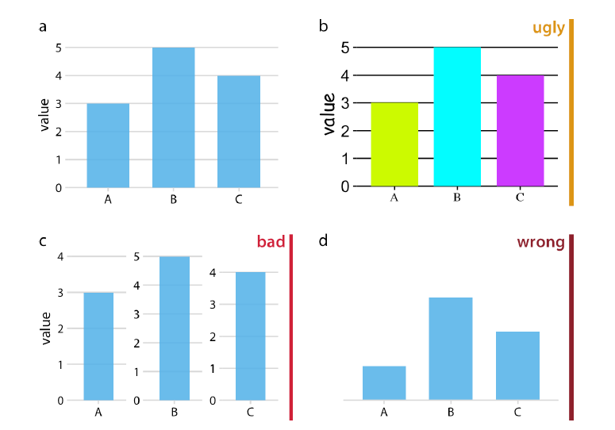

**Figura:** exemplo de gráficos "ugly", "bad" e "wrong".  
Fonte: Wilke, C. O. (2019). *Fundamentals of Data Visualization*. O'Reilly Media. Figura 1-1.

## 2. Datos, información e coñecemento

Para comprender o papel da visualización de datos é útil distinguir tres conceptos relacionados: **datos**, **información** e **coñecemento**. Estes tres niveis describen como se transforma un conxunto de valores en algo que pode empregarse para comprender unha situación ou tomar decisións.

### Datos

Os **datos** son valores individuais que describen observacións ou rexistros dun fenómeno. Por si sós adoitan ter pouco significado, xa que carecen de contexto ou interpretación.

Por exemplo, nun sistema de análise web poden rexistrarse datos como os seguintes:

| Hora | Visitas |
|-----|--------|
| 10:00 | 12 |
| 11:00 | 15 |
| 12:00 | 18 |

Tamén poden aparecer como rexistros nun sistema:

2026-03-06 10:15:03 GET /index.html 200  
2026-03-06 10:15:05 GET /login 200  
2026-03-06 10:15:10 GET /products 404  

Neste nivel simplemente se almacenan valores, pero aínda non se está interpretando o seu significado.

### Información

A **información** aparece cando os datos se organizan, agregan ou representan de forma que permiten identificar patróns ou tendencias.

Por exemplo, se os datos anteriores se representan nun gráfico temporal, pódese observar que o número de visitas aumenta co paso do tempo. Neste caso xa non se están vendo só números illados, senón unha **tendencia**.

A visualización de datos xoga aquí un papel fundamental, xa que permite transformar grandes cantidades de datos en representacións que facilitan a súa interpretación.

### Coñecemento

O **coñecemento** aparece cando a información permite comprender unha situación ou tomar decisións.

A partir da información anterior pódense extraer conclusións como:

- As visitas están aumentando ao longo da mañá.
- O momento de maior actividade prodúcese arredor do mediodía.
- Pode ser necesario reforzar a infraestrutura nesas horas.

Neste punto os datos xa non só se interpretan, senón que **se utilizan para tomar decisións ou explicar un fenómeno**.

### Relación entre datos, información e coñecemento

Este proceso pódese representar de forma simplificada da seguinte maneira:

Datos → Información → Coñecemento → Decisións

- **Datos:** valores rexistrados.
- **Información:** datos organizados e interpretables.
- **Coñecemento:** comprensión obtida a partir da información.

A visualización de datos sitúase principalmente na transición entre **datos e información**, xa que permite transformar grandes volumes de datos en representacións que facilitan a análise e a interpretación.

## 3. Como se representan os datos nun gráfico

Cando se crea unha visualización de datos, os valores dun conxunto de datos convértense en elementos visuais que forman o gráfico. Aínda que existen moitos tipos diferentes de visualizacións —como gráficos de barras, diagramas de dispersión ou mapas de calor— todos seguen un principio común: **os valores dos datos represéntanse mediante características visuais do gráfico**.

Estas características visuais denomínanse **atributos visuais** ou **estéticas**.

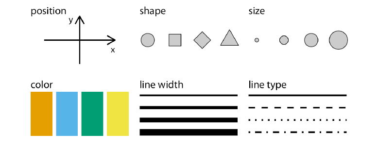

**Figura:** atributos visuais comúns nunha visualización de datos: posición, forma, tamaño, cor, grosor da liña e tipo de liña.  
Fonte: Wilke, C. O. (2019). *Fundamentals of Data Visualization*. O'Reilly Media. Figura 2-1.

### Atributos visuais

Os atributos visuais describen propiedades dos elementos que aparecen nun gráfico. Algúns dos máis utilizados son:

- **Posición**  
  Indica onde aparece un elemento dentro do gráfico. Nun gráfico bidimensional, a posición adoita definirse mediante os eixos **X** e **Y**.

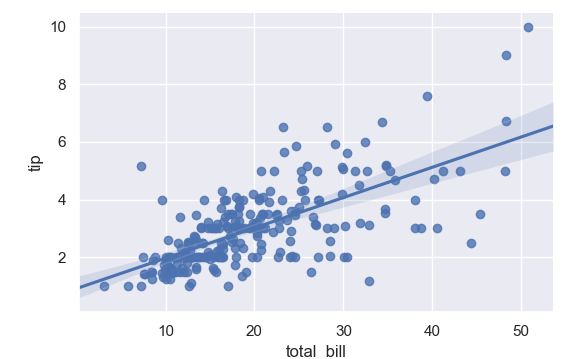

**Figura:** exemplo de diagrama de dispersión. Neste tipo de gráfico, a posición de cada punto nos eixos X e Y representa os valores de dúas variables.  
Fonte: imaxe obtida de URL directa `d33wubrfki0l68.cloudfront.net` (consulta: 06-03-2026).

- **Tamaño**  
  O tamaño dun elemento pode representar valores máis grandes ou máis pequenos.

- **Cor**  
  A cor permite distinguir categorías ou representar variacións nun valor.

- **Forma**  
  Diferentes formas poden empregarse para diferenciar tipos de datos ou categorías.

- **Grosor ou tipo de liña**  
  En gráficos con liñas, o grosor ou o estilo (continua, discontinua, etc.) tamén pode representar información.

Por exemplo, nun gráfico de barras horizontais:

- a **posición no eixo Y** pode representar categorías (por exemplo, produtos);
- o **tamaño da barra** pode representar unha métrica (por exemplo, vendas).

Deste modo, os datos transfórmanse nunha representación visual que facilita a súa interpretación.

### Mapeo entre datos e elementos visuais

O proceso de converter datos en elementos visuais denomínase **mapeo visual**. Isto significa asociar cada variable dun conxunto de datos cun atributo visual do gráfico.

Por exemplo:

| Variable | Representación |
|----------|---------------|
| Produto | Posición no eixo Y |
| Crecemento de poboación | Tamaño da barra |
| Rexión | Cor |

Este mapeo permite que o gráfico transmita información de forma inmediata, xa que o lector pode identificar patróns ou comparacións visualmente.

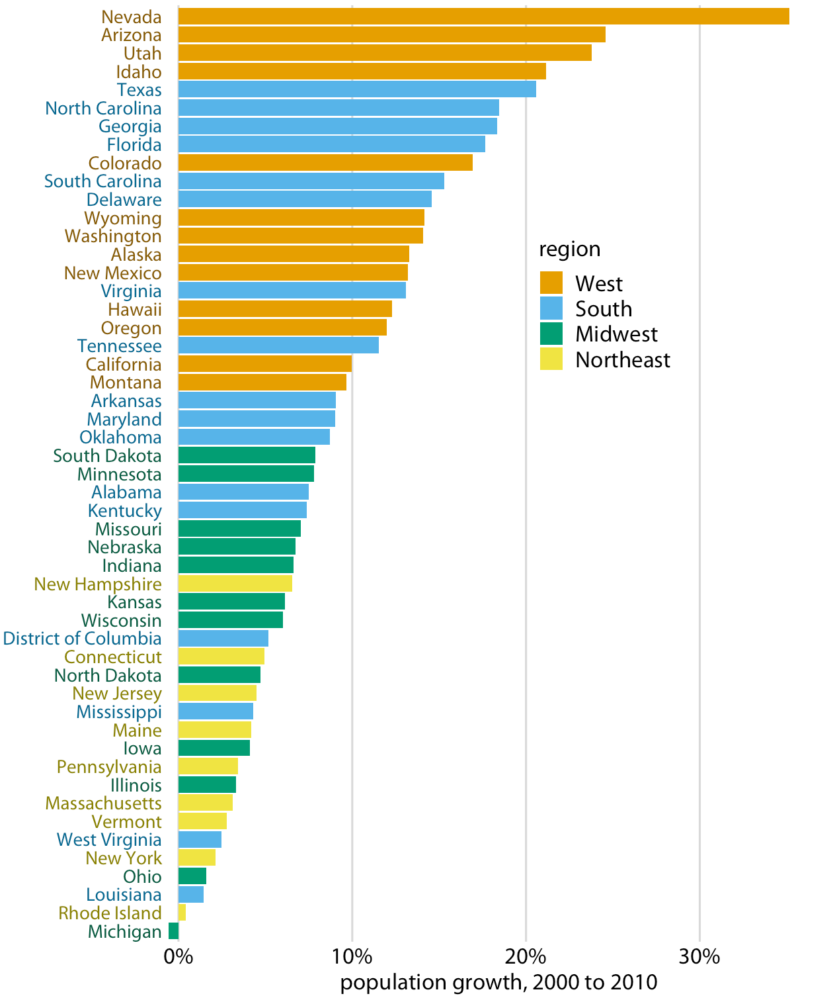

**Figura:** exemplo de gráfico de barras.  
Fonte: Wilke, C. O. (2019). *Fundamentals of Data Visualization*. O'Reilly Media. Figura 4-2.

### Importancia dunha boa representación

Unha representación visual adecuada permite:

- identificar patróns e tendencias,
- comparar valores entre categorías,
- detectar anomalías ou cambios no comportamento dos datos.

Escoller correctamente os atributos visuais é un paso fundamental para que unha visualización transmita a información de forma clara e precisa.

## 4. Tipos de datos

Non todos os datos teñen a mesma natureza. Antes de crear unha visualización é importante comprender **que tipo de datos se está a representar**, xa que isto condiciona tanto a forma de analizalos como o tipo de gráfico máis adecuado.

De forma xeral, os datos poden clasificarse en dous grandes grupos: **datos cuantitativos** e **datos cualitativos**.

### Datos cuantitativos

Os **datos cuantitativos** son valores numéricos que representan cantidades. Estes datos poden medirse e compararse mediante operacións matemáticas.

Por exemplo:

- número de habitantes dunha cidade  
- temperatura  
- ingresos dunha empresa  
- número de visitas a unha páxina web  

Os datos cuantitativos poden ser de dous tipos.

#### Continuos

Os datos continuos poden tomar calquera valor dentro dun intervalo. Entre dous valores sempre existen posibles valores intermedios.

Por exemplo:

- temperatura  
- tempo  
- peso  
- distancia  

Entre 20 e 21 graos poden existir valores como 20.5 ou 20.75.

Os datos continuos adoitan representarse mediante gráficos que mostran a relación entre dúas variables numéricas, como os **diagramas de dispersión**.

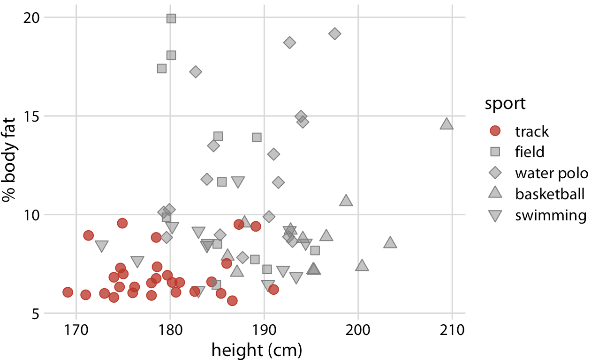

**Figura:** relación entre altura e porcentaxe de graxa corporal en diferentes atletas. A posición dos puntos representa dúas variables continuas, mentres que a forma dos puntos indica a disciplina deportiva.  
Fonte: elaboración propia.

#### Discretos

Os datos discretos só poden tomar valores separados entre si, normalmente números enteiros.

Por exemplo:

- número de estudantes nunha aula  
- número de pedidos  
- número de visitantes dun sitio web  

Non é posible ter 25.5 estudantes nunha aula.

### Datos cualitativos

Os **datos cualitativos** describen categorías ou características e non representan cantidades numéricas. Este tipo de datos tamén se denomina **datos categóricos**.

Por exemplo:

- país  
- produto  
- tipo de usuario  
- método de pagamento  

Os datos cualitativos poden clasificarse en dous tipos.

#### Nominais

As categorías non teñen unha orde natural.

Por exemplo:

- cores  
- países  
- tipos de animal  

#### Ordenados

As categorías teñen unha orde lóxica.

Por exemplo:

- nivel de satisfacción: baixo, medio, alto  
- clasificación: primeiro, segundo, terceiro  

### Importancia do tipo de datos na visualización

Comprender o tipo de datos é fundamental para seleccionar unha visualización adecuada. Por exemplo:

- os **datos continuos** adoitan representarse con gráficos de liñas ou diagramas de dispersión;  
- os **datos categóricos** adoitan representarse con gráficos de barras ou táboas.

**Figura:** exemplo de gráfico de barras utilizado para comparar valores entre diferentes categorías.  
Fonte: Wilke, C. O. (2019). *Fundamentals of Data Visualization*. O'Reilly Media. Figura 4-2.

Escoller unha visualización adecuada facilita a interpretación da información e evita erros na análise dos datos.

## 5. Métricas e indicadores clave (KPI)

Nas análises de datos e nos dashboards é habitual traballar con **métricas** e **indicadores clave de rendemento**, coñecidos como **KPI (Key Performance Indicators)**.

Un **KPI** é unha medida que permite avaliar o rendemento dun proceso, actividade ou sistema respecto dun obxectivo determinado.

Por exemplo, nun sistema web poden empregarse KPI como:

- número de visitas
- tempo medio de permanencia
- taxa de conversión
- número de erros

Nunha empresa poden empregarse KPI como:

- ingresos
- beneficio
- número de clientes
- vendas por rexión

### Métricas vs KPI

Non todas as métricas son KPI.

- **Métrica:** calquera valor que describe un aspecto dun sistema.
- **KPI:** unha métrica seleccionada porque é especialmente relevante para avaliar o rendemento.

Por exemplo:

| Métrica | Tipo |
|-------|------|
| Número total de visitas | Métrica |
| Tempo medio de carga | Métrica |
| Taxa de conversión | KPI |
| Ingresos mensuais | KPI |

### KPI en visualización de datos

Nos dashboards é habitual representar os KPI mediante visualizacións que destacan os indicadores máis importantes. Un dos elementos máis utilizados son as **KPI cards** (ou **tarxetas de métricas**).

Unha **KPI card** é unha visualización moi simple que mostra **un único indicador clave de forma destacada**, normalmente acompañado de información contextual como a evolución respecto a un período anterior ou un obxectivo.

Este tipo de visualización adoita incluír:

- o **nome do indicador**
- o **valor actual da métrica**
- unha **comparación** (por exemplo, respecto ao día anterior ou ao obxectivo)
- ás veces un **indicador visual de tendencia** (frechas ou cores)

Por exemplo:

- número de usuarios activos
- ingresos do mes actual
- número de erros detectados
- taxa de conversión

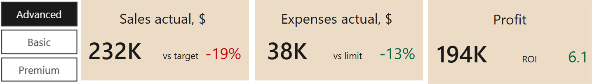

**Figura:** exemplo de KPI cards nun dashboard.  
Fonte: Arnold, J. (2022). *Learning Microsoft Power BI*. O'Reilly Media. Figura 8-2.

As KPI cards permiten que o usuario dun dashboard identifique rapidamente **o estado xeral dun sistema ou proceso**, sen necesidade de analizar gráficos máis complexos.

Por este motivo, adoitan situarse **na parte superior dos dashboards**, resumindo as métricas máis relevantes.

## 6. Tipos de visualizacións

Existen moitos tipos de visualizacións diferentes. Algunhas baséanse en gráficos, mentres que outras presentan a información mediante táboas ou indicadores numéricos. Na práctica, a maioría das visualizacións utilízanse para responder a un pequeno conxunto de preguntas: comparar valores, analizar relacións entre variables, observar evolucións ao longo do tempo ou comprender a distribución dos datos.

Escoller o tipo de visualización adecuado é fundamental para transmitir correctamente a información.

### Táboas

As **táboas** tamén son unha forma habitual de presentar datos. A diferenza dos gráficos, as táboas mostran os valores de forma explícita, permitindo consultar cifras exactas.

As táboas son especialmente útiles cando:

- é importante coñecer os **valores exactos**
- hai **poucas observacións**
- os datos deben ser **consultados con precisión**

Non obstante, as táboas dificultan a identificación de patróns ou tendencias cando o número de datos é grande. Nestes casos, os gráficos adoitan facilitar moito máis a interpretación da información.

Por este motivo, nos dashboards é habitual combinar **táboas e gráficos**, empregando cada un deles segundo o tipo de información que se queira transmitir.
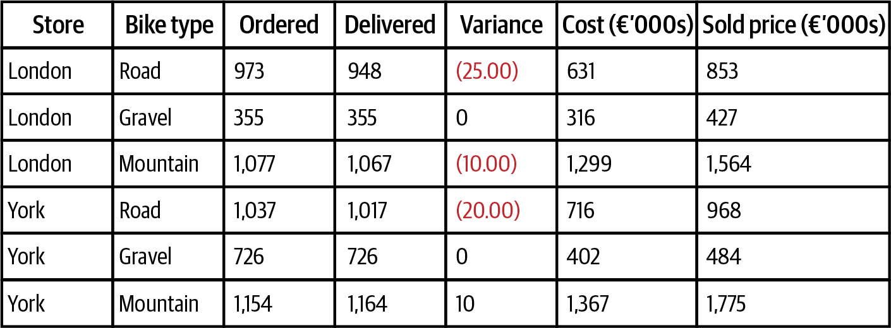

**Figura:** exemplo de táboa para presentar datos de forma estruturada.  
Fonte: Allchin, C. (2019). *Communicating with Data*. O'Reilly Media. Figura 3-6.

### Gráficos de barras

Os **gráficos de barras** utilízanse para comparar valores entre diferentes categorías. Cada barra representa unha categoría e a súa lonxitude indica o valor correspondente.

Son especialmente útiles para:

- comparar categorías
- mostrar rankings
- visualizar diferenzas entre grupos

**Figura:** exemplo de gráfico de barras utilizado para comparar valores entre diferentes categorías.  
Fonte: Wilke, C. O. (2019). *Fundamentals of Data Visualization*. O'Reilly Media. Figura 4-2.

### Diagramas de dispersión

Os **diagramas de dispersión** (scatter plots) utilízanse para analizar a relación entre dúas variables numéricas. Cada punto representa unha observación e a súa posición no gráfico indica os valores das variables.

Permiten:

- identificar relacións entre variables
- detectar tendencias
- observar agrupamentos ou valores atípicos

**Figura:** relación entre altura e porcentaxe de graxa corporal en diferentes atletas. A posición dos puntos representa dúas variables continuas, mentres que a forma dos puntos indica a disciplina deportiva.  
Fonte: elaboración propia.

### Gráficos de liñas

Os **gráficos de liñas** utilízanse habitualmente para representar a evolución dunha variable ao longo do tempo. Os puntos de datos conéctanse mediante unha liña que permite visualizar tendencias ou cambios.

Son moi utilizados para:

- series temporais
- evolución de métricas
- análise de tendencias

Por exemplo:

- visitas a unha páxina web ao longo do tempo
- evolución das vendas dun produto
- cambios na temperatura ao longo dun día

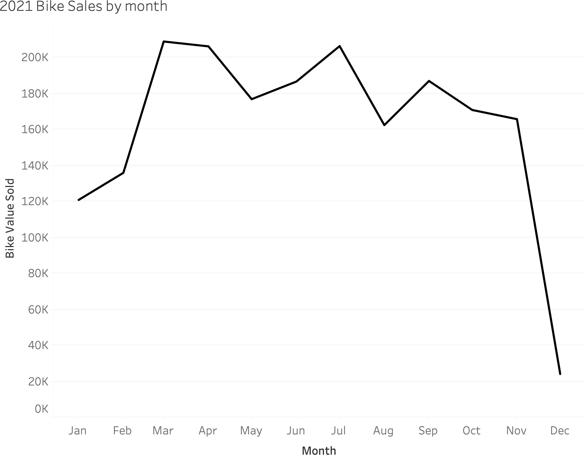

**Figura:** exemplo de gráfico de liñas.  
Fonte: Allchin, C. (2019). *Communicating with Data*. O'Reilly Media. Figura 3.26.

### Histogramas

Os **histogramas** utilízanse para representar a distribución dun conxunto de datos numéricos. Os valores agrúpanse en intervalos e a altura das barras indica cantas observacións caen en cada intervalo.

Permiten:

- analizar a distribución dos datos
- identificar concentracións de valores
- detectar posibles valores extremos

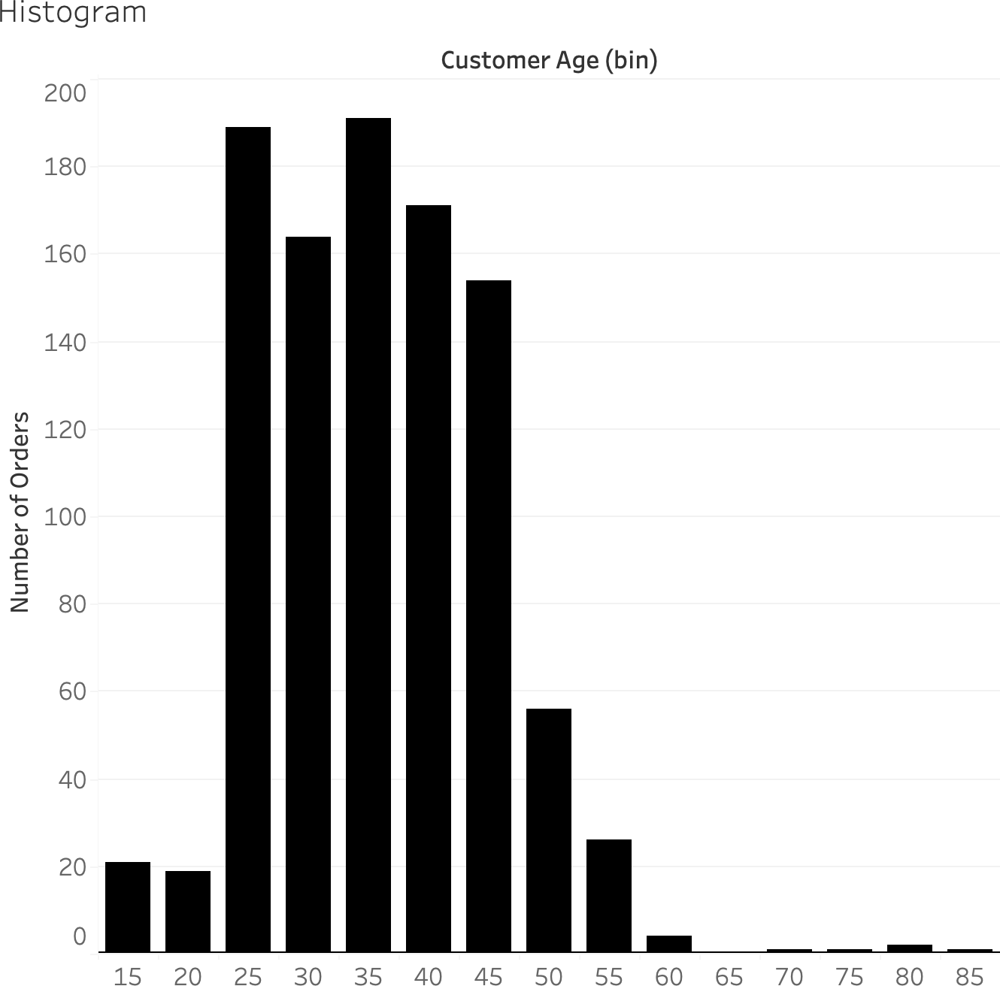

**Figura:** exemplo de histograma utilizado para representar a distribución dun conxunto de datos.  
Fonte: Allchin, C. (2019). *Communicating with Data*. O'Reilly Media. Figura 3-21.

> A diferenza dun gráfico de barras, nun histograma as barras representan **intervalos dun valor continuo**, non categorías.

### Gráficos circulares

Os **gráficos circulares** (pie charts) representan proporcións dun total. Cada sector do círculo corresponde a unha categoría.

Non obstante, este tipo de gráfico pode resultar difícil de interpretar cando existen moitas categorías ou cando as diferenzas entre valores son pequenas. Por este motivo, en moitos casos é preferible utilizar gráficos de barras.
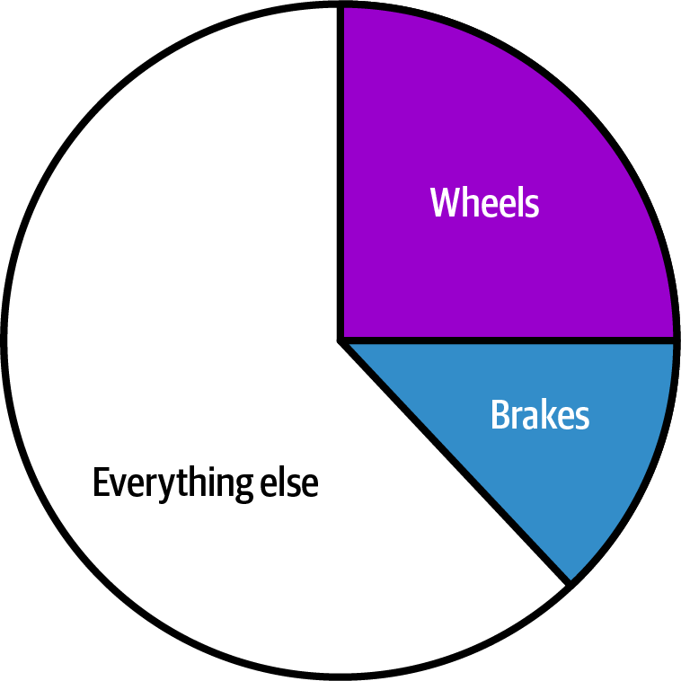

**Figura:** exemplo de gráfico circular utilizado para representar proporcións dun total.  
Fonte: Allchin, C. (2019). *Communicating with Data*. O'Reilly Media. Figura 3-18.

### Escoller a visualización axeitada
En xeral, pódense seguir algunhas recomendacións básicas:

#### Barras 
Úsanse especialmente cando se quere:

- comparar valores entre categorías
- mostrar rankings
- visualizar diferenzas entre grupos
- comparar poucas categorías (idealmente menos de 10)

#### Liñas 
Son especialmente adecuadas para:

- representar series temporais
- analizar evolucións ao longo do tempo
- detectar tendencias ou cambios
- comparar evolucións entre varios grupos

#### Dispersión
Utilízanse cando se quere:

- analizar relacións entre dúas variables numéricas
- detectar correlacións
- identificar agrupamentos
- observar valores atípicos

#### Histogramas
Resultan útiles para:

- analizar a distribución dos datos
- observar concentracións de valores
- detectar valores extremos
- comprender a forma da distribución (simétrica, sesgada, etc.)

#### Gráficos circulares
Só se recomenda cando:

- hai poucas categorías
- o obxectivo é mostrar proporcións dun total
- as diferenzas entre valores son claras

#### Resumindo
| Obxectivo | Gráfico recomendado |
|----------|--------------------|
| Consultar valores exactos | Táboa |
| Comparar categorías | Barras |
| Analizar relación entre variables | Dispersión |
| Observar evolución no tempo | Liñas |
| Analizar distribución de datos | Histogramas |
| Mostrar proporcións dun total | Circular |

## 7. Dashboards

Un **dashboard** é unha interface visual que presenta de forma resumida a información máis relevante sobre un sistema, proceso ou actividade. O seu obxectivo é facilitar a supervisión, a análise e a toma de decisións mediante unha combinación organizada de visualizacións.

A diferenza dun gráfico illado, un dashboard non se limita a mostrar un único aspecto dos datos, senón que integra distintos elementos nun mesmo espazo para ofrecer unha visión de conxunto.

Habitualmente, un dashboard combina distintos tipos de elementos, como por exemplo:

- **indicadores clave (KPI)**
- **gráficos**
- **táboas**
- **filtros ou segmentadores**

Por este motivo, un dashboard debe entenderse como un **produto de información completo**, no que cada elemento cumpre unha función dentro dun conxunto organizado.

### Características dun bo dashboard

Un dashboard eficaz adoita presentar as seguintes características:

- mostra só a **información máis relevante**
- permite **interpretar rapidamente** o estado dun sistema ou proceso
- organiza a información de forma **clara e coherente**
- utiliza visualizacións adecuadas para cada tipo de dato
- facilita a identificación de **tendencias, desviacións ou anomalías**

### Erros habituais no deseño de dashboards

Moitos dashboards resultan confusos non polo uso de malas cores ou fontes, senón por unha falta de organización xeral. Algúns erros habituais son:

- colocar xuntos elementos con funcións diferentes
- distribuír os gráficos sen seguir unha orde clara
- introducir táboas ou gráficos sen respectar a xerarquía da información
- empregar tamaños, espazos e proporcións incoherentes
- sobrecargar a pantalla con demasiados elementos

Nestes casos, o problema principal non é visual senón **estrutural**: o dashboard non organiza correctamente a información.

### Organización dun dashboard por niveis

Un dashboard adoita organizarse de arriba abaixo, desde a información máis xeral ata os detalles. Unha distribución habitual consiste en dividir a páxina en varios niveis.

#### Cabeceira

Na parte superior sitúanse os elementos comúns a todo o dashboard, como por exemplo:

- o título
- filtros ou segmentadores
- botóns de navegación
- logotipo ou data do informe

#### Primeiro nivel: KPI

Debaixo da cabeceira colócanse os **KPI cards** ou indicadores clave. Este nivel debe chamar a atención sobre a información máis importante e ofrecer unha lectura inmediata do estado xeral.

#### Segundo nivel: visión xeral e tendencias

Na zona intermedia sitúanse visualizacións de nivel máis agregado, como por exemplo:

- evolución temporal dunha métrica
- comparación entre rexións
- distribución por categorías principais

Estas visualizacións permiten comprender o contexto xeral e detectar patróns relevantes.

#### Terceiro nivel: detalle

Na parte inferior preséntase a información máis detallada, normalmente mediante:

- táboas
- gráficos desagregados
- detalle por subcategorías

Este nivel permite afondar na análise e consultar información máis específica.

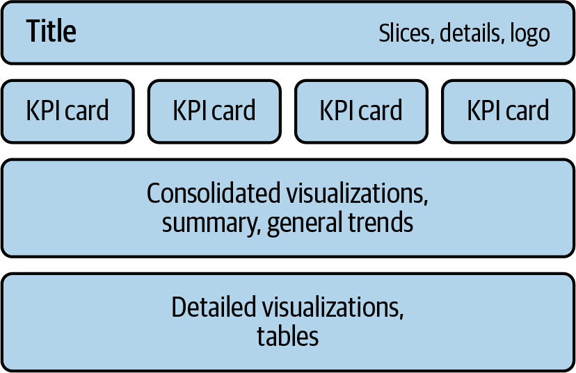

**Figura:** esquema de niveis de información nun dashboard.  
Fonte: Kolokolov, A., & Zelensky, M. (2024). *Data Visualization with Microsoft Power BI*. O'Reilly Media. Figura 10-4.

### Do xeral ao específico

Un dos principios máis importantes no deseño de dashboards é avanzar **do xeral ao específico**. Primeiro debe mostrarse o máis importante e despois a información que engade contexto ou detalle.

Esta organización facilita a lectura do dashboard e evita que o usuario teña que buscar sen orde a información relevante.

### Dashboards e análise visual

Os dashboards son unha ferramenta fundamental na análise de datos, xa que permiten reunir nun único espazo:

- indicadores clave
- gráficos de análise
- táboas de detalle
- elementos de interacción

Por este motivo, son moi utilizados en ámbitos como:

- análise de negocio
- seguimento de vendas
- observabilidade de sistemas
- análise de logs e eventos
- control de procesos

Na práctica, un bo dashboard non consiste en engadir moitos gráficos, senón en **seleccionar a información máis relevante e organizala de forma clara**.

Un dashboard ben organizado segue unha estrutura clara na que a información se presenta de forma progresiva, desde os indicadores principais ata o detalle dos datos. A seguinte figura mostra un exemplo de dashboard no que os distintos elementos están organizados seguindo esta lóxica.

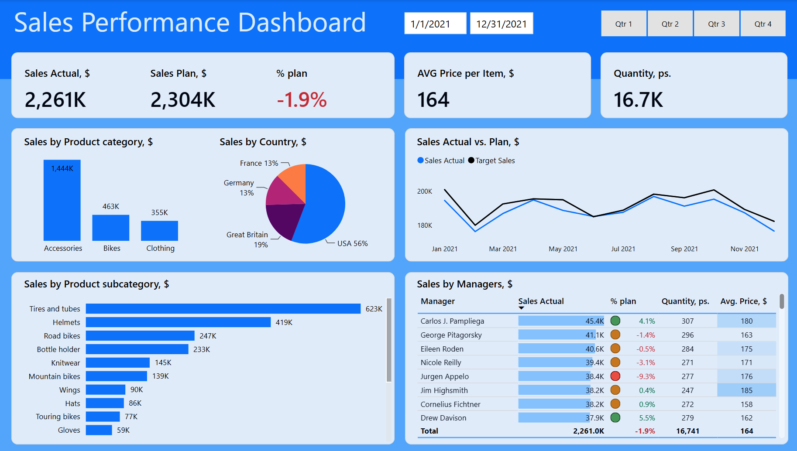

**Figura:** exemplo de dashboard con organización estruturada dos elementos visuais.  
Fonte: Kolokolov, A., & Zelensky, M. (2024). *Data Visualization with Microsoft Power BI*. O'Reilly Media. Figura 10-3.

## 8. Ferramentas de visualización de datos

Existen numerosas ferramentas que permiten crear visualizacións de datos e dashboards. Estas ferramentas facilitan a exploración da información, a creación de gráficos e a análise de datos de forma interactiva.

En xeral, as ferramentas de visualización permiten:

- conectar con diferentes fontes de datos
- crear gráficos e visualizacións
- construír dashboards interactivos
- explorar e analizar grandes volumes de información

A elección dunha ferramenta depende de factores como:

- o tipo de datos que se van analizar
- as fontes de información dispoñibles
- o nivel de interacción necesario
- o contexto de uso (análise de negocio, monitorización de sistemas, análise de logs, etc.)

A continuación descríbense algunhas das ferramentas máis utilizadas.

### Power BI

**Power BI** é unha plataforma de análise de datos desenvolvida por Microsoft que permite conectar múltiples fontes de datos, transformalos e crear visualizacións e dashboards interactivos.

É unha das ferramentas máis utilizadas no ámbito empresarial e intégrase especialmente ben co ecosistema de produtos de Microsoft.

Nos últimos anos Power BI integrouse dentro da plataforma **Microsoft Fabric**, unha solución de análise de datos de extremo a extremo que combina almacenamento, procesamento, análise e visualización de datos nun mesmo ecosistema.

Características principais:

- conexión con múltiples fontes de datos
- creación de dashboards interactivos
- integración con Excel, Azure e outros servizos de Microsoft
- integración coa plataforma **Microsoft Fabric**
- publicación e compartición de informes

### Tableau

**Tableau** é unha ferramenta moi estendida no ámbito da intelixencia de negocio (BI) e da análise visual de datos. Está especialmente orientada á exploración interactiva e á creación de visualizacións avanzadas.

Características principais:

- gran variedade de visualizacións
- exploración visual interactiva
- creación de dashboards complexos
- ampla adopción no ámbito empresarial

### OpenSearch Dashboards

**OpenSearch Dashboards** é unha ferramenta de visualización e análise de datos asociada ao ecosistema **OpenSearch**. Permite explorar índices, realizar buscas e crear visualizacións baseadas nos datos almacenados nun clúster OpenSearch.

É especialmente utilizada para analizar:

- logs
- eventos
- métricas de sistemas
- datos xerados por aplicacións

Características principais:

- integración directa co motor OpenSearch
- exploración interactiva de datos
- creación de dashboards
- análise de logs e observabilidade

### Grafana

**Grafana** é unha ferramenta de visualización moi utilizada para a monitorización de sistemas e infraestruturas. Permite crear dashboards que mostran métricas procedentes de diferentes fontes de datos.

É habitual en contornos de:

- monitorización de servidores
- infraestruturas cloud
- contornos DevOps

Características principais:

- dashboards altamente configurables
- visualización de métricas en tempo real
- integración con múltiples fontes de datos
- ampla utilización en contornos de monitorización

### Apache Superset

**Apache Superset** é unha plataforma open source de visualización e exploración de datos orientada á análise empresarial e á intelixencia de negocio.

Permite conectar diferentes bases de datos e crear visualizacións e dashboards interactivos a través dunha interface web.

Características principais:

- exploración visual de datos
- creación de dashboards
- conexión con múltiples bases de datos
- proxecto open source

Superset utilízase frecuentemente como alternativa libre a ferramentas comerciais de BI.

### Outras ferramentas

Ademais das anteriores existen moitas outras ferramentas de visualización e análise de datos, como por exemplo:

- **Metabase**
- **Redash**
- **Looker**
- **Qlik**

Cada ferramenta presenta diferentes características e está orientada a distintos tipos de análise e fontes de datos.

### Comparación de ferramentas

| Ferramenta | Uso principal |
|-------------|---------------|
| Power BI | intelixencia de negocio e análise empresarial |
| Tableau | visualización e exploración de datos |
| OpenSearch Dashboards | análise de logs e eventos |
| Grafana | monitorización de sistemas |
| Apache Superset | BI open source |

## 9. Resumo 
A visualización de datos permite transformar datos en representacións visuais que facilitan a comprensión da información e a toma de decisións.

O proceso pode resumirse da seguinte maneira:

Datos → Información → Coñecemento → Decisións

### Elementos clave da visualización de datos

Visualización de datos

- Fundamentos
  - Rigor nos datos (ciencia)
  - Claridade visual (arte)

- Transformación dos datos
  - Datos
  - Información
  - Coñecemento

- Representación visual
  - Atributos visuais
    - posición
    - tamaño
    - cor
    - forma
    - tipo de liña
  - mapeo entre datos e elementos visuais

- Tipos de datos
  - cuantitativos
    - continuos
    - discretos
  - cualitativos
    - nominais
    - ordenados

- Métricas e indicadores
  - métricas
  - KPI (Key Performance Indicators)

- Tipos de visualización
  - táboas
  - gráficos de barras
  - diagramas de dispersión
  - gráficos de liñas
  - histogramas
  - gráficos circulares

- Dashboards
  - combinación de KPI, gráficos e táboas
  - organización da información por niveis
  - análise visual interactiva

- Ferramentas de visualización
  - Power BI
  - Tableau
  - OpenSearch Dashboards
  - Grafana
  - Apache Superset

Comprender estes conceptos permite seleccionar a visualización máis axeitada para cada situación e construír dashboards que faciliten a análise e a toma de decisións.

Na práctica, as visualizacións utilízanse principalmente para responder a preguntas como:

- Comparar valores entre categorías
- Analizar relacións entre variables
- Observar evolucións ao longo do tempo
- Comprender a distribución dos datos
- Consultar valores exactos

Nos dashboards estas visualizacións combínanse con indicadores clave (KPI) para ofrecer unha visión rápida do estado dun sistema ou proceso.

## 10. Bibliografía

- Allchin, C. (2019). *Communicating with Data*. O'Reilly Media.

- Arnold, J. (2022). *Learning Microsoft Power BI*. O'Reilly Media.

- Evergreen, S. D. H. (2017). *Effective Data Visualization: The Right Chart for the Right Data*. SAGE Publications.

- Kolokolov, A., & Zelensky, M. (2024). *Data Visualization with Microsoft Power BI*. O'Reilly Media.

- Wilke, C. O. (2019). *Fundamentals of Data Visualization*. O'Reilly Media.