# OpenSearch Dashboards: visualizacións e elementos do dashboard

## 1. Obxectivo deste documento

Este documento describe os elementos máis habituais que se poden engadir a un dashboard de OpenSearch Dashboards:

- métricas
- gráficas
- táboas
- controis
- paneis de texto

En cada caso indícase:

- para que serve o elemento
- que parámetros se poden configurar
- unha configuración básica usando o índice `eventos`, definido na sección 2.1 de [1.intro-dashboards.md](./1.intro-dashboards.md)

Como apoio visual, ao longo do documento deixaranse inseridas imaxes de exemplo. Nalgunhas aparecerá o proceso de creación da visualización e noutras verase directamente o resultado final dentro do dashboard.

---

## 2. Punto de partida común

Antes de crear calquera visualización supoñemos que xa existen:

- o índice `eventos`
- o `index pattern` `eventos`
- o campo temporal `timestamp`

Ao seleccionar o tipo de visualización, o primeiro que normalmente hai que escoller é o `index pattern`. Ese paso é común a todas as visualizacións, xa que determina sobre que conxunto de datos se vai traballar.

Neste documento asumiremos sempre que o `index pattern` seleccionado é `eventos`, para non repetir esa mesma indicación en todos os exemplos.

Os campos principais do exemplo son:

- `timestamp`: data e hora do evento
- `servizo`: nome do servizo
- `nivel`: nivel do evento
- `status`: código de estado
- `latency_ms`: latencia en milisegundos
- `endpoint`: endpoint da petición
- `usuario`: usuario asociado ao evento
- `mensaxe`: descrición textual do evento

En moitas visualizacións repetiranse os mesmos conceptos:

- métrica (`Metric`): cálculo principal, por exemplo `Count` ou `Average`
- agrupacións (`Buckets`): forma de organizar os datos, por exemplo por tempo ou por categorías
- series separadas (`Split series`): separación en varias series dentro da mesma gráfica
- filtros (`Filters`): restrición dos datos que se mostran
- intervalo temporal: rango de tempo aplicado ao dashboard ou á visualización

Tamén convén lembrar unha idea práctica importante: non todos os campos encaixan igual en todas as agregacións.

- Para `Terms`, o máis habitual é usar campos categóricos de tipo `keyword`, como `servizo`, `nivel` ou `endpoint`.
- Para `Histogram`, cómpre usar campos numéricos, como `latency_ms` ou `status`.
- Un campo de tipo `text`, como `mensaxe`, está pensado sobre todo para busca e non adoita ser a mellor opción para agregacións directas.

### 2.1. Imaxes de contexto e proceso de creación

Antes de entrar nas visualizacións concretas, convén incluír algunhas capturas do proceso de traballo en OpenSearch Dashboards.

Unha primeira imaxe útil é unha vista xeral dun dashboard xa montado, para que se vexa o obxectivo final:

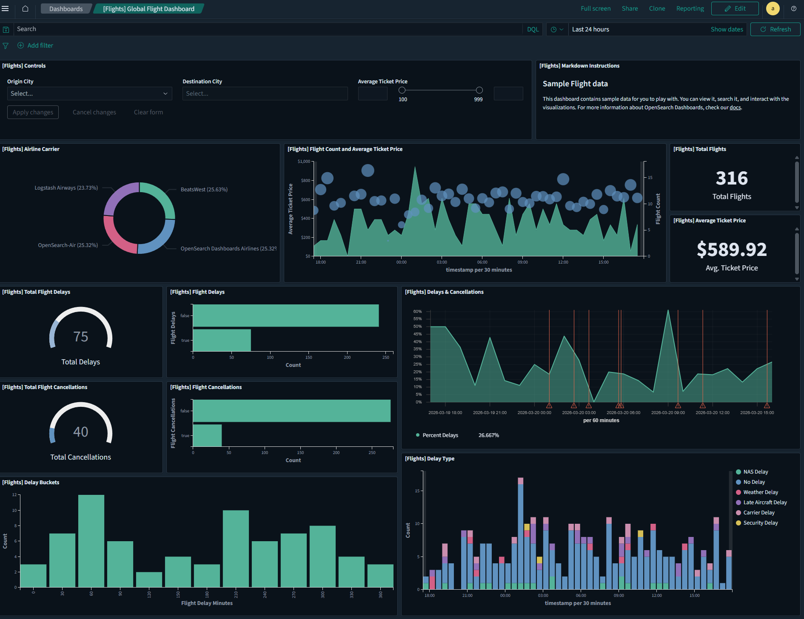

**Figura:** Exemplo dun dashboard completo en OpenSearch Dashboards.  
Fonte: elaboración propia.

Tamén resulta recomendable engadir unha ou varias imaxes do proceso de creación:

- O primeiro paso é escoller o tipo de visualización que se quere crear (para iso hai que seleccionar o botón `Create visualization` ou `Create new`):

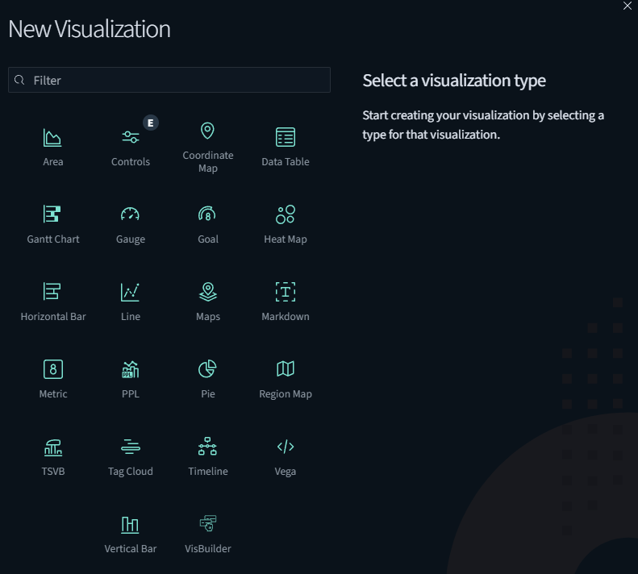

**Figura:** Selección do tipo de visualización ao iniciar unha nova visualización.  
Fonte: elaboración propia.

- A continuación, hai que escoller o `index pattern` sobre o que se vai traballar:

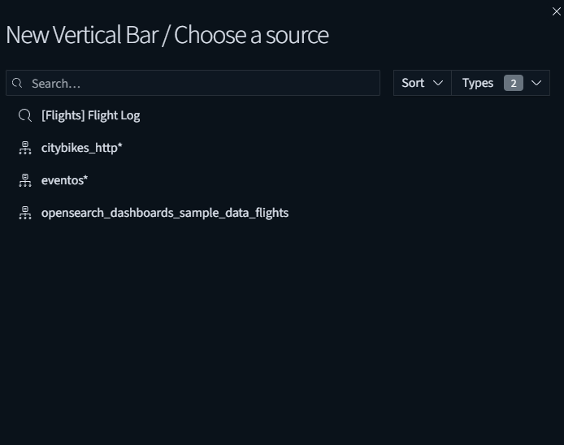

**Figura:** Escolla do `index pattern` ao crear unha visualización.  
Fonte: elaboración propia.

- O seguinte paso é configurar a visualización. Esta é unha das partes máis importantes, porque aquí se define que información queremos calcular e como se vai organizar na pantalla.

No panel de configuración adoitan aparecer, entre outros, estes elementos:

- **Métricas** (`Metrics`): indican que cálculo se vai facer sobre os datos. Por exemplo, `Count` conta cantos documentos hai, `Average` calcula a media dun campo numérico, `Max` devolve o valor máximo e `Sum` fai unha suma.
- **Buckets**: serven para agrupar os datos. Non calculan un valor por si mesmos, senón que dividen a información en bloques para poder representala mellor. Por exemplo, `Date Histogram` agrupa por intervalos de tempo, `Terms` agrupa por categorías e `Histogram` agrupa por rangos numéricos.
- **Campos** (`Field`): son os campos do índice sobre os que se aplica a métrica ou a agrupación. Por exemplo, pódese calcular `Average` sobre `latency_ms` ou agrupar por `servizo`.
- **Ordenación e tamaño** (`Order by`, `Size`): permiten decidir en que orde aparecen os resultados e cantos grupos se van mostrar.
- **Filtros** (`Filter`): permiten limitar os datos da visualización, por exemplo para mostrar só os eventos de erro.

O funcionamento xeral adoita ser este:

- primeiro escóllese unha ou varias métricas para decidir que valor se quere representar
- despois engádense buckets se se necesita organizar os datos por tempo, categorías ou intervalos
- finalmente axústanse detalles como etiquetas, cores, orde dos resultados ou filtros

Por exemplo:

- nunha métrica simple pódese usar só `Count`, sen buckets
- nunha gráfica de liñas é habitual combinar unha métrica como `Count` cun bucket `Date Histogram` sobre `timestamp`
- nunha gráfica de barras vertical pódese empregar `Average` sobre `latency_ms` como métrica e `Terms` sobre `servizo` como bucket para comparar a latencia media entre servizos

A imaxe seguinte pode empregarse como exemplo do panel de configuración dunha visualización de tipo gráfica de barras vertical:

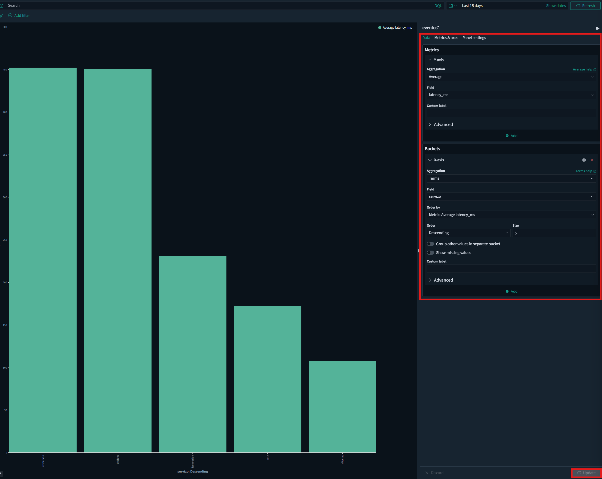

**Figura:** Panel de configuración dunha gráfica de barras vertical coa latencia media (`Average` sobre `latency_ms`) agrupada por `servizo` mediante `Terms`.  
Fonte: elaboración propia.

Durante o proceso de configuración da gráfica pódese facer clic en `Update` para ver o resultado. Se se quere gardar a visualización, hai que pulsar o botón `Save` e darlle un nome. Unha vez gardada, a visualización estará dispoñible para engadir ao dashboard.

---

## 3. Métricas

### 3.1. Para que serven

As métricas, tamén chamadas KPI ou visualizacións de tipo `Metric`, úsanse para mostrar un único valor destacado.

Son útiles para responder rapidamente a preguntas como:

- cantos eventos hai
- cal é a latencia media
- cantos erros houbo

### 3.2. Parámetros configurables

Os parámetros máis habituais son:

- `Index pattern`: conxunto de datos usado pola visualización
- `Metric`: operación de agregación principal
- `Field`: campo sobre o que se aplica a agregación, se é necesario
- `Custom label`: texto visible no panel
- `Filter`: filtro opcional para limitar os datos
- formato do número mostrado

As métricas máis frecuentes son:

- `Count`
- `Average`
- `Min`
- `Max`
- `Sum`
- `Percentiles`

### 3.3. Configuración básica co índice `eventos`

#### Exemplo 1: número total de eventos

- Tipo de visualización: `Metric`
- `Index pattern`: `eventos`
- Métrica (`Metric`): `Count`
- Etiqueta (`Custom label`): `Total de eventos`

Resultado esperado:

- mostra o número total de documentos do índice no intervalo temporal activo

#### Exemplo 2: latencia media

- Tipo de visualización: `Metric`
- `Index pattern`: `eventos`
- Métrica (`Metric`): `Average`
- Campo (`Field`): `latency_ms`
- Etiqueta (`Custom label`): `Latencia media (ms)`

#### Exemplo 3: número de erros

- Tipo de visualización: `Metric`
- `Index pattern`: `eventos`
- Métrica (`Metric`): `Count`
- Filtro (`Filter`): `nivel: ERROR`
- Etiqueta (`Custom label`): `Total de erros`


**Figura:** Visualización de tipo `Metric` co total de erros no índice `eventos`.  
Fonte: elaboración propia.

---

## 4. Gráfica de liñas

### 4.1. Para que serve

A gráfica de liñas é a máis indicada para ver a evolución temporal dos datos.

Permite detectar:

- tendencias
- picos
- cambios bruscos
- comparacións entre series

### 4.2. Parámetros configurables

Nunha gráfica de liñas hai que configurar, sobre todo, dúas partes: que valor queremos representar e como queremos agrupar os datos no tempo.

O primeiro é o **eixo Y**, que normalmente leva unha **métrica**. Esa métrica indica que cálculo se vai facer cos datos. O máis habitual é usar:

- `Count`, para contar cantos eventos hai
- `Average`, para calcular unha media, por exemplo de `latency_ms`
- `Max` ou `Min`, se interesa ver valores extremos

O segundo é o **eixo X**, onde se define a agrupación dos datos. Cando se quere representar evolución temporal, o habitual é usar unha agrupación (`Bucket`) de tipo `Date Histogram`. Isto significa que OpenSearch agrupa os documentos por franxas de tempo usando un campo temporal, no noso caso `timestamp`.

Unha vez escollido `Date Histogram`, hai que indicar o **intervalo temporal** desa agrupación. Ese intervalo define cada canto tempo se crea un punto na liña. Por exemplo:

- cada `30 minutes`
- cada `1 hour`
- cada `1 day`
- ou ben intervalo automático

Se o intervalo é moi pequeno, a gráfica pode quedar demasiado cargada. Se é moi grande, pode perder detalle. Por iso adoita ser boa idea comezar con intervalo automático e axustalo despois se fai falta.

Ademais, pódense configurar **series adicionais** dentro da mesma gráfica. Para iso úsase `Split series`, que permite separar a información en varias liñas segundo un campo categórico. Por exemplo, pódese representar unha liña por cada valor de `nivel`, ou por cada `servizo`.

Tamén adoitan existir outras opcións complementarias:

- filtros para limitar os datos representados
- título da visualización
- cores de cada serie
- lenda para identificar as liñas

En resumo, a configuración máis habitual nunha gráfica temporal é esta:

- unha métrica no eixo Y
- un `Date Histogram` no eixo X usando `timestamp`
- un intervalo temporal adecuado
- opcionalmente, un `Split series` para separar varias categorías

### 4.3. Configuración básica co índice `eventos`

#### Exemplo: evolución do número de eventos no tempo

- Tipo de visualización: `Line chart`
- `Index pattern`: `eventos`
- Métrica do eixo Y (`Metric`): `Count`
- Agrupación do eixo X (`Bucket`): `Date Histogram`
- Campo temporal: `timestamp`
- Intervalo: automático ou `30 minutes`
- Etiqueta (`Custom label`): `Eventos ao longo do tempo`

Neste caso, cada punto da liña representa o número de eventos rexistrados nunha franxa temporal.

#### Exemplo con varias series: eventos totais e eventos de erro no tempo

- Tipo de visualización: `Line chart`
- `Index pattern`: `eventos`
- Métrica 1 do eixo Y (`Metric`): `Count`
- Métrica 2 do eixo Y (`Metric`): `Count`
- Filtro da segunda serie (`Filter`): `nivel: ERROR`
- Agrupación do eixo X (`Bucket`): `Date Histogram` sobre `timestamp`
- Intervalo: automático ou `30 minutes`
- Etiqueta da serie 1: `Eventos totais`
- Etiqueta da serie 2: `Eventos de erro`

Isto permitiría comparar nun mesmo gráfico a evolución temporal do total de eventos e a dos eventos filtrados para mostrar só os erros.

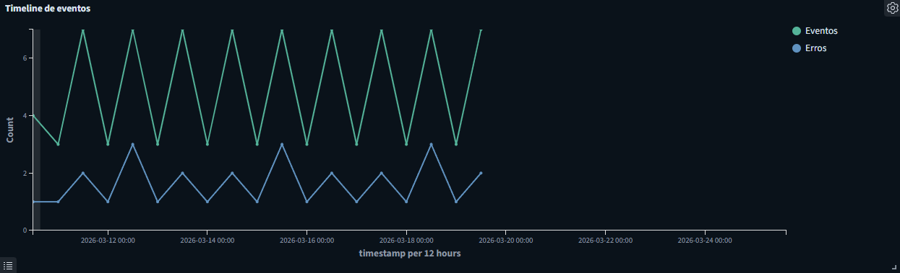

**Figura:** Gráfica de liñas con `Date Histogram` sobre `timestamp`, comparando o total de eventos cos eventos filtrados por `nivel: ERROR`.  
Fonte: elaboración propia.

---

## 5. Gráfica de barras

### 5.1. Para que serve

A gráfica de barras é útil para comparar categorías.

É adecuada para responder preguntas como:

- que servizo xera máis eventos
- que endpoints se usan máis
- que estados aparecen con maior frecuencia

Se a pregunta principal é "como evoluciona algo no tempo?", normalmente encaixa mellor unha gráfica de liñas. Se a pregunta é "que categoría destaca sobre as demais?", adoita resultar máis clara unha gráfica de barras.

### 5.2. Parámetros configurables

Os parámetros máis habituais son:

- `Index pattern`
- métrica (`Metric`) do eixo Y
- agrupación (`Bucket`) do eixo X
- campo da agrupación (`Field`)
- tamaño do top de resultados (`Size`)
- criterio de ordenación (`Order by`)
- orientación vertical ou horizontal
- `Split series` ou `Split chart`

Os buckets máis usados son:

- `Terms`
- `Filters`
- `Histogram`, se o campo é numérico

Para este tipo de gráfica, o máis habitual é usar `Terms` sobre campos categóricos como `servizo`, `nivel` ou `endpoint`. Se hai demasiadas categorías, convén limitar o número de barras para que o resultado siga sendo lexible.

### 5.3. Configuración básica co índice `eventos`

#### Exemplo: eventos por servizo

- Tipo de visualización: `Bar chart`
- `Index pattern`: `eventos`
- Métrica do eixo Y (`Metric`): `Count`
- Agrupación do eixo X (`Bucket`): `Terms`
- Campo (`Field`): `servizo`
- Ordenación (`Order by`): `Count`
- Tamaño (`Size`): `10`
- Etiqueta (`Custom label`): `Eventos por servizo`

#### Exemplo: estados máis frecuentes

- Tipo de visualización: `Bar chart`
- `Index pattern`: `eventos`
- Métrica do eixo Y (`Metric`): `Count`
- Agrupación do eixo X (`Bucket`): `Terms`
- Campo (`Field`): `status`
- Ordenación (`Order by`): `Count`

#### Exemplo: erros por servizo

- Tipo de visualización: `Bar chart`
- `Index pattern`: `eventos`
- Métrica do eixo Y (`Metric`): `Count`
- Agrupación do eixo X (`Bucket`): `Terms`
- Campo (`Field`): `servizo`
- Filtro (`Filter`): `nivel: ERROR`
- Ordenación (`Order by`): `Count`
- Tamaño (`Size`): `10`
- Etiqueta (`Custom label`): `Erros por servizo`

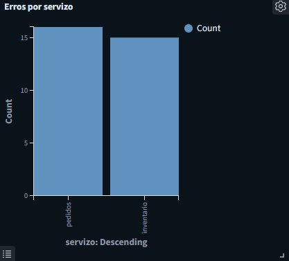

**Figura:** Gráfica de barras para comparar o número de erros por `servizo`.  
Fonte: elaboración propia.

---

## 6. Gráfico circular

### 6.1. Para que serve

O gráfico circular, tipo `Pie` ou `Donut`, úsase para mostrar a distribución proporcional dun conxunto de datos.

É útil cando interesa ver rapidamente como se reparte un total entre varias categorías.

Funciona mellor cando hai poucos segmentos e as diferenzas entre eles son fáciles de interpretar. Se hai moitas categorías ou valores moi próximos, adoita entenderse mellor unha gráfica de barras.

### 6.2. Parámetros configurables

Os parámetros máis habituais son:

- `Index pattern`
- métrica (`Metric`)
- agrupación (`Bucket`) de tipo `Terms`
- campo da categoría (`Field`)
- número de segmentos (`Size`)
- etiquetas
- modo `Pie` ou `Donut`
- cores

### 6.3. Configuración básica co índice `eventos`

#### Exemplo: distribución por nivel

- Tipo de visualización: `Pie chart`
- `Index pattern`: `eventos`
- Métrica (`Metric`): `Count`
- Agrupación (`Bucket`): `Terms`
- Campo (`Field`): `nivel`
- Tamaño (`Size`): `5`
- Modo: `Donut`
- Etiqueta (`Custom label`): `Distribución por nivel`

Tamén se podería facer unha distribución por:

- `servizo`
- `status`
- `endpoint`

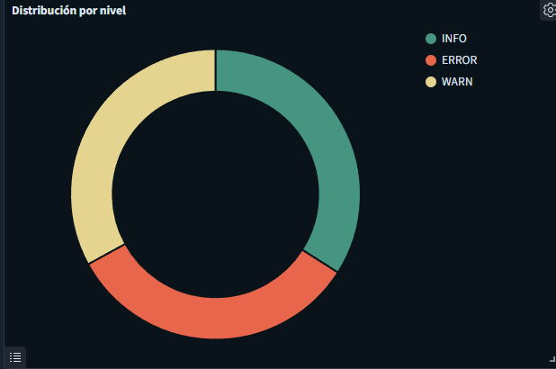

**Figura:** Gráfico circular de tipo `Donut` coa distribución por `nivel`.  
Fonte: elaboración propia.

---

## 7. Táboa de datos

### 7.1. Para que serve

A táboa de datos permite mostrar agregacións de maneira tabular.

É moi útil para:

- ver rankings
- combinar varias métricas
- revisar datos resumidos con máis detalle

### 7.2. Parámetros configurables

Os parámetros máis habituais son:

- `Index pattern`
- métricas da táboa
- agrupacións por filas (`Buckets`)
- orde das columnas
- ordenación
- número máximo de filas
- filtros

### 7.3. Configuración básica co índice `eventos`

#### Exemplo: resumo por servizo

- Tipo de visualización: `Data Table`
- `Index pattern`: `eventos`
- Agrupación por filas (`Bucket`): `Terms`
- Campo da agrupación (`Field`): `servizo`
- Tamaño (`Size`): `10`
- Métrica 1 (`Metric`): `Count`
- Métrica 2 (`Metric`): `Average` sobre `latency_ms`
- Métrica 3 (`Metric`): `Max` sobre `latency_ms`

Esta táboa permitiría ver:

- cantos eventos ten cada servizo
- a latencia media por servizo
- a latencia máxima por servizo

#### Exemplo: resumo por endpoint

- Tipo de visualización: `Data Table`
- `Index pattern`: `eventos`
- Agrupación por filas (`Bucket`): `Terms`
- Campo (`Field`): `endpoint`
- Métrica principal (`Metric`): `Count`

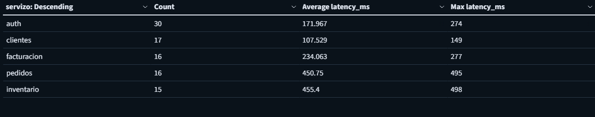

**Figura:** Táboa de datos con métricas agregadas por `servizo`.  
Fonte: elaboración propia.

---

## 8. Histograma

### 8.1. Para que serve

O histograma permite analizar a distribución de frecuencia dun campo numérico.

En OpenSearch Dashboards, segundo a versión e as opcións dispoñibles, o histograma pode non presentarse como un tipo de visualización independente. Moitas veces constrúese a partir dunha visualización de tipo `Vertical bar`, configurando o eixo X cun bucket `Histogram`.

O importante aquí non é tanto o nome exacto do tipo de visualización na interface como a lóxica da representación. Nun histograma, as barras non comparan categorías como `servizo` ou `nivel`, senón intervalos numéricos consecutivos dun mesmo campo, por exemplo `latency_ms`.

Por iso mantemos este apartado propio: aínda que na interface poida montarse a partir dunha gráfica de barras vertical, a pregunta que responde e a interpretación do resultado son distintas das dunha gráfica de barras por categorías.

É útil para responder preguntas como:

- como se distribúen as latencias
- en que intervalos se concentran máis valores

### 8.2. Parámetros configurables

Os parámetros máis habituais son:

- `Index pattern`
- métrica (`Metric`)
- agrupación (`Bucket`) de tipo `Histogram`
- campo numérico (`Field`)
- tamaño do intervalo
- rango temporal

O valor do intervalo é importante: se é demasiado pequeno, aparecerán demasiadas barras; se é demasiado grande, perderase detalle. O normal é probar cun valor simple e axustalo segundo a dispersión dos datos.

### 8.3. Configuración básica co índice `eventos`

#### Exemplo: distribución da latencia

- Tipo de visualización en OpenSearch Dashboards: `Vertical bar`
- `Index pattern`: `eventos`
- Métrica do eixo Y (`Metric`): `Count`
- Agrupación do eixo X (`Bucket`): `Histogram`
- Campo (`Field`): `latency_ms`
- Intervalo: `50`
- Etiqueta (`Custom label`): `Distribución da latencia`

Neste caso, na interface escóllese unha visualización de tipo `Vertical bar`, pero o resultado interprétase como un histograma porque o eixo X non agrupa categorías con `Terms`, senón intervalos numéricos consecutivos do campo `latency_ms`.

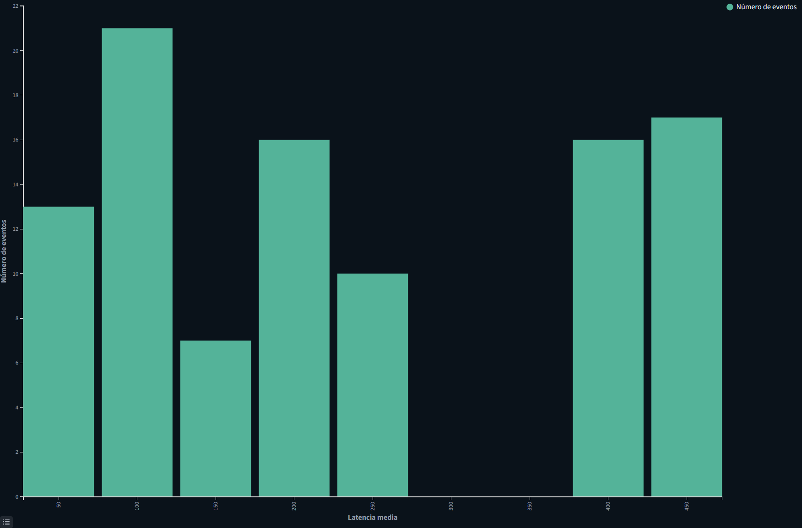

**Figura:** Histograma para analizar a distribución de `latency_ms`.  
Fonte: elaboración propia.

---

## 9. Controis

### 9.1. Para que serven

Os controis son filtros interactivos que se engaden ao dashboard para que o usuario poida cambiar o conxunto de datos mostrado sen editar cada visualización.

Permiten facer dashboards máis cómodos e reutilizables.

### 9.2. Tipos habituais

Os máis frecuentes son:

- lista despregable para campos categóricos
- control de rango para campos numéricos

Ademais destes controis, o dashboard adoita ter tamén un selector temporal global. Ese selector afecta ao conxunto do panel, pero convén distinguilo dos controis engadidos como elementos propios do dashboard.

### 9.3. Parámetros configurables

Os parámetros dependen do tipo de control, pero normalmente inclúen:

- `Index pattern`
- campo do control (`Field`)
- tipo de control
- valor por defecto
- selección simple ou múltiple
- orde dos valores
- ancho e posición no dashboard

Para listas despregables adoitan empregarse campos categóricos como `servizo` ou `nivel`. Para controis de rango, en cambio, úsanse campos numéricos como `latency_ms`.

### 9.4. Configuración básica co índice `eventos`

#### Exemplo 1: filtro por servizo

- Tipo de elemento: `Controls`
- Tipo de control: lista despregable
- `Index pattern`: `eventos`
- Campo (`Field`): `servizo`
- Etiqueta (`Label`): `Servizo`
- Selección múltiple (`Multi-select`): opcional

#### Exemplo 2: filtro por nivel

- Tipo de elemento: `Controls`
- Tipo de control: lista despregable
- `Index pattern`: `eventos`
- Campo (`Field`): `nivel`
- Etiqueta (`Label`): `Nivel`

#### Exemplo 3: rango de latencia

- Tipo de elemento: `Controls`
- Tipo de control: rango numérico
- `Index pattern`: `eventos`
- Campo (`Field`): `latency_ms`
- Etiqueta (`Label`): `Latencia (ms)`

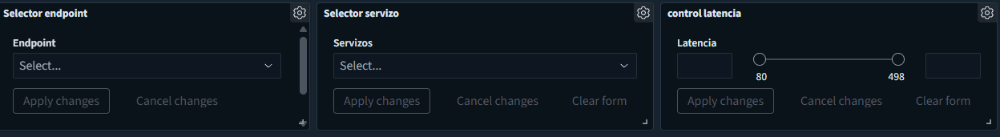

**Figura:** Controis interactivos do dashboard para filtrar por `servizo`, `nivel` e `latency_ms`.  
Fonte: elaboración propia.

---

## 10. Paneis de texto

### 10.1. Para que serven

Os paneis de texto en formato `Markdown` ou `Text` permiten engadir contido explicativo dentro do dashboard.

Son útiles para:

- poñer un título xeral
- dividir o dashboard en seccións
- explicar o significado dunha métrica
- indicar como usar os filtros

### 10.2. Parámetros configurables

Os parámetros máis habituais son:

- título do panel
- contido en `Markdown`
- ligazóns
- formato básico do texto
- tamaño e posición no dashboard

### 10.3. Configuración básica co índice `eventos`

#### Exemplo: panel de título

Tipo de panel:

- `Markdown` ou `Text`

Contido de exemplo:

```md
# Dashboard de eventos

Este panel mostra a actividade do índice `eventos`.

Filtros recomendados:
- servizo
- nivel
- rango temporal
```

Este tipo de panel non calcula métricas, pero mellora moito a comprensión do dashboard.


**Figura:** Panel de texto en formato `Markdown` para introducir e explicar o dashboard.  
Fonte: elaboración propia.

---

## 11. Proposta de dashboard básico co índice `eventos`

Un dashboard inicial e equilibrado podería incluír:

### Parte superior

- panel de texto co título `Dashboard de eventos`, para indicar que información se está vendo
- métrica `Total de eventos`, para responder rapidamente a cantos rexistros hai
- métrica `Total de erros`, para detectar se houbo incidencias
- métrica `Latencia media (ms)`, para ter unha visión rápida do rendemento

### Parte central

- gráfica de liñas cos eventos por `timestamp`, para ver a evolución temporal
- gráfica de liñas separada por `nivel`, para comparar como se comporta cada tipo de evento
- gráfica de barras cos eventos por `servizo`, para identificar que servizos concentran máis actividade

### Parte inferior

- gráfico circular coa distribución por `nivel`, para ver o reparto xeral entre categorías
- histograma de `latency_ms`, para entender como se distribúen as latencias
- táboa con resumo por `servizo`, para consultar detalle agregado e comparar métricas

### Controis

- filtro por `servizo`, para centrar a análise nun compoñente concreto
- filtro por `nivel`, para illar erros, avisos ou eventos informativos
- rango por `latency_ms`, para revisar só determinados niveis de latencia

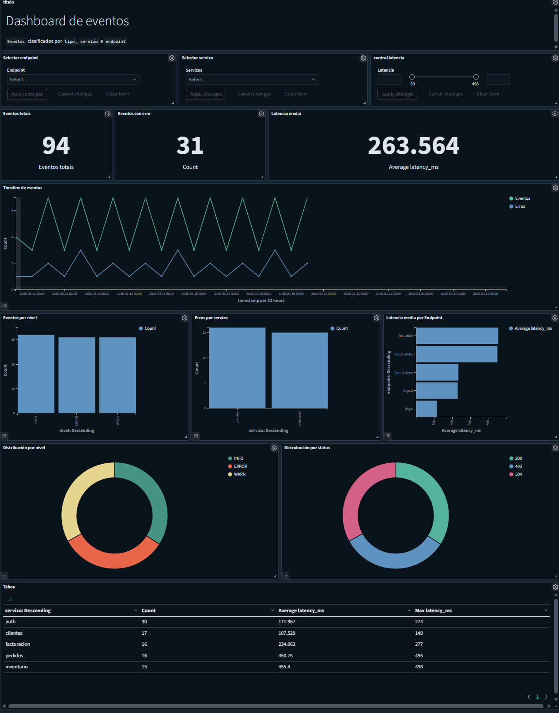

**Figura:** Exemplo dun dashboard completo de eventos en OpenSearch Dashboards.  
Fonte: elaboración propia.

---

## 12. Recomendacións finais

Ao construír visualizacións convén empezar por configuracións simples e ir engadindo detalle pouco a pouco.

Un bo enfoque é este:

1. Crear primeiro as métricas resumo.
2. Engadir despois unha visualización temporal.
3. Incorporar visualizacións por categorías.
4. Engadir filtros interactivos.
5. Pechar o dashboard cunha táboa ou elementos de detalle.

Así é máis doado comprobar que cada panel responde a unha pregunta concreta e que o dashboard final resulta claro e útil.
