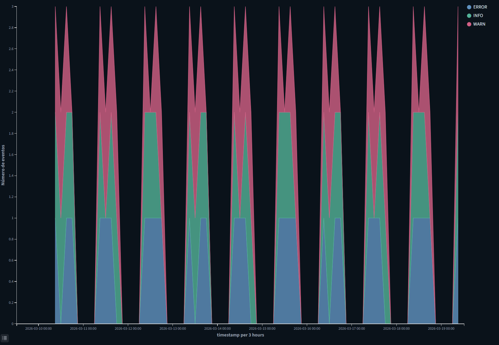
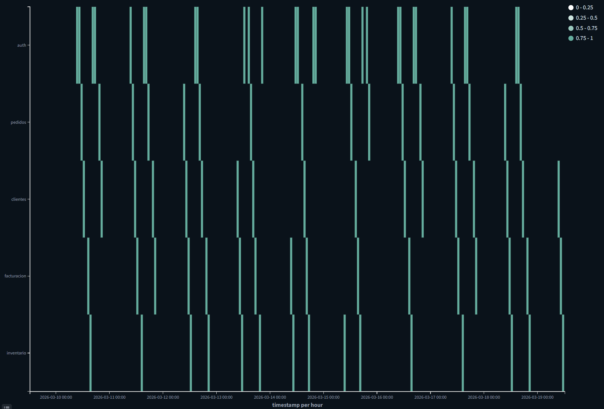
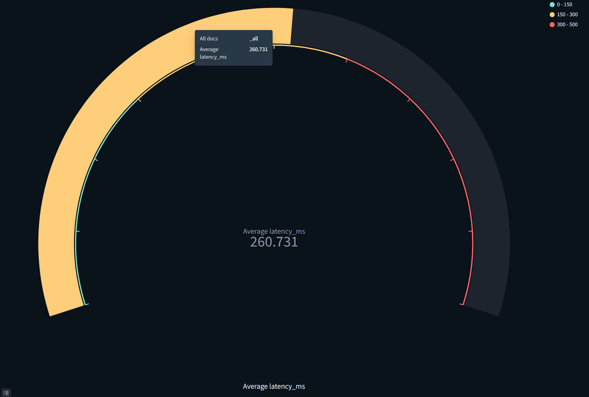
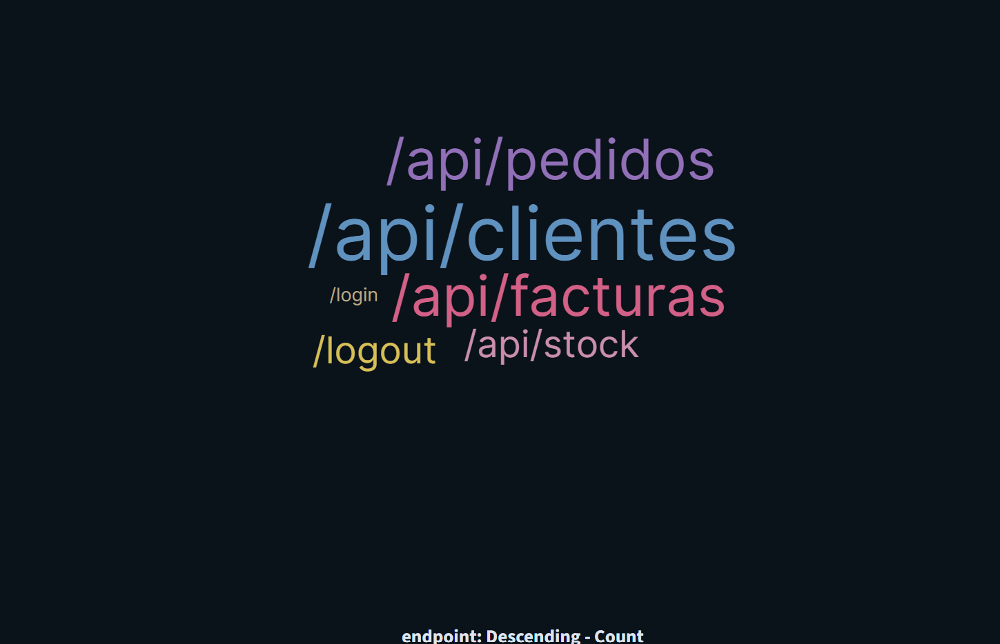
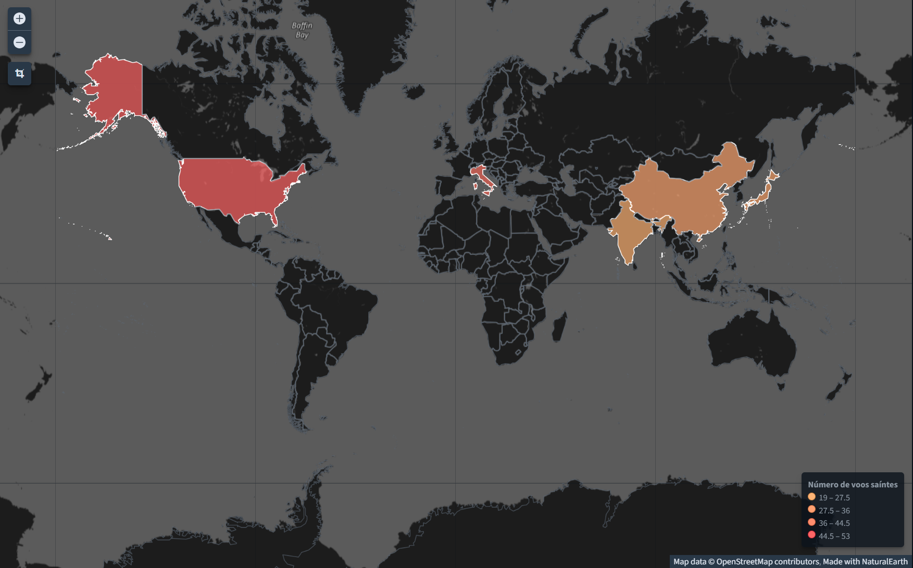
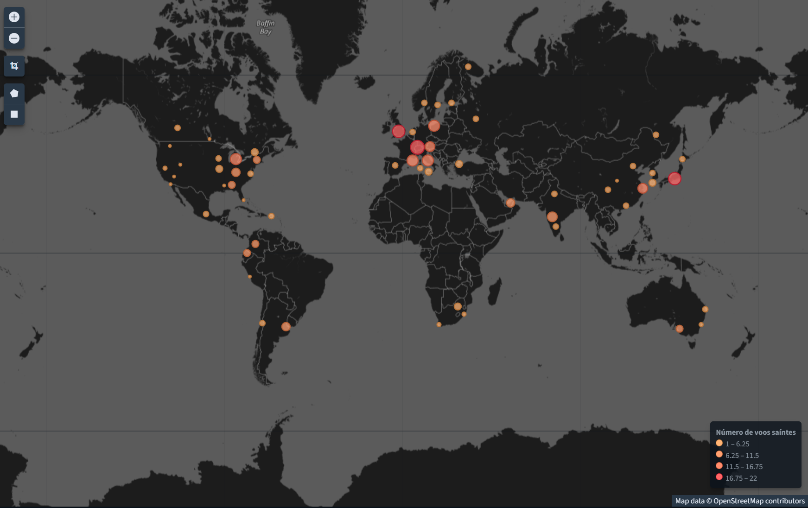
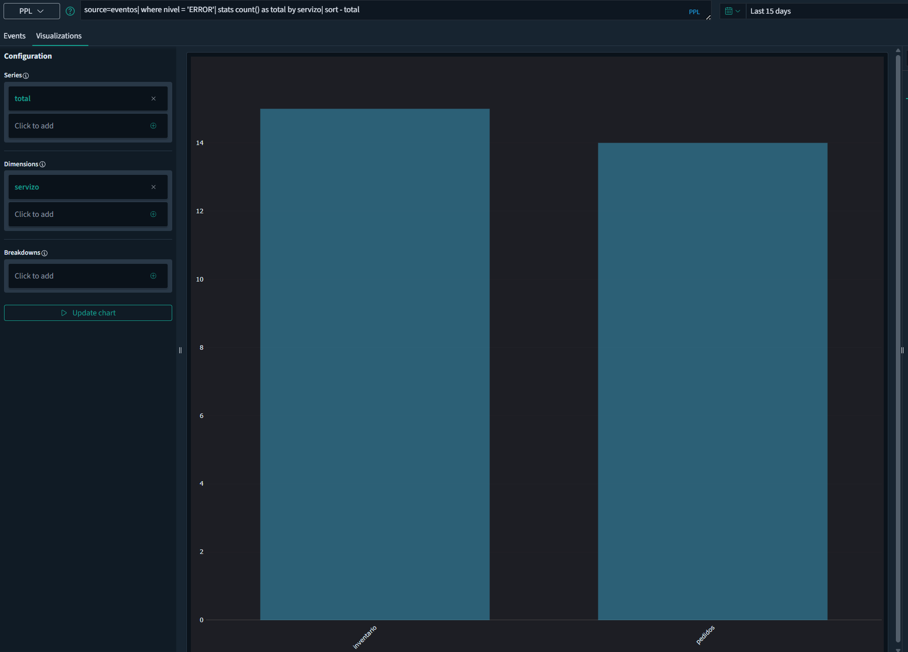

# OpenSearch Dashboards: ampliación de visualizacións

## 1. Obxectivo deste documento

Este documento complementa o contido de [2.visualizacións.md](./2.visualizacións.md) cun repaso doutras visualizacións e elementos que tamén poden aparecer en OpenSearch Dashboards.

Aquí non se entra con tanto detalle como no documento principal. A idea é ter un pequeno catálogo adicional para saber:

- para que serve cada visualización
- cando compensa usala
- que parámetros adoitan ser os máis importantes
- que tipo de exemplo se pode construír

Sempre que sexa posible manteranse exemplos co índice `eventos`. Cando unha visualización necesite datos xeográficos ou un tipo de estrutura que non encaixa ben con ese índice, empregarase un índice de demostración máis adecuado, como `flights`.

---

## 2. Punto de partida

Seguimos partindo do mesmo contexto explicado en [1.intro-dashboards.md](./1.intro-dashboards.md) e en [2.visualizacións.md](./2.visualizacións.md):

- existe un índice `eventos`
- existe o `index pattern` `eventos`
- o campo temporal principal é `timestamp`

Os campos máis útiles para esta ampliación seguen sendo:

- `timestamp`
- `servizo`
- `nivel`
- `status`
- `latency_ms`
- `endpoint`
- `usuario`

Ademais, para algunhas visualizacións convén lembrar esta idea:

- se queremos comparar categorías, o habitual é usar `Terms`
- se queremos ver evolución temporal, o máis frecuente é usar `Date Histogram`
- se queremos traballar con intervalos numéricos, adoita empregarse `Histogram`
- se queremos mapas, necesitaremos campos xeográficos, por exemplo de tipo `geo_point`

---

## 3. Area chart

### 3.1. Para que serve

A visualización de tipo `Area chart` é semellante á gráfica de liñas, pero enche con cor a área inferior da serie.

Isto fai que sexa útil cando interesa destacar:

- o volume total ao longo do tempo
- a contribución de varias series acumuladas
- unha evolución temporal cunha lectura máis visual

### 3.2. Parámetros configurables

Os parámetros máis habituais son:

- `Index pattern`
- métrica do eixo Y (`Metric`)
- agrupación temporal no eixo X (`Date Histogram`)
- series adicionais (`Split series`)
- intervalo temporal
- modo de apilado, se está dispoñible

Na práctica, a configuración é moi parecida á dunha gráfica de liñas. A diferenza principal está no efecto visual e en que a área coloreada fai máis evidente o peso de cada serie.

### 3.3. Configuración básica co índice `eventos`

#### Exemplo: volume de eventos no tempo

- Tipo de visualización: `Area chart`
- `Index pattern`: `eventos`
- Métrica do eixo Y (`Metric`): `Count`
- Agrupación do eixo X (`Bucket`): `Date Histogram`
- Campo temporal: `timestamp`
- Intervalo: automático ou `30 minutes`
- Etiqueta (`Custom label`): `Volume de eventos`

#### Exemplo con series separadas: eventos por nivel no tempo

- Tipo de visualización: `Area chart`
- `Index pattern`: `eventos`
- Métrica do eixo Y (`Metric`): `Count`
- Agrupación do eixo X (`Bucket`): `Date Histogram` sobre `timestamp`
- Series separadas (`Split series`): `Terms`
- Campo da serie: `nivel`
- Tamaño (`Size`): `3`

Este tipo de gráfica pode resultar útil cando queremos ver ao mesmo tempo a evolución total e como se reparte entre `INFO`, `WARN` e `ERROR`.



**Figura:** Gráfica de áreas coa evolución temporal dos eventos, separada por `nivel`.  
Fonte: elaboración propia.

---

## 4. Heat map

### 4.1. Para que serve

O `Heat map` representa valores mediante cores dentro dunha grella.

É especialmente útil para detectar:

- zonas de concentración
- combinacións frecuentes entre dúas dimensións
- patróns que nunha táboa serían máis difíciles de ver

### 4.2. Parámetros configurables

Os parámetros máis habituais son:

- `Index pattern`
- métrica principal (`Metric`)
- bucket do eixo X
- bucket do eixo Y
- escala de cores
- número de categorías ou intervalos

O máis normal é cruzar dúas agrupacións e usar a cor para expresar intensidade. Por exemplo, nun eixo podemos ter o tempo e noutro un campo categórico.

### 4.3. Configuración básica co índice `eventos`

#### Exemplo: eventos por servizo e nivel

- Tipo de visualización: `Heat map`
- `Index pattern`: `eventos`
- Métrica (`Metric`): `Count`
- Eixo X: `Terms` sobre `servizo`
- Eixo Y: `Terms` sobre `nivel`
- Ordenación: por número de documentos

Este exemplo permite ver rapidamente se hai servizos nos que predominan máis os erros ou os avisos.

#### Exemplo alternativo: intensidade temporal por servizo

- Tipo de visualización: `Heat map`
- `Index pattern`: `eventos`
- Métrica (`Metric`): `Count`
- Eixo X: `Date Histogram` sobre `timestamp`
- Eixo Y: `Terms` sobre `servizo`
- Intervalo temporal: automático ou `1 hour`

Aquí a idea é detectar en que franxas temporais hai máis actividade para cada servizo.



**Figura:** `Heat map` que cruza `servizo` e `nivel` para mostrar a intensidade de eventos mediante cor.  
Fonte: elaboración propia.

---

## 5. Gauge

### 5.1. Para que serve

O `Gauge` mostra un valor resumido dentro dunha escala, normalmente cunha lectura visual de zonas como baixa, media ou alta.

É útil cando interesa avaliar rapidamente se un indicador está:

- dentro dun rango aceptable
- preto dun límite
- claramente fóra do esperado

### 5.2. Parámetros configurables

Os parámetros máis habituais son:

- `Index pattern`
- métrica principal (`Metric`)
- campo sobre o que se calcula a métrica
- rangos da escala configurados en `Options`
- rangos por cor
- etiqueta visible

Os rangos adoitan configurarse na pestana `Options`. Nesa zona pódense definir varios tramos dentro da escala e asignarlle unha cor distinta a cada un, por exemplo verde para valores bos, amarelo para valores intermedios e vermello para valores altos ou problemáticos.

Esta visualización funciona mellor cando xa temos unha referencia clara do que significa un valor bo, normal ou preocupante.

### 5.3. Configuración básica co índice `eventos`

#### Exemplo: latencia media

- Tipo de visualización: `Gauge`
- `Index pattern`: `eventos`
- Métrica (`Metric`): `Average`
- Campo (`Field`): `latency_ms`
- Etiqueta (`Custom label`): `Latencia media`
- Pestana `Options`: definición de rangos para a escala
- Rangos orientativos: `0-150`, `150-300` e máis de `300`

Como referencia orientativa, pódense definir os rangos en verde de `0` a `150`, en amarelo de `150` a `300` e en vermello a partir de `300`.

Este exemplo ten sentido se queremos que o dashboard transmita de forma inmediata se o rendemento é aceptable.

Cómpre lembrar que os límites non saen automaticamente dos datos: hai que definilos cun criterio funcional ou didáctico.



**Figura:** Visualización de tipo `Gauge` coa latencia media do índice `eventos`.  
Fonte: elaboración propia.

---

## 6. Tag cloud

### 6.1. Para que serve

A `Tag cloud` representa palabras ou categorías cun tamaño proporcional á súa frecuencia ou ao valor dunha métrica.

Pode ser útil como recurso visual rápido para:

- destacar os termos máis repetidos
- comparar o peso relativo de varias categorías
- facer unha lectura máis informal ou exploratoria

Non adoita ser a visualización máis precisa para análise detallada, pero si pode ser útil como complemento.

### 6.2. Parámetros configurables

Os parámetros máis habituais son:

- `Index pattern`
- métrica principal (`Metric`)
- agrupación (`Terms`)
- campo categórico
- número de elementos (`Size`)
- orde dos resultados

### 6.3. Configuración básica co índice `eventos`

#### Exemplo: servizos máis frecuentes

- Tipo de visualización: `Tag cloud`
- `Index pattern`: `eventos`
- Métrica (`Metric`): `Count`
- Agrupación (`Bucket`): `Terms`
- Campo (`Field`): `servizo`
- Tamaño (`Size`): `10`

#### Exemplo alternativo: endpoints máis frecuentes

- Tipo de visualización: `Tag cloud`
- `Index pattern`: `eventos`
- Métrica (`Metric`): `Count`
- Agrupación (`Bucket`): `Terms`
- Campo (`Field`): `endpoint`
- Tamaño (`Size`): `15`

Neste caso convén usala con moderación. Se o obxectivo é comparar con precisión, adoita ser mellor unha gráfica de barras. A nube de etiquetas encaixa mellor como elemento visual complementario.



**Figura:** `Tag cloud` cos servizos máis frecuentes no índice `eventos`.  
Fonte: elaboración propia.

---

## 7. Region map

### 7.1. Para que serve

O `Region map` permite colorear zonas dun mapa segundo o valor dunha métrica agregada.

É útil para responder preguntas como:

- en que rexións hai máis actividade
- como se distribúen os valores por países, áreas ou territorios

A idea importante é que esta visualización non debuxa o mapa a partir dos datos do índice. O mapa xa existe por debaixo en forma de capa xeográfica vectorial, e o índice só achega os valores que se van representar sobre esas áreas.

Isto significa que nun `Region map` interveñen dúas pezas:

- por un lado, os datos do índice, por exemplo un reconto de documentos agrupado por `OriginCountry`
- por outro, unha capa vectorial que contén as formas xeográficas e un campo de unión (`join field`)

OpenSearch Dashboards fai corresponder ambos elementos comparando os valores do bucket `Terms` co identificador das rexións desa capa. Se coinciden, a rexión píntase coa intensidade adecuada. Se non coinciden exactamente, a zona non se poderá representar.

### 7.2. Parámetros configurables

Os parámetros máis habituais son:

- `Index pattern`
- métrica principal (`Metric`)
- bucket de tipo `Terms` cun campo territorial
- capa do mapa ou `Vector map`
- campo de unión entre os datos e as rexións do mapa
- escala de cores

Na práctica, o habitual é usar unha métrica como `Count` e un bucket de tipo `Terms` cun campo que represente áreas xeográficas, por exemplo `OriginCountry`. Ese campo non ten que conter coordenadas, senón nomes ou códigos territoriais que a capa xeográfica saiba recoñecer.

Na sección `Layer options` da visualización pódense escoller distintos `Vector maps` e tamén o campo de unión (`join field`) co que OpenSearch vai relacionar os valores do índice coas rexións da capa.

Por iso adoita funcionar mellor un campo como `OriginCountry` ca outro como `OriginRegion`, salvo que a capa seleccionada estea preparada para eses códigos rexionais concretos.

OpenSearch indica na documentación oficial que os `Region map` usan ficheiros `GeoJSON` estándar como base vectorial e que OpenSearch Dashboards xa fornece mapas e capas básicas por defecto. Cando esa capa non chega, pódese importar un `GeoJSON` propio mediante `Import Vector Map` para engadir novas rexións ou territorios personalizados. Véxase a documentación oficial: <https://docs.opensearch.org/latest/dashboards/visualize/geojson-regionmaps/>.

Esta visualización require unha estrutura xeográfica que o índice `eventos` non ten no exemplo básico. Por iso aquí é máis natural empregar un índice de demostración preparado para ese tipo de datos.

### 7.3. Exemplo cun índice máis adecuado

#### Exemplo: distribución de voos por país ou destino

- Tipo de visualización: `Region map`
- `Index pattern`: `flights`
- Métrica (`Metric`): `Count`
- Bucket (`Terms`): `OriginCountry`
- `Vector map`: capa por países dispoñible en OpenSearch Dashboards
- Campo de unión: o que corresponda cos identificadores desa capa

Neste exemplo, o índice achega os países de orixe dos voos e a capa vectorial achega os polígonos dos países. OpenSearch relaciona ambos elementos mediante o campo territorial e colorea cada país segundo o número de documentos.

Se se quixese facer algo parecido co índice `eventos`, habería que ampliar o mapping e os datos para incluír información xeográfica estruturada, por exemplo un país, unha comunidade ou outro campo preparado para representar zonas.



**Figura:** `Region map` construído cun índice de demostración como `flights`, máis axeitado para exemplos xeográficos.  
Fonte: elaboración propia.

---

## 8. Coordinate map

### 8.1. Para que serve

O `Coordinate map` representa puntos sobre un mapa a partir de coordenadas xeográficas.

Serve para:

- localizar eventos no espazo
- detectar concentracións por zona
- analizar desprazamentos ou repartos xeográficos

A diferenza do `Region map`, aquí non se colorean áreas completas como países ou rexións. O que se representa son localizacións concretas no espazo, normalmente a partir dun campo xeográfico con latitude e lonxitude.

Tamén neste caso hai un mapa base por debaixo, pero os datos do índice non se unen a unha capa de rexións mediante un `join field`. O que fai OpenSearch Dashboards é colocar os puntos ou as agregacións espaciais directamente sobre ese mapa a partir das coordenadas.

### 8.2. Parámetros configurables

Os parámetros máis habituais son:

- `Index pattern`
- métrica principal (`Metric`)
- campo xeográfico de tipo `geo_point`
- nivel de zoom
- agrupación espacial
- estilo ou intensidade dos puntos

Na práctica, o elemento máis importante é o campo xeográfico. OpenSearch Dashboards indica na documentación oficial que os `Coordinate maps` están pensados para visualizar datos baseados en localización usando campos de coordenadas, por exemplo latitude e lonxitude agrupadas nun `geo_point`. Véxase a documentación oficial xeral sobre visualizacións: <https://docs.opensearch.org/docs/latest/dashboards/visualize/viz-index/>.

Segundo a configuración da visualización, OpenSearch pode representar:

- puntos individuais
- agrupacións espaciais
- marcas máis grandes ou máis pequenas segundo o valor da métrica

Isto fai que a lectura sexa distinta da dun `Region map`:

- en `Region map`, a unidade visual é unha área xa debuxada nunha capa vectorial
- en `Coordinate map`, a unidade visual é unha posición xeográfica concreta

Sen un campo xeográfico real esta visualización non ten sentido. No índice `eventos` presentado no documento principal só temos un campo `ip`, pero non unhas coordenadas xa resoltas como latitude e lonxitude.

### 8.3. Exemplo cun índice máis adecuado

#### Exemplo: puntos xeográficos de voos

- Tipo de visualización: `Coordinate map`
- `Index pattern`: `flights`
- Métrica (`Metric`): `Count`
- Bucket de agregación espacial: `Geohash`
- Campo xeográfico do bucket: `OriginLocation` ou `DestLocation`
- Zoom: un nivel que permita ver ben a distribución global ou rexional
- Representación: puntos ou agregación espacial segundo a configuración dispoñible

Neste exemplo, o índice achega directamente as coordenadas xeográficas e OpenSearch colócaas sobre o mapa base. Non hai que facer unha unión cunha capa territorial como pasaba no `Region map`.

Se no futuro se ampliase o índice `eventos` cun campo como `localizacion` de tipo `geo_point`, esta visualización podería empregarse tamén para situar incidencias, peticións ou usuarios nun mapa.



**Figura:** `Coordinate map` cun índice de exemplo preparado con campos xeográficos.  
Fonte: elaboración propia.

---

## 9. PPL

### 9.1. Para que serve

`PPL` é a linguaxe de consulta de OpenSearch orientada á exploración e transformación de datos. Máis que unha visualización concreta, é unha forma de construír consultas que poden empregarse para analizar resultados, preparar táboas ou deixar máis explícita a lóxica coa que filtramos e agregamos a información.

Pode ser útil para:

- filtrar datos con máis flexibilidade
- calcular agregacións antes de visualizalas
- preparar unha consulta máis expresiva ca un filtro simple

### 9.2. Cando compensa usalo

Paga a pena recorrer a `PPL` cando a configuración visual estándar se queda curta ou cando queremos expresar con máis claridade que pasos se aplican sobre os datos.

Por exemplo, podería interesar para:

- seleccionar só erros cun determinado `status`
- agrupar por `servizo`
- calcular medias ou totais
- ordenar resultados antes de levalos a unha táboa

### 9.3. Exemplo básico co índice `eventos`

Un exemplo conceptual podería ser unha consulta orientada a contar eventos de erro por servizo:

```text
source=eventos
| where nivel = 'ERROR'
| stats count() as total by servizo
| sort - total
```

Outro exemplo sinxelo sería calcular a latencia media por servizo:

```text
source=eventos
| stats avg(latency_ms) as latencia_media by servizo
| sort - latencia_media
```

Segundo a versión de OpenSearch Dashboards e os complementos instalados, estas consultas poden executarse en apartados específicos de busca ou análise e producir unha táboa de resultados que logo sirva de apoio á exploración. O importante aquí é entender que `PPL` non substitúe todas as visualizacións, pero si pode complementar moi ben o traballo previo de filtrado, agregación e ordenación.



**Figura:** Exemplo de consulta `PPL` para agrupar os erros por `servizo`.  
Fonte: elaboración propia.

---

## 10. Outras visualizacións que poden aparecer

Segundo a versión de OpenSearch Dashboards, tamén poden aparecer outros tipos ou variantes de visualizacións, por exemplo:

- `Donut`, como variante do gráfico circular
- táboas con opcións adicionais de resumo
- mapas con máis capas ou opcións de navegación
- visualizacións baseadas en consultas ou plugins concretos

Neste caso convén seguir a mesma idea xeral que no resto do documento:

- identificar que pregunta queremos responder
- comprobar que tipo de campo necesitamos
- escoller a métrica e os buckets máis axeitados
- probar unha configuración simple antes de complicala

---

## 11. Recomendacións finais

Non é necesario usar todas as visualizacións nun mesmo dashboard. De feito, o máis habitual é que un panel bo combine poucas pezas ben escollidas.

Como criterio práctico:

- para evolución temporal, adoitan funcionar mellor `Line chart` e `Area chart`
- para comparación entre categorías, adoitan ser máis claras `Bar chart` e `Data Table`
- para visión rápida dun indicador, son útiles `Metric` e `Gauge`
- para relación entre dúas dimensións, pode compensar un `Heat map`
- para análise xeográfica, fan falta mapas e datos preparados para iso

No caso do índice `eventos`, a maioría dos exemplos naturais están relacionados con:

- tempo
- categorías
- latencia
- filtros por servizo ou nivel

Por iso, mapas como `Region map` ou `Coordinate map` non encaixan ben co exemplo base salvo que o índice se amplíe con campos xeográficos.
