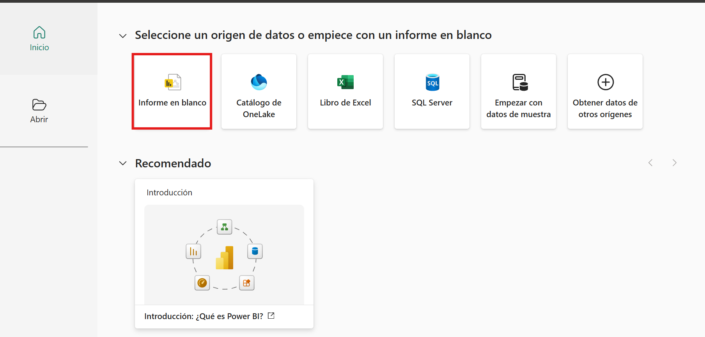
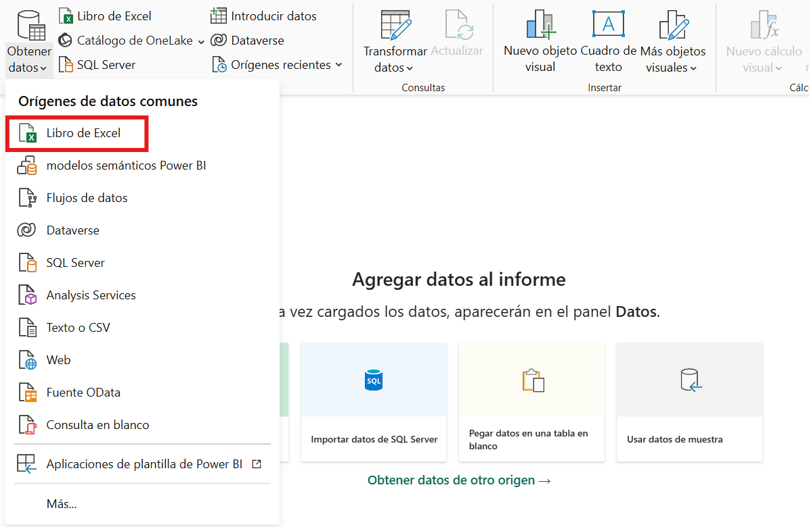
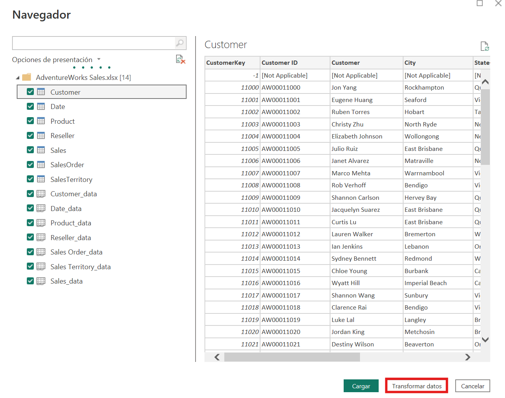
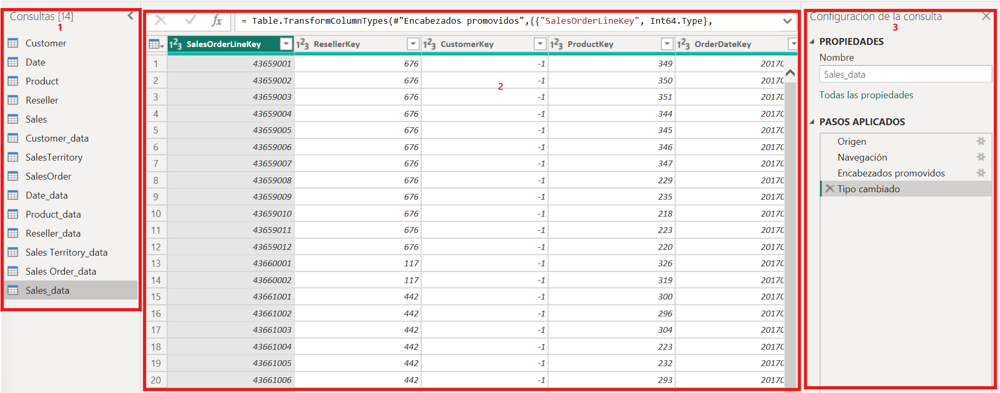
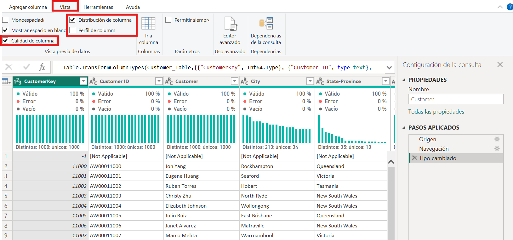
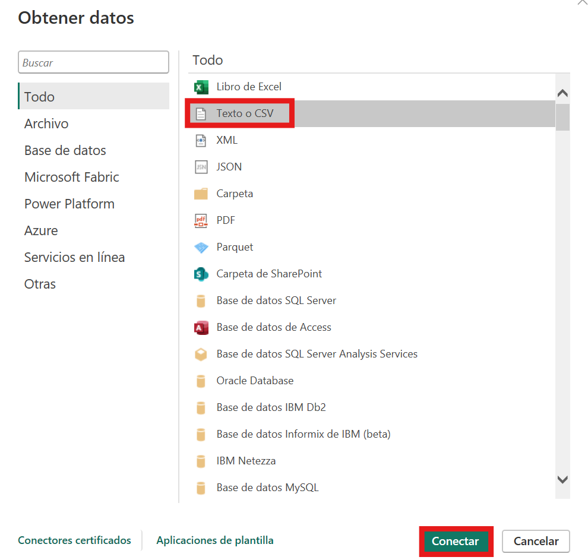
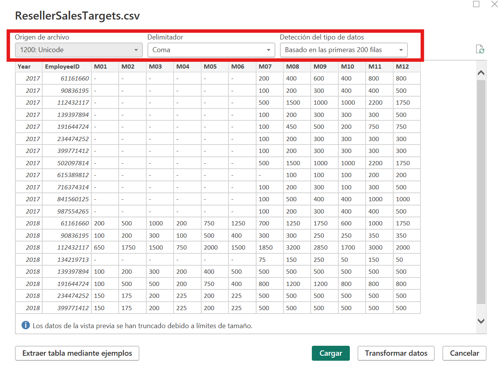
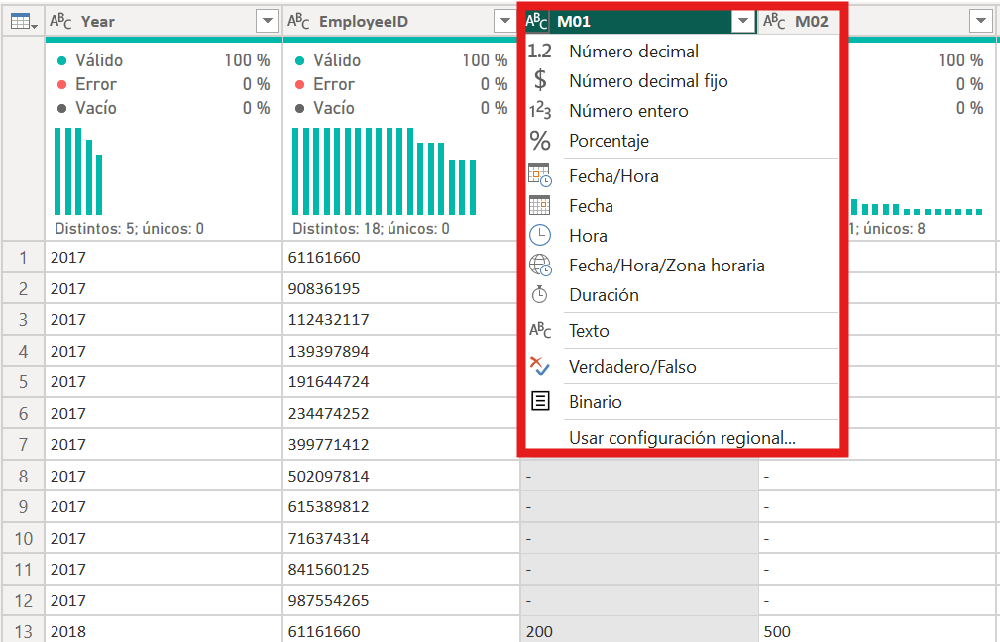

# Adquisición de datos en Power BI

## 1. Introdución

Este bloque está centrado exclusivamente na **adquisición de datos** en Power BI. A idea é aprender a conectarse a distintas fontes, revisar a vista previa dos datos e facer unha primeira avaliación da súa calidade antes de pasar á limpeza e á transformación.

Este enfoque segue a lóxica do laboratorio oficial **Get data in Power BI** de Microsoft Learn, pero adaptado ao material deste proxecto e ao ficheiro local [AdventureWorks Sales.xlsx](power-bi/data/AdventureWorks Sales.xlsx).

Neste documento imos traballar tres obxectivos:

- abrir Power BI Desktop e conectar fontes de datos
- revisar os datos na vista previa e en Power Query
- importar un segundo exemplo en `CSV`, facendo especial fincapé nos tipos de datos

---

## 2. Que fontes imos usar

Neste primeiro bloque práctico imos combinar dous tipos de fonte moi habituais.

### 2.1. Ficheiro Excel: Adventure Works

O ficheiro [AdventureWorks Sales.xlsx](power-bi/data/AdventureWorks Sales.xlsx) será a fonte principal deste bloque.

É unha boa opción para comezar porque:

- encaixa moi ben co ecosistema de exemplos de Microsoft
- contén varias táboas ou follas relacionadas co ámbito de vendas
- permite crecer máis adiante cara a modelado, DAX e dashboards
- é máis sinxelo de manexar nun primeiro laboratorio ca unha base de datos completa

### 2.2. Exemplo adicional en CSV: `ResellerSalesTargets.csv`

Ademais do Excel, interesa importar polo menos un ficheiro `CSV` porque é un formato moi frecuente e adoita mostrar con máis claridade certos problemas de estrutura.

Nun `CSV` é habitual ter que revisar con atención:

- o separador de campos
- a codificación
- o formato das datas
- a interpretación dos decimais
- o tipo de dato asignado automaticamente a cada columna

Por iso, o exemplo en `CSV` será útil para remarcar que **importar datos non é simplemente abrir un ficheiro**: hai que comprobar se Power BI os entendeu correctamente.

---

## 3. Laboratorio 1. Obter datos desde Excel

### Obxectivo

Importar datos desde o ficheiro Adventure Works e revisar a súa estrutura inicial.

### Paso 1. Abrir Power BI Desktop

Abre Power BI Desktop e crea un informe baleiro.



### Paso 2. Escoller a opción de obter datos

Na cinta principal, selecciona a opción `Obter datos`.

Entre as fontes dispoñibles, escolle `Excel`.



### Paso 3. Seleccionar o ficheiro

Localiza o ficheiro [AdventureWorks Sales.xlsx](power-bi/data/AdventureWorks Sales.xlsx) e ábreo.

Power BI mostrará o navegador de follas ou táboas dispoñibles no libro.

### Paso 4. Revisar o contido no navegador

Antes de cargar os datos, revisa con atención a vista previa.

Neste punto interesa observar:

- que follas ou táboas aparecen
- se os nomes son claros
- se a primeira fila se interpreta correctamente
- se hai columnas que xa parecen problemáticas



### Paso 5. Seleccionar varias táboas ou follas

Marca as táboas ou follas que se vaian usar no laboratorio.

Se o ficheiro trae varias estruturas relacionadas, é preferible seleccionar varias e pasar a `Transformar datos` en lugar de cargar directamente.

### Paso 6. Entrar en Transformar datos

Selecciona `Transformar datos` para abrir **Power Query**.

Isto permite inspeccionar mellor os datos antes de que entren no modelo.


---

## 4. Revisión inicial en Power Query

Unha vez aberta a fonte en Power Query, xa é posible facer unha primeira avaliación do contido.

### 4.1. Paneis principais

Ao entrar en Power Query convén identificar tres zonas:

1. panel esquerdo coas consultas cargadas
2. panel central coa vista previa dos datos
3. panel dereito coa configuración da consulta e os pasos aplicados




### 4.2. Vista previa dos datos

A vista previa permite detectar rapidamente cuestións como estas:

- columnas inesperadas
- valores baleiros
- texto onde debería haber números
- datas mal interpretadas
- nomes de campos pouco claros

Neste momento aínda non toca transformar a fondo, pero si facer unha lectura crítica dos datos.

### 4.3. Perfilado de datos

Seguindo a idea do laboratorio oficial de Microsoft, é moi recomendable activar as opcións de perfilado de datos en Power Query.

As máis útiles nesta fase son:

- calidade da columna
- distribución da columna
- perfil da columna

Estas opcións axudan a comprobar:

- porcentaxe de valores válidos, baleiros ou con erro
- número de valores distintos
- posibles inconsistencias nunha categoría



### 4.4. Que observar nesta revisión

Nesta primeira revisión interesa facerse preguntas como estas:

- hai columnas con moitos valores nulos?
- hai identificadores que parecen únicos?
- hai categorías escritas de formas distintas?
- hai campos numéricos que Power BI está tratando como texto?

Estas observacións serán moi útiles no seguinte documento, cando se aborde a limpeza e a transformación.

---

## 5. Laboratorio 2. Obter datos desde CSV

### Obxectivo

Importar o ficheiro `ResellerSalesTargets.csv` e comprobar como inflúe o formato da fonte na interpretación dos datos.

### Sobre o exemplo

Neste laboratorio empregarase o ficheiro `ResellerSalesTargets.csv`. É un exemplo sinxelo, pero moi útil didacticamente porque permite revisar como Power BI interpreta distintos tipos de datos nunha estrutura que aínda non está lista para análise directa.

O máis razoable é que conteña columnas como estas:

- `EmployeeID` ou identificador equivalente
- `Year`
- doce columnas mensuais, desde `M01` ata `M12`

Este tipo de estrutura é útil porque permite detectar con facilidade problemas como:

- números interpretados como texto
- códigos que non deben agregarse
- meses expresados cun formato pouco cómodo para a análise
- importes obxectivo que precisan revisión do tipo de dato

### Paso 1. Engadir unha nova fonte

Dentro de Power Query, usa `Nova fonte` e escolle `Text/CSV`.



### Paso 2. Seleccionar o ficheiro CSV

Abre o ficheiro `ResellerSalesTargets.csv` e revisa a vista previa.

Neste punto convén fixarse especialmente en:

- se o separador se detectou ben
- se os nomes das columnas aparecen correctamente
- se os valores de `Target` se interpretan como importes
- se `Year` e `MonthNumber` parecen campos numéricos ou textuais



Como se pode observar, é moi común que os meses aparezan como texto e os importes como texto tamén, o que xa indica que haberá que revisar os tipos de datos. Tamén se pode concluír que hai moitas filas con valores ausentes, probablemente porque non hai datos para algúns meses en concreto.

Neste caso, o separador de campos é correcto, pero en outros casos pode ser necesario axustalo manualmente na barra superior, na que tamén se pode revisar a codificación do ficheiro e as filas que se van ter en conta para inferir os tipos de datos.

### Paso 3. Revisar os tipos de datos asignados

No caso de `ResellerSalesTargets.csv`, Power BI adoita inferir os tipos automaticamente, pero esa asignación non sempre é correcta.

Hai que comprobar con atención se cada columna foi interpretada como:

- texto
- número enteiro
- número decimal
- data
- valor lóxico



Como se pode observar, os campos dos meses foron inferidos como texto, o que non é o máis axeitado para a análise. Isto é un erro común en ficheiros `CSV` e adoita ter unha causa clara: os valores ausentes non aparecen como nulos reais, senón como o texto `"-"`. Ao existir texto na columna, Power BI tende a inferila como texto en lugar de como número.

Antes de cambiar o tipo de dato, convén facer esta corrección en Power Query:

- seleccionar as columnas mensuais afectadas
- usar `Transformar -> Substituír valores`
- buscar o valor `-`
- substituílo por `null`

En linguaxe M, ese paso pode quedar así:

```powerquery
= Table.ReplaceValue(
    #"Paso anterior",
    "-",
    null,
    Replacer.ReplaceValue,
    {"M01", "M02", "M03", "M04", "M05", "M06", "M07", "M08", "M09", "M10", "M11", "M12"}
)
```

Despois desta substitución, xa se pode asignar a esas columnas un tipo numérico adecuado. Esta orde é importante: primeiro hai que converter os marcadores de ausencia en `null`, e só despois cambiar o tipo de dato.
### Paso 4. Por que os tipos de datos son tan importantes

Este punto merece unha énfase especial.

Os tipos de datos afectan directamente a cuestións como estas:

- que operacións se poden facer sobre unha columna
- como se ordenan os valores
- se unha data pode empregarse nun eixo temporal
- se un importe pode sumarse correctamente
- se unha columna pode actuar como identificador ou categoría

Algúns erros habituais neste tipo de ficheiro son estes:

- meses ou códigos como `M01`, `M02` ou similares importados como texto sen máis preparación
- importes obxectivo importados como texto por mor do separador decimal
- identificadores numéricos interpretados como valores para sumar cando en realidade son claves

Neste laboratorio convén insistir en que unha importación aparentemente correcta pode estar mal desde o punto de vista analítico se os tipos de datos non se revisan.

---

## 6. Comparación entre Excel e CSV

Despois de probar ambos casos, pódense extraer varias conclusións útiles.

### Excel

Adoita ser unha fonte máis cómoda para comezar porque:

- conserva mellor certa estrutura tabular
- pode incluír varias follas
- resulta familiar para moito alumnado

### CSV

É moi útil para aprender porque deixa máis visibles problemas como:

- separadores incorrectos
- falta de metadatos
- ambigüidade nos tipos de datos
- necesidade de revisar mellor a interpretación automática

Por iso, combinar Excel e CSV nun primeiro bloque é unha boa decisión didáctica.

---

## 7. Resultado esperado deste bloque

Ao rematar este documento deberías ser capaz de:

- abrir Power BI Desktop e importar datos
- seleccionar unha fonte adecuada
- revisar a vista previa da importación
- entrar en Power Query para inspeccionar os datos
- usar o perfilado básico de columnas
- detectar problemas iniciais de calidade e de tipo de dato

Aínda non se trata de transformar os datos a fondo. O obxectivo aquí é **entender a adquisición de datos e facer unha primeira avaliación crítica da fonte**.

