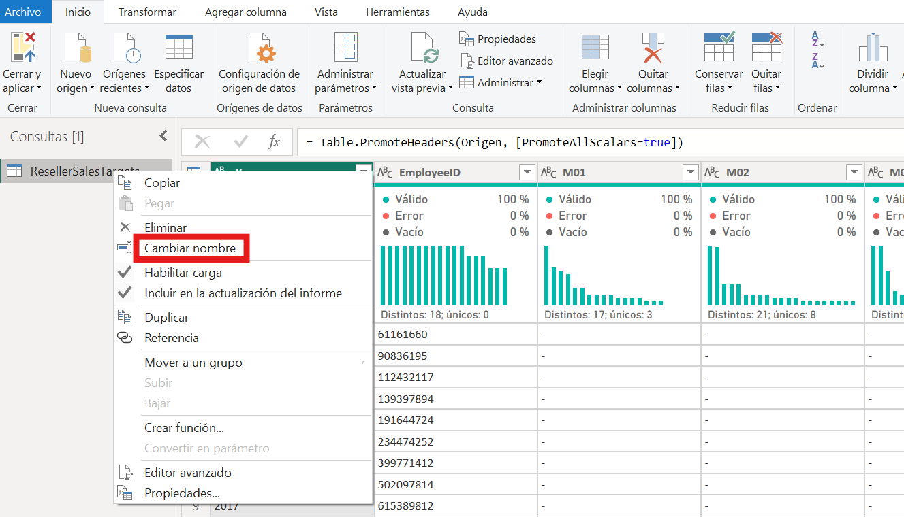
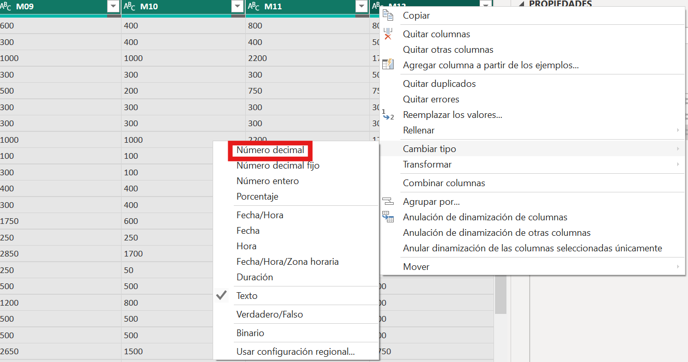
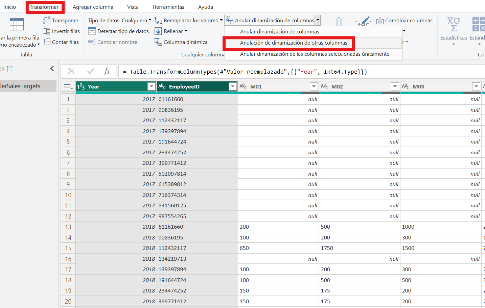
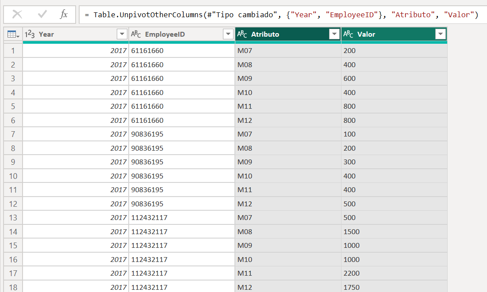
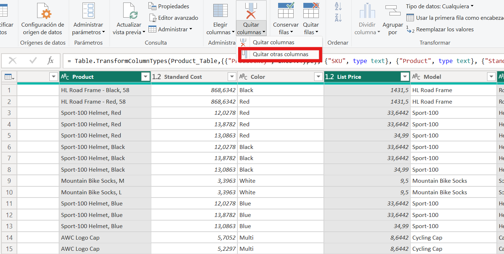
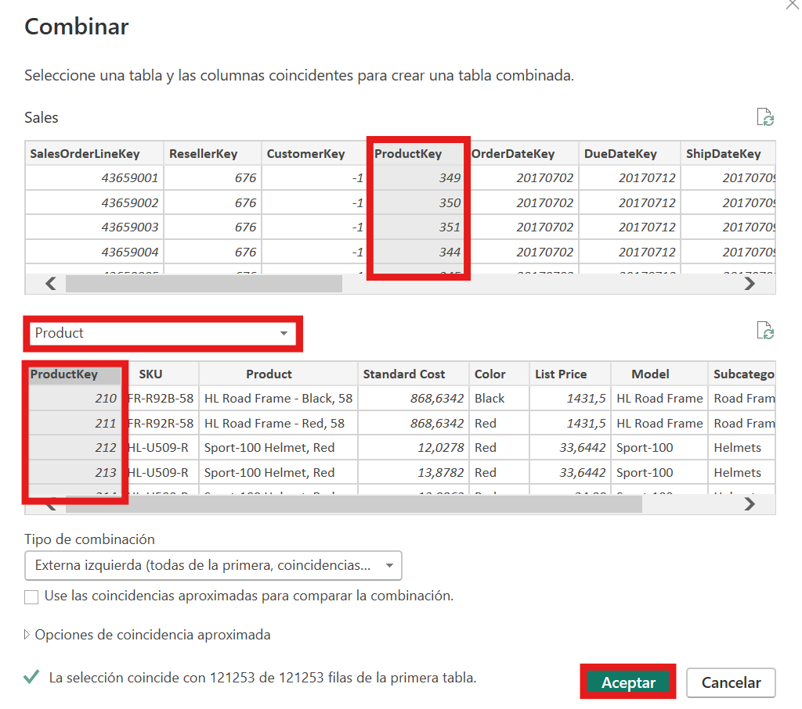
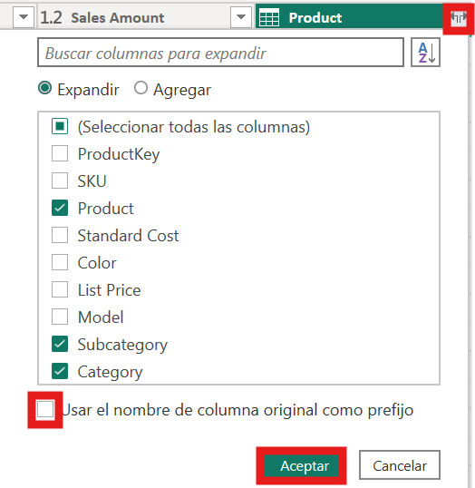
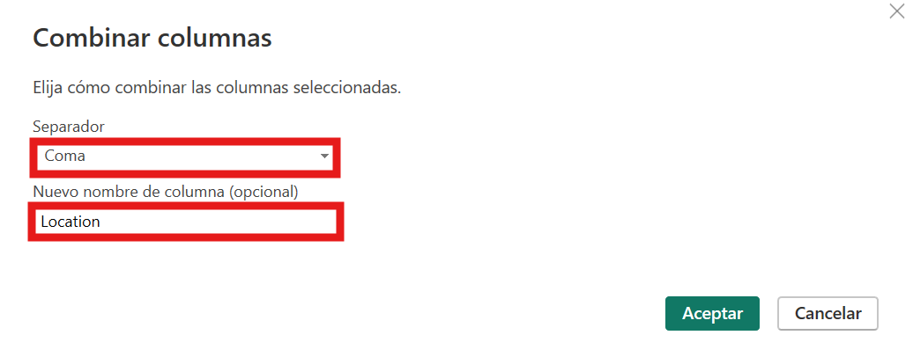
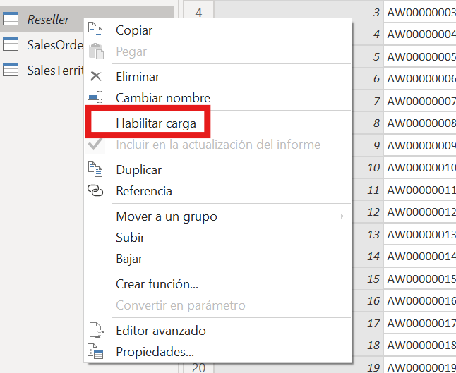

# Limpeza, transformación e carga de datos en Power BI

## 1. Introdución

Unha vez importadas as fontes, o seguinte paso é preparar os datos para que poidan cargarse correctamente no modelo. Esta fase inclúe tarefas de limpeza, selección de columnas, corrección de valores, reestruturación da información e definición adecuada dos tipos de datos.

Neste documento imos seguir un enfoque parecido ao dos laboratorios de Microsoft: partir dun caso real, detectar os problemas principais e ir aplicando transformacións en Power Query ata deixar os datos listos para a análise.

O exemplo principal será o ficheiro `ResellerSalesTargets.csv`, porque permite ver con claridade varios problemas moi habituais:

- valores ausentes representados como `"-"`
- columnas mensuais `M01` a `M12`
- tipos de dato inferidos de forma incorrecta
- unha estrutura pouco cómoda para analizar directamente

De forma complementaria, nalgúns puntos tamén se farán referencias ao ficheiro `AdventureWorks Sales.xlsx`, sobre todo para operacións como eliminar columnas, expandir información relacionada ou combinar columnas.

---

## 2. Que se vai traballar

Neste bloque van aparecer transformacións moi habituais en Power BI:

- renomear consultas e columnas
- revisar e corrixir valores nulos ou inconsistentes
- cambiar tipos de datos
- despivotar columnas
- crear columnas máis útiles para a análise
- eliminar columnas innecesarias
- decidir que consultas cargan ao modelo

Ao final do proceso, os datos deberían quedar listos para pasar ao modelado.

---

## 3. Cambios que se van realizar sobre `ResellerSalesTargets.csv`

### 3.1. Abrir Power Query e revisar a situación inicial

Se xa tes importado o ficheiro `ResellerSalesTargets.csv` desde o documento anterior, abre Power Query coa opción `Transformar datos`.


Ao abrir o editor, convén identificar tres zonas:

1. o panel esquerdo coas consultas dispoñibles
2. o panel central coa vista previa dos datos
3. o panel dereito cos pasos aplicados


Nesta primeira revisión interesa observar que tipo de estrutura ten a consulta:

- unha columna identificadora, como `EmployeeID`
- unha columna para o ano
- varias columnas mensuais, desde `M01` ata `M12`
- valores `"-"` en meses sen dato

Esta observación xa permite adiantar unha idea importante: a táboa está pensada para gardar información, pero aínda non está na mellor forma para analizala en Power BI.

---

### 3.2. Renomear a consulta e entender que problema hai que resolver

Antes de transformar nada, é boa práctica renomear a consulta para que o seu nome sexa claro no modelo final.

Por exemplo, se Power BI importou a consulta co nome do ficheiro ou cun nome pouco expresivo, pódese cambiar por algo como `Reseller Sales Targets`.



Neste caso, o problema principal non é só de nomes: tamén hai cuestións de calidade e estrutura.

Se observas a táboa con atención, verás que:

- hai meses sen dato representados por `"-"`
- as columnas mensuais quedan como texto
- os meses están distribuídos en moitas columnas en vez de en filas

Isto significa que a consulta necesita varias transformacións antes de poder analizar obxectivos por mes, comparar anos ou relacionar esta información con outras táboas.

---

### 3.3. Corrixir os valores ausentes representados como `"-"`

Este é o primeiro paso importante do laboratorio.

En `ResellerSalesTargets.csv`, os meses sen valor non aparecen como `null`, senón como `"-"`. A consecuencia é que Power BI detecta as columnas mensuais como texto.

Para corrixilo:

1. selecciona as columnas `M01` a `M12` (pode facerse clic na cabeciera da primeira, manter `Shift` e facer clic na última)
2. abre `Transformar -> Substituír valores`
3. en `Valor que buscar`, escribe `-`
4. en `Substituír por`, indica `null`


Este paso é importante porque o problema non é só visual. Mentres a columna conteña texto, Power Query non poderá tratala correctamente como columna numérica.

En linguaxe M, o paso pode verse así:

```powerquery
= Table.ReplaceValue(
    #"Paso anterior",
    "-",
    null,
    Replacer.ReplaceValue,
    {"M01", "M02", "M03", "M04", "M05", "M06", "M07", "M08", "M09", "M10", "M11", "M12"}
)
```

Despois desta substitución, os valores ausentes xa quedan como nulos reais e a consulta está preparada para o seguinte paso.

---

### 3.4. Revisar e corrixir os tipos de datos

Unha vez substituído `"-"` por `null`, xa ten sentido revisar os tipos de datos.



Neste exemplo, convén comprobar especialmente:

- `EmployeeID`, para decidir se se trata como identificador ou como número
- `Year`, que normalmente debería quedar como número enteiro
- `M01` a `M12`, que deberían pasar a tipo numérico

O importante aquí é entender a orde correcta:

1. primeiro limpar os valores problemáticos
2. despois cambiar o tipo de dato

Se se intenta cambiar o tipo antes de substituír `"-"` por `null`, o resultado adoita ser unha columna con erros de conversión.

Este tipo de revisión é unha das tarefas máis importantes en Power Query. Un tipo mal asignado pode afectar a sumas, filtros, ordenacións e visualizacións posteriores.

---

### 3.5. Despivotar as columnas mensuais

Neste punto a táboa xa está máis limpa, pero segue tendo unha estrutura pouco cómoda para a análise: cada mes está nunha columna distinta.

Para resolver isto, o máis recomendable é aplicar `Unpivot Other Columns`.

O procedemento habitual é:

1. seleccionar as columnas que deben manterse fixas, por exemplo `EmployeeID` e `Year`
2. aplicar `Transformar -> Anular dinamización doutras columnas`



O resultado será unha estrutura moito máis útil:

- unha columna co nome do mes, normalmente `Atributo`
- outra columna co valor do obxectivo, normalmente `Value`



Esta transformación é clave porque deixa os datos nun formato moito máis analítico. A partir de aquí xa é posible filtrar por mes, agrupar, crear relacións ou facer visualizacións temporais con máis facilidade.

---

### 3.6. Renomear columnas e deixar a estrutura lista para análise

Despois do despivotado, convén renomear as columnas resultantes para que sexan máis claras.

Unha opción razoable sería:

- `Attribute` -> `Month`
- `Value` -> `Target`

Tamén pode ser boa idea revisar se o formato do mes é suficiente para o que se quere facer despois. Por exemplo, `M01`, `M02` e similares poden servir nun primeiro momento, aínda que máis adiante se podería crear unha columna adicional con número de mes ou mesmo cun nome máis descritivo.

O importante agora é que a táboa xa ten unha forma moito máis útil:

- unha fila por persoa e mes
- un campo temporal identificable
- un valor numérico listo para agregación

---

### 3.7. Revisar se fan falta máis transformacións

Antes de cargar, convén facer unha comprobación xeral da consulta:

- hai columnas que xa non achegan nada?
- hai nomes pouco claros?
- hai nulos esperables ou nulos que revelan un problema?
- a vista de perfilado mostra erros?

Nesta fase tamén se pode valorar se convén crear algunha columna adicional. Por exemplo:

- extraer o número de mes a partir de `M01`, `M02`...
- crear unha etiqueta máis lexible para informes

Non sempre fai falta facelo aquí. O importante é non engadir transformacións porque si, senón porque resolven unha necesidade concreta.

Para este laboratorio, imos facer unha transformación adicional na columna do mes. Eliminaremos a letra `M` dos valores (`M01`, `M02`...) para conservar só o número do mes, e despois cambiaremos o tipo de dato desa columna a enteiro. A columna manterase co nome `Month`.

Tamén renomearemos a columna `Value` a `Target`, para que represente con máis claridade o significado do dato.

---

### 3.8. Pechar e aplicar

Cando a consulta xa está limpa e coa estrutura adecuada, o seguinte paso é pechar Power Query e aplicar os cambios.

A partir dese momento, a táboa xa estará lista para pasar ao modelado de datos.

---

## 4. Cambios sobre `AdventureWorks Sales.xlsx`

O ficheiro `ResellerSalesTargets.csv` é moi bo para explicar limpeza, tipos e despivotado, pero non cobre todos os patróns habituais de Power Query. Por iso, pódese completar este bloque con algúns exemplos tomados de `AdventureWorks Sales.xlsx`.

Neste libro aparecen consultas como `Sales`, `Product`, `Reseller`, `Customer`, `Date` e `Sales Territory`. A idea non é transformalas todas a fondo, senón usar algunhas para practicar operacións concretas moi habituais.

### 4.1. Eliminar columnas innecesarias

Moitas veces unha táboa trae máis columnas das que realmente se van usar. Eliminar as que non aportan valor axuda a simplificar o modelo e reduce ruído.

Un exemplo moi claro é `Product`. Se o obxectivo é analizar vendas por produto e categoría, pode ser suficiente conservar columnas como:

- `ProductKey`
- `Product`
- `Subcategory`
- `Category`
- `List Price`

E eliminar outras que non vaian utilizarse neste momento, como por exemplo:

- `SKU`
- `Standard Cost`
- `Color`
- `Model`

Un bo criterio práctico é deixar só as columnas que van participar en relacións, filtros, agrupacións ou etiquetas visibles nos informes.



### 4.2. Expandir información relacionada

Un caso moi útil é partir da consulta `Sales` e engadirlle información máis descritiva desde outras consultas.

Por exemplo, pódese facer unha combinación entre:

- `Sales` e `Product` mediante `ProductKey`

O procedemento sería este:

1. abre a consulta `Sales`
2. vai á cinta `Inicio` e escolle a opción `Combinar consultas`
3. na xanela de combinación, selecciona `Sales` como primeira táboa e `Product` como segunda
4. marca a columna `ProductKey` en ambas táboas
5. deixa o tipo de combinación como `Left Outer`, para conservar todas as filas de `Sales`
6. preme `Aceptar`



Despois da combinación aparecerá en `Sales` unha nova columna asociada á táboa `Product`.

O seguinte paso é expandir esa columna:

1. preme na icona de expansión da nova columna
2. escolle os campos que queres incorporar
3. para este exemplo, selecciona:

- `Product`
- `Subcategory`
- `Category`

4. se non che interesa que Power Query engada prefixos longos aos nomes, desmarca a opción correspondente
5. preme `Aceptar`

Isto permite que a táboa de vendas non quede só con chaves numéricas, senón tamén con atributos útiles para a análise.

Se se quere ampliar o exercicio, tamén se pode facer algo semellante entre:

- `Sales` e `Reseller` mediante `ResellerKey`

E expandir campos como `Reseller`, `Business Type` ou `Country-Region`.



### 4.3. Combinar columnas

Outra transformación frecuente é combinar varias columnas para construír un campo máis útil nos informes.

Neste caso pódese traballar coa consulta `Reseller` para crear unha columna de localización a partir de varios datos xeográficos.

O procedemento sería este:

1. abre a consulta `Reseller`
2. selecciona as columnas `City`, `State-Province` e `Country-Region`
3. vai á cinta `Agregar columna` e escolle `Combinar columnas`
4. no cadro de diálogo, escolle un separador adecuado, por exemplo `, `
5. escribe como nome da nova columna `Location`
6. preme `Aceptar`



O resultado pode quedar con valores como:

- `Seattle, Washington, United States`

Este tipo de campo é útil para táboas, filtros ou etiquetas de mapas, e evita ter que arrastrar tres columnas por separado en cada visualización.

Convén revisar dous aspectos despois da combinación:

- que a orde das columnas sexa a correcta antes de combinar
- que o separador escollido deixe un resultado claro e lexible

Se se queren conservar tamén as columnas orixinais, é mellor facer esta operación desde `Agregar columna`. Se se fai desde `Transformar`, Power Query combinará as columnas seleccionadas e substituirá o resultado polas anteriores.

Neste exemplo adoita ser máis interesante conservar os campos orixinais e engadir `Location` como columna adicional, porque así a consulta segue tendo detalle suficiente e ao mesmo tempo incorpora un campo máis cómodo para os informes.

### 4.4. Decidir que consultas cargan ao modelo

Non todas as consultas teñen por que cargarse como táboas do modelo.

Ás veces unha consulta serve só como apoio intermedio, por exemplo para preparar outra, combinar datos ou facer unha expansión. Nese caso pódese desactivar a carga ao modelo final.

Aquí "desactivar a carga" non significa eliminar a consulta. O habitual é facer clic dereito sobre a consulta e desmarcar a opción `Habilitar carga` (`Enable load`). Deste xeito a consulta segue existindo en Power Query, pero xa non se carga como táboa no modelo final.

Eliminar a consulta sería outra cousa distinta: nese caso desaparecería por completo. Neste apartado interesa a primeira opción, non a segunda.

Neste exemplo, unha opción razoable sería manter cargada a consulta `Sales` e desactivar a carga de consultas auxiliares como `Product` ou `Reseller` se se usan só para expandir información e non se van analizar de forma independente no modelo final.


Esta decisión axuda a:

- evitar táboas redundantes
- manter o modelo máis limpo
- reducir confusión no panel de campos

### 4.5. Axustar `Month` e `MonthKey` en `Date` (AdventureWorks)

Para os seguintes bloques (modelado e DAX), convén deixar ben preparados os campos temporais da táboa `Date`.

Pasos recomendados:

1. comproba que `Month` é un campo de texto (etiqueta de mes)
2. comproba que `MonthKey` é numérico
3. xa en Power BI Desktop (vista `Datos` ou `Modelo`, non en Power Query), selecciona `Month` e aplica `Ordenar por columna -> MonthKey`

Este axuste evita desordes nos meses cando se fan validacións en matrices ou cálculos temporais.

---

## 5. Ideas clave

Ao rematar este documento deberías quedar con varias ideas claras:

- Power Query serve para construír un proceso reproducible de preparación dos datos.
- Os valores ausentes deben representarse correctamente como `null`.
- Os tipos de datos non se deben aceptar sen revisión.
- O despivotado é fundamental cando os meses ou categorías veñen en columnas.
- Non todas as consultas teñen que cargarse ao modelo final.
