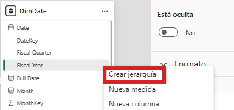
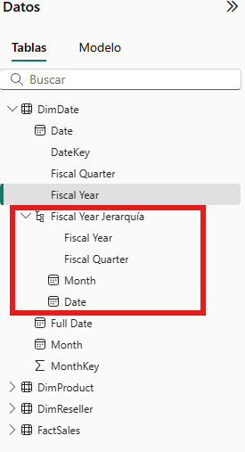
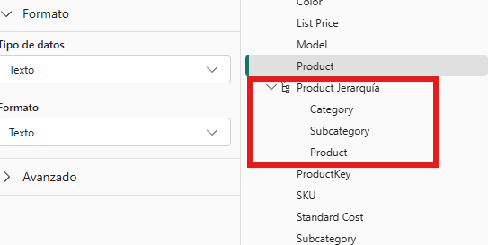
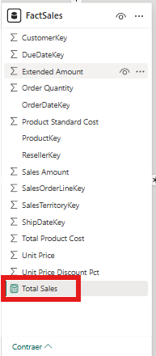
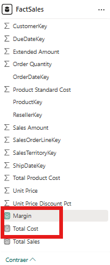
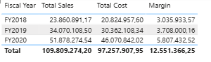

# Modelado de datos en Power BI

## 1. Contexto e obxectivo

### 1.1. Introdución

Unha vez importados e preparados os datos, o seguinte paso é organizar as táboas dentro dun modelo que resulte claro, eficiente e útil para a análise. Nesta fase xa non se trata tanto de limpar valores ou transformar columnas, senón de decidir que papel cumpre cada táboa e como se relaciona co resto.

Neste documento imos seguir un enfoque parecido ao dos laboratorios de Microsoft Learn: partir dun conxunto de táboas xa preparadas, identificar unha táboa de feitos e varias dimensións, construír un modelo en estrela e revisar as relacións antes de pasar a medidas e visualizacións.

### 1.2. Que se vai traballar

Neste bloque van aparecer tarefas moi habituais de modelado en Power BI:

- distinguir entre táboa de feitos e dimensións
- introducir a idea de modelo en estrela
- renomear consultas para que reflictan o seu papel no modelo
- crear relacións entre táboas
- revisar cardinalidade e dirección de filtro
- definir boas prácticas de táboa de datas
- crear xerarquías de campos útiles para navegar os datos
- introducir medidas básicas como ponte cara a DAX

Ao final do proceso, o modelo debería quedar preparado para crear medidas, filtros e visualizacións con máis sentido analítico.

### 1.3. Dataset e alcance

O ficheiro principal deste bloque será `AdventureWorks Sales.xlsx`, porque contén varias táboas relacionadas co ámbito de vendas e permite construír un modelo bastante realista sen complicar demasiado o escenario.

Neste documento imos centrarnos no modelado. A parte de DAX avanzada quedará para o seguinte bloque.

---

## 2. Fundamentos de modelado

### 2.1. Táboa de feitos e dimensións

Nun modelo analítico adoitan existir dous tipos de táboas:

- táboa de feitos: contén os rexistros principais da actividade (por exemplo, vendas)
- dimensións: achegan contexto para analizar eses feitos (tempo, produto, cliente, territorio...)

No caso de `AdventureWorks`, unha proposta moi razoable sería:

- `FactSales` como táboa central
- `DimDate` para o contexto temporal
- `DimProduct` para o contexto de produto
- `DimReseller` para o contexto comercial

Máis adiante, se interesa ampliar o modelo, tamén se poderían incorporar outras dimensións como `DimCustomer` ou `DimSalesTerritory`.

### 2.2. Modelo en estrela

Un dos deseños máis habituais en BI é o **modelo en estrela**. A idea básica é organizar o modelo arredor dunha táboa central de feitos e varias dimensións conectadas a ela.


O importante nesta fase non é memorizar unha definición abstracta, senón entender a lóxica do deseño:

- os indicadores principais viven na táboa de feitos
- as dimensións serven para cortar, filtrar e agrupar a análise
- as relacións deben estar organizadas de forma clara arredor da táboa central

### 2.3. Granularidade da táboa de feitos

Antes de crear relacións convén definir unha idea clave: **a granularidade**.

A granularidade responde á pregunta: "que representa exactamente cada fila da táboa de feitos?"

No noso caso, unha definición típica sería:

- unha fila en `FactSales` representa unha liña de venda para un produto, nunha data e para un revendedor concreto

Se esta definición non queda clara, é máis fácil atopar duplicados, sumas incorrectas ou medidas inconsistentes.

---

## 3. Construción do modelo base

### 3.1. Selección de táboas mínimas

As consultas mínimas recomendables para este exemplo son:

- `Sales`
- `Date`
- `Product`
- `Reseller`

Se no teu Power BI aparecen máis consultas, non pasa nada. O importante é centrarse primeiro nestas catro para construír unha estrela mínima e comprensible.

### 3.2. Renomeado funcional das táboas

Ao comezar a modelar, convén que os nomes das consultas deixen claro se se trata dunha táboa de feitos ou dunha dimensión.

Unha proposta moi habitual sería:

- `Sales` -> `FactSales`
- `Date` -> `DimDate`
- `Product` -> `DimProduct`
- `Reseller` -> `DimReseller`

Este cambio non modifica os datos, pero mellora moito a lectura do modelo, especialmente cando se empeza a traballar con relacións, medidas e visualizacións.

O procedemento habitual sería:

1. ir ao panel esquerdo de consultas ou ao panel de campos
2. facer clic dereito sobre a táboa correspondente
3. escoller a opción de renomear
4. escribir o novo nome


### 3.3. Comprobación previa de tipos nas claves

Antes de crear relacións, convén facer unha comprobación rápida: as columnas clave que van participar nas unións (`ProductKey`, `DateKey`, `ResellerKey`...) deberían ter tipos de dato compatibles entre táboas.

Se os tipos non coinciden, Power BI pode crear relacións incorrectas ou directamente non crealas.

### 3.4. Abrir a vista de modelo

Para crear e revisar relacións, o máis cómodo é cambiar á **vista de modelo**.

Nesa vista pódense ver as táboas como caixas separadas e debuxar visualmente as conexións entre elas.


---

## 4. Relacións do modelo

### 4.1. Relación entre `FactSales` e `DimProduct`

Neste caso, a relación faríase entre:

- `FactSales[ProductKey]`
- `DimProduct[ProductKey]`

O procedemento sería este:

1. na vista de modelo, localiza `FactSales` e `DimProduct`
2. arrastra `ProductKey` desde `FactSales` ata `ProductKey` en `DimProduct`
3. revisa o cadro de diálogo da relación

Nesa revisión convén comprobar:

- que a relación estea activa
- que a cardinalidade sexa `Varios a un (*:1)` desde `FactSales` cara a `DimProduct`
- que a dirección do filtro quede nun único sentido, desde a dimensión cara á táboa de feitos

Esas comprobacións tamén son necesarias no caso de que a relación se cree automaticamente ao cargar os datos, porque ás veces Power BI pode propoñer unha configuración que non é a máis adecuada para o modelo.


### 4.2. Relación entre `FactSales` e `DimDate`

O mesmo criterio aplícase á dimensión temporal.

Se o ficheiro xa trae claves como `OrderDateKey`, o máis natural é relacionar:

- `FactSales[OrderDateKey]`
- `DimDate[DateKey]`

Se o laboratorio quere centrarse só nunha data principal, chega con crear unha única relación activa baseada en `OrderDateKey`.

Se existen outras claves de data en `FactSales` (por exemplo, envío ou entrega), pódense crear relacións adicionais pero deixalas inactivas para evitar ambigüidades no modelo.


### 4.3. Relación entre `FactSales` e `DimReseller`

Neste caso, a relación sería:

- `FactSales[ResellerKey]`
- `DimReseller[ResellerKey]`

O criterio de revisión é o mesmo:

- relación activa
- cardinalidade `*:1`
- filtro nun único sentido


### 4.4. Cardinalidade e dirección de filtro

Nun modelo en estrela, o máis habitual é:

- moitas filas na táboa de feitos
- unha fila por clave na dimensión

Iso adoita reflectirse como:

- `FactSales` no lado `*`
- cada dimensión no lado `1`

Un punto crítico é que as chaves das dimensións (`DimProduct[ProductKey]`, `DimDate[DateKey]`, `DimReseller[ResellerKey]`) non deberían ter duplicados.

Como criterio xeral, neste exemplo interesa manter a dirección de filtro nun único sentido. Nunha estrela simple, o comportamento esperado é que as dimensións filtren a táboa de feitos.

### 4.5. Relacións activas e inactivas

É habitual que unha táboa de feitos teña máis dunha data (`OrderDate`, `ShipDate`, `DeliveryDate`...).

Bo criterio práctico:

- deixar unha relación activa por defecto (a principal para o negocio)
- manter as demais como inactivas
- activar relacións alternativas só en medidas específicas cando sexa necesario

Este enfoque evita rutas ambiguas de filtro e fai o modelo máis previsible.


---

## 5. Calidade estrutural do modelo

### 5.1. Estrela limpa vs modelo enredado

Se o diagrama comeza a parecer confuso ou aparecen moitas conexións cruzadas, adoita ser un sinal de que o modelo se está afastando da lóxica dunha estrela simple.

Nesa situación convén revisar:

- se hai relacións innecesarias entre dimensións
- se se pode simplificar o modelo deixando `FactSales` como centro
- se algunhas táboas deberían quedar como auxiliares sen carga

### 5.2. Comprobación final do modelo

Antes de pasar a medidas e visuais, convén facer unha revisión final.

Neste punto debería comprobarse:

- que as táboas teñen nomes claros
- que as relacións importantes están creadas
- que a cardinalidade ten sentido
- que a dirección do filtro non introduce ambigüidades
- que o modelo resultante se entende visualmente como unha estrela sinxela

Tamén é boa idea revisar se hai táboas auxiliares que xa non interesa manter cargadas no modelo final.

---

## 6. Boas prácticas avanzadas

### 6.1. Táboa de datas (`DimDate`)

No modelo final, `DimDate` debería comportarse como táboa de datas de referencia.

Convén revisar:

- que a columna de data non teña ocos no rango que se vai analizar
- que non haxa duplicados na clave temporal
- que estea marcada como táboa de datas cando cumpra os requisitos

Isto axuda a que as análises temporais e as medidas de intelixencia temporal funcionen de forma consistente.

### 6.2. Xerarquías de campos

As xerarquías melloran moito a navegación dos visuais e permiten facer drill-down/drill-up sen ter que arrastrar cada campo por separado.

#### 6.2.1. Crear a xerarquía temporal en `DimDate` (paso a paso)

No caso deste modelo, en `DimDate` tes campos como `Date`, `DateKey`, `Fiscal Quarter`, `Fiscal Year`, `Full Date`, `Month` e `MonthKey`. Con estes campos, unha xerarquía fiscal práctica sería:

- `Fiscal Year -> Fiscal Quarter -> Month -> Date`

Pasos:

1. Vai á vista `Datos` ou á vista `Modelo`.
2. No panel de campos, localiza a táboa `DimDate`.
3. Fai clic dereito sobre `Fiscal Year` e escolle `Crear xerarquía`.
4. Renomea como `Fiscal Date Hierarchy`.
5. Arrastra dentro os campos `Fiscal Quarter`, `Month` e `Date`, nesa orde.
6. Comproba que a xerarquía final quede como `Fiscal Year -> Fiscal Quarter -> Month -> Date`.

Para evitar que os meses queden en orde alfabética:

1. Selecciona a columna `Month` (non a medida, nin a táboa completa).
2. Vai á vista `Datos`.
3. Na cinta superior, abre `Ferramentas de columna` e preme `Ordenar por columna`.
4. Escolle `MonthKey`.

Nota práctica:

- `DateKey` é técnico e normalmente non se inclúe na xerarquía.
- `Full Date` adoita ser redundante se xa usas `Date`.





#### 6.2.2. Crear a xerarquía de produto en `DimProduct` (paso a paso)

1. No panel de campos, localiza `DimProduct`.
2. Fai clic dereito en `Category` e escolle `Crear xerarquía`.
3. Renomea como `Product Hierarchy`.
4. Engade `Subcategory` e `Product` dentro desa xerarquía.
5. Verifica que a orde final sexa: `Category -> Subcategory -> Product`.



#### 6.2.3. Proba rápida da xerarquía nun visual

1. Nunha páxina do informe, escolle o visual `Gráfico de columnas agrupadas`.
2. Arrastra `Fiscal Date Hierarchy` a `Eixo X`.
3. Se xa creaches a medida, arrastra `Total Sales` a `Eixo Y`.
4. Se aínda non creaches a medida, arrastra `FactSales[Sales Amount]` a `Eixo Y` e deixa a agregación en `Suma`.
5. Usa os botóns de drill do visual para baixar de `Fiscal Year` a `Fiscal Quarter`, `Month` e `Date`.

Se o drill funciona ben, a xerarquía está correctamente configurada.

### 6.3. Dimensións conformadas

Se máis adiante incorporas novas táboas de feitos (por exemplo, obxectivos de venda), é recomendable reutilizar dimensións comúns (`DimDate`, `DimProduct`, `DimReseller`).

Este patrón coñécese como dimensións conformadas e facilita comparacións consistentes entre diferentes procesos de negocio.

### 6.4. Usabilidade e limpeza do panel de campos

Para mellorar a experiencia de quen consume o informe, convén:

- ocultar columnas técnicas de clave cando non se usan directamente en visuais
- manter nomes claros e consistentes (`Fact...`, `Dim...`)
- ordenar campos temporais (por exemplo, `MesNome` ordenado por `MesNum`)

### 6.5. Introdución breve a medidas

Aínda que o detalle de DAX vai no seguinte documento, neste punto xa ten sentido crear medidas base para validar o modelo.

#### 6.5.1. Crear `Total Sales` (paso a paso)

1. No panel de campos, selecciona `FactSales`.
2. Vai á cinta `Cálculos` (ou `Modelado`, segundo a versión) e preme `Nova medida`.
3. Escribe esta fórmula na barra DAX:

```DAX
Total Sales = SUM(FactSales[Sales Amount])
```

4. Preme `Enter`.
5. Revisa que apareza a calculadora xunto ao nome da medida.



#### 6.5.2. Crear `Total Cost` e `Margin` (paso a paso)

1. Preme de novo `Nova medida`.
2. Crea primeiro:

```DAX
Total Cost = SUM(FactSales[Total Product Cost])
```

3. Crea despois:

```DAX
Margin = [Total Sales] - [Total Cost]
```

4. Opcional pero recomendable: define formato monetario para as tres medidas.



#### 6.5.3. Validación rápida das medidas

1. Insire unha táboa visual na páxina do informe.
2. Engade `DimDate[Fiscal Year]`, `Total Sales`, `Total Cost` e `Margin`.
3. Comproba que os totais son coherentes e que `Margin` responde aos filtros por ano.
4. Proba tamén con `DimProduct[Category]` para verificar que os filtros das dimensións impactan nas medidas.



---

## 7. Peche do bloque

### 7.1. Checklist final antes de DAX

Antes de pasar ao seguinte documento, convén validar:

- granularidade de `FactSales` definida
- claves únicas nas dimensións
- relacións principais en `*:1`
- dirección de filtro en sentido único (dimensión -> feitos)
- `DimDate` preparada e marcada como táboa de datas cando corresponda
- xerarquías principais creadas
- medidas base de control con resultados coherentes

### 7.2. Ideas clave

Ao rematar este documento deberías quedar con varias ideas claras:

- modelar non é o mesmo ca limpar datos: aquí importa a estrutura do conxunto
- unha táboa de feitos contén os rexistros principais da actividade
- as dimensións achegan contexto para analizar eses rexistros
- o modelo en estrela é unha forma clara e moi habitual de organizar un modelo analítico
- antes de seguir con DAX convén revisar relacións, cardinalidade e dirección de filtro

### 7.3. Punto de continuidade

Unha vez construído e validado o modelo, o seguinte paso natural será crear **medidas e cálculos en DAX** para responder preguntas de negocio co informe.
