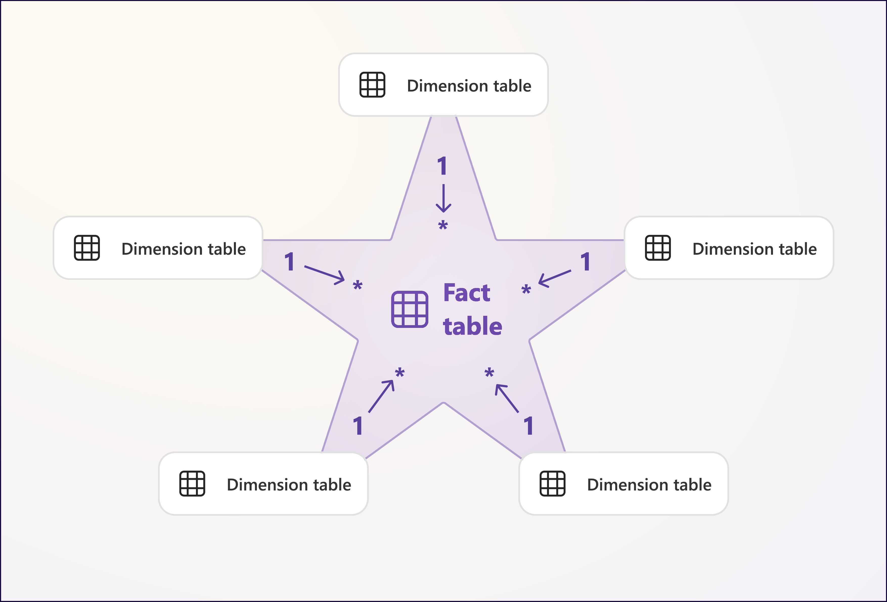
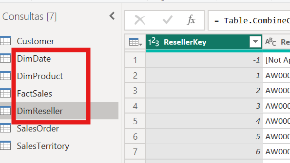
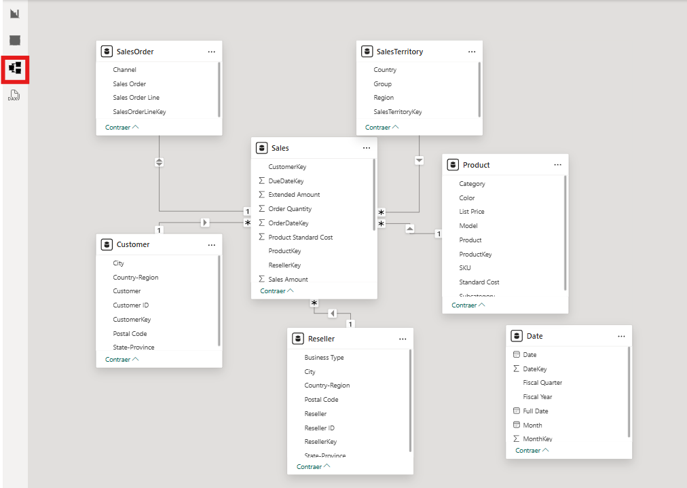
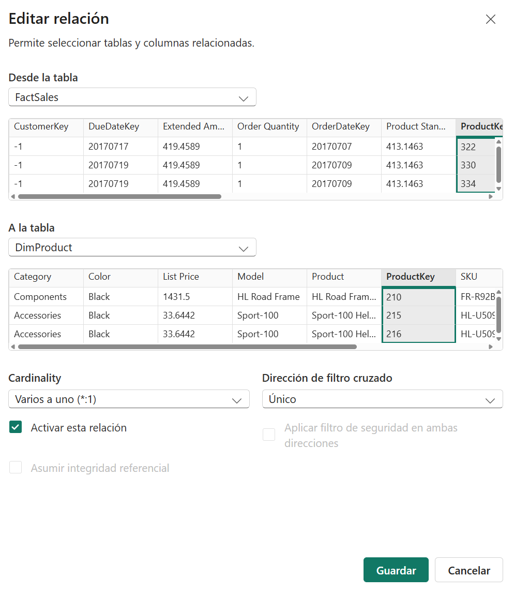
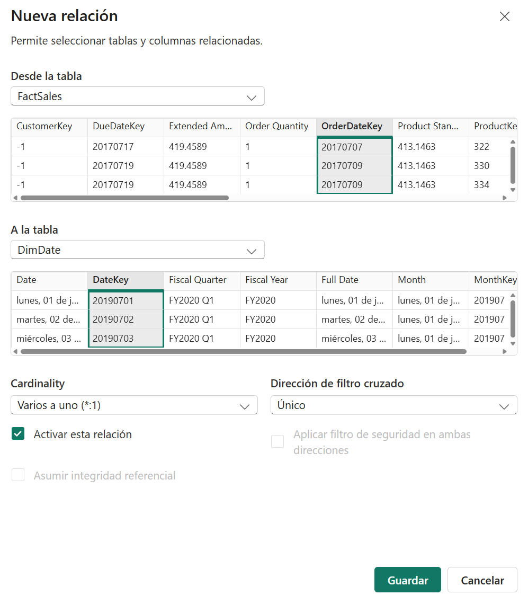
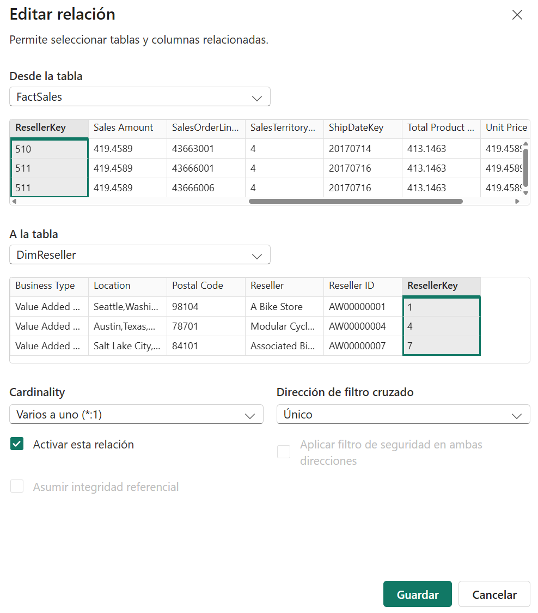
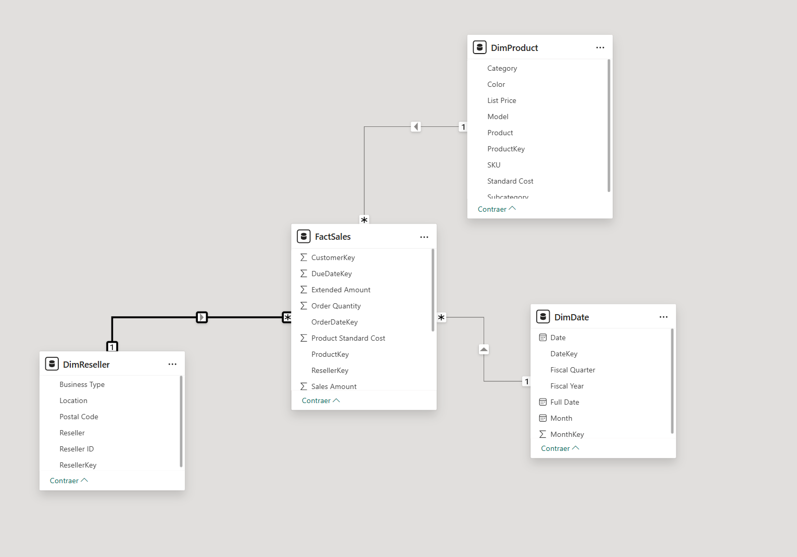

# Modelado de datos en Power BI

## 1. Introdución

Unha vez importados e preparados os datos, o seguinte paso é organizar as táboas dentro dun modelo que resulte claro, eficiente e útil para a análise. Nesta fase xa non se trata tanto de limpar valores ou transformar columnas, senón de decidir que papel cumpre cada táboa e como se relaciona co resto.

Neste documento imos seguir un enfoque parecido ao dos laboratorios de Microsoft Learn: partir dun conxunto de táboas xa preparadas, identificar unha táboa de feitos e varias dimensións, construír un modelo en estrela e revisar as relacións antes de pasar a medidas e visualizacións.

O ficheiro principal deste bloque será `AdventureWorks Sales.xlsx`, porque contén varias táboas relacionadas co ámbito de vendas e permite construír un modelo bastante realista sen complicar demasiado o escenario.

---

## 2. Que se vai traballar

Neste bloque van aparecer tarefas moi habituais de modelado en Power BI:

- distinguir entre táboa de feitos e dimensións
- introducir a idea de modelo en estrela
- renomear consultas para que reflictan o seu papel no modelo
- crear relacións entre táboas
- revisar cardinalidade e dirección de filtro
- comprobar o resultado na vista de modelo

Ao final do proceso, o modelo debería quedar preparado para crear medidas, filtros e visualizacións con máis sentido analítico.

---

## 3. Introdución ao modelo en estrela

Un dos deseños máis habituais en BI é o **modelo en estrela**. A idea básica é organizar o modelo arredor dunha táboa central de feitos e varias táboas de dimensións conectadas a ela.

Neste tipo de estrutura:

- a táboa de feitos contén os rexistros principais da actividade, por exemplo vendas, pedidos ou movementos
- as dimensións achegan contexto para analizar eses feitos, por exemplo datas, produtos, clientes ou territorios

No caso de `AdventureWorks`, unha proposta moi razoable sería:

- `FactSales` como táboa central
- `DimDate` para o contexto temporal
- `DimProduct` para o contexto de produto
- `DimReseller` para o contexto comercial

Máis adiante, se interesa ampliar o modelo, tamén se poderían incorporar outras dimensións como `DimCustomer` ou `DimSalesTerritory`.

O importante nesta fase non é memorizar unha definición abstracta, senón entender a lóxica do deseño:

- os indicadores principais viven na táboa de feitos
- as dimensións serven para cortar, filtrar e agrupar a análise
- as relacións deben estar organizadas de forma clara arredor da táboa central

---

## 4. Construír o modelo con `AdventureWorks Sales.xlsx`

Neste bloque imos partir das consultas importadas desde `AdventureWorks Sales.xlsx` e organizar unha primeira versión do modelo.

As consultas mínimas recomendables para este exemplo son:

- `Sales`
- `Date`
- `Product`
- `Reseller`

Se no teu Power BI aparecen máis consultas, non pasa nada. O importante é centrarse primeiro nestas catro para construír unha estrela mínima e comprensible.

### 4.1. Identificar a táboa de feitos

O primeiro paso é decidir cal será a táboa central do modelo.

Neste caso, a táboa que mellor encaixa como feito é `Sales`, porque contén rexistros de vendas e varias columnas numéricas que se poden agregar.

Por exemplo, nela aparecen campos como:

- `Order Quantity`
- `Unit Price`
- `Total Product Cost`
- `Sales Amount`

Isto fai que `Sales` sexa a mellor candidata para representar o feito principal do modelo.

### 4.2. Identificar as dimensións

Unha vez escollida a táboa central, toca revisar que consultas van achegar contexto á análise.

Neste exemplo, as dimensións máis claras serían:

- `Date`, para analizar as vendas ao longo do tempo
- `Product`, para analizar categorías, subcategorías e produtos
- `Reseller`, para analizar os socios comerciais e a súa localización

Estas táboas non conteñen o feito principal da venda, senón información que axuda a describilo e interpretalo.

### 4.3. Renomear as consultas para reflectir o seu papel

Ao comezar a modelar, convén que os nomes das consultas deixen claro se se trata dunha táboa de feitos ou dunha dimensión.

Unha proposta moi habitual sería:

- `Sales` -> `FactSales`
- `Date` -> `DimDate`
- `Product` -> `DimProduct`
- `Reseller` -> `DimReseller`

Este cambio non modifica os datos, pero mellora moito a lectura do modelo, especialmente cando se empeza a traballar con relacións, medidas e visualizacións.

O procedemento habitual sería:

1. ir ao panel esquerdo de consultas ou ao panel de campos
2. facer clic dereito sobre a táboa correspondente
3. escoller a opción de renomear
4. escribir o novo nome

---

## 5. Crear as relacións do modelo

Unha vez identificadas e renomeadas as táboas principais, o seguinte paso é construír as relacións entre elas.

### 5.1. Abrir a vista de modelo

Para crear e revisar relacións, o máis cómodo é cambiar á **vista de modelo**.

Nesa vista pódense ver as táboas como caixas separadas e debuxar visualmente as conexións entre elas.

### 5.2. Relación entre `FactSales` e `DimProduct`

Unha das relacións máis naturais é a que conecta as vendas cos produtos.

Neste caso, a relación faríase entre:

- `FactSales[ProductKey]`
- `DimProduct[ProductKey]`

O procedemento sería este:

1. na vista de modelo, localiza `FactSales` e `DimProduct`
2. arrastra `ProductKey` desde `FactSales` ata `ProductKey` en `DimProduct`
3. revisa o cadro de diálogo da relación

Nesa revisión convén comprobar:

- que a relación estea activa
- que a cardinalidade sexa `Varios a un (*:1)` desde `FactSales` cara a `DimProduct`
- que a dirección do filtro quede nun único sentido, desde a dimensión cara á táboa de feitos

Esas comprobacións tamén son necesarias no caso de que a relación se cree automaticamente ao cargar os datos, porque ás veces Power BI pode propoñer unha configuración que non é a máis adecuada para o modelo. Nese caso convén facer clic na relación e revisar os seus parámetros.

### 5.3. Relación entre `FactSales` e `DimDate`

O mesmo criterio aplícase á dimensión temporal.

Aquí haberá que decidir que chave usar. Se o ficheiro xa trae claves como `OrderDateKey`, o máis natural é relacionar:

- `FactSales[OrderDateKey]`
- `DimDate[DateKey]`

Se o laboratorio quere centrarse só nunha data principal, chega con crear unha única relación activa baseada en `OrderDateKey`.

### 5.4. Relación entre `FactSales` e `DimReseller`

Tamén interesa relacionar a táboa de feitos cos socios comerciais.

Neste caso, a relación sería:

- `FactSales[ResellerKey]`
- `DimReseller[ResellerKey]`

O criterio de revisión é o mesmo:

- relación activa
- cardinalidade `*:1`
- filtro nun único sentido

### 5.5. Revisar o conxunto das relacións

Unha vez creadas as relacións principais, convén parar un momento e revisar o modelo no seu conxunto.

Neste punto debería verse unha estrutura na que:

- `FactSales` queda no centro
- `DimProduct`, `DimDate` e `DimReseller` aparecen arredor
- cada dimensión se conecta coa táboa central
- non aparecen relacións innecesarias entre dimensións

Se o diagrama comeza a parecer confuso ou aparecen moitas conexións cruzadas, adoita ser un sinal de que o modelo se está afastando da lóxica dunha estrela simple.

---

## 6. Revisar cardinalidade e dirección de filtro

Crear a relación non chega: tamén hai que revisar se os seus parámetros son coherentes.

### 6.1. Cardinalidade

Nun modelo en estrela, o máis habitual é:

- moitas filas na táboa de feitos
- unha fila por clave na dimensión

Iso adoita reflectirse como:

- `FactSales` no lado `*`
- cada dimensión no lado `1`

Se Power BI propón outra cousa, convén revisar se hai claves duplicadas ou tipos mal definidos nalgunha dimensión.

### 6.2. Dirección de filtro

Como criterio xeral, neste exemplo interesa manter a dirección de filtro nun único sentido.

Isto axuda a:

- simplificar o comportamento do modelo
- evitar ambigüidades
- facer máis previsibles os filtros e as visualizacións

Nunha estrela simple, o comportamento esperado é que as dimensións filtren a táboa de feitos.

---

## 7. Comprobación final do modelo

Antes de pasar a medidas e visuais, convén facer unha revisión final.

Neste punto debería comprobarse:

- que as táboas teñen nomes claros
- que as relacións importantes están creadas
- que a cardinalidade ten sentido
- que a dirección do filtro non introduce ambigüidades
- que o modelo resultante se entende visualmente como unha estrela sinxela

Tamén é boa idea revisar se hai táboas auxiliares que xa non interesa manter cargadas no modelo final.

---

## 8. Ideas clave

Ao rematar este documento deberías quedar con varias ideas claras:

- modelar non é o mesmo ca limpar datos: aquí importa a estrutura do conxunto
- unha táboa de feitos contén os rexistros principais da actividade
- as dimensións achegan contexto para analizar eses rexistros
- o modelo en estrela é unha forma clara e moi habitual de organizar un modelo analítico
- antes de seguir con DAX ou visualizacións convén revisar relacións, cardinalidade e dirección de filtro

---

## 9. Punto de continuidade

Unha vez construído o modelo, o seguinte paso natural será crear **medidas e cálculos en DAX** para empezar a responder preguntas de negocio co informe.
