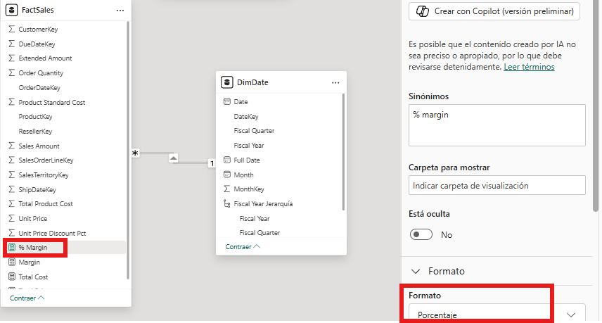
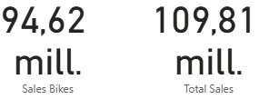
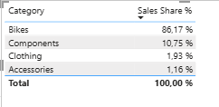
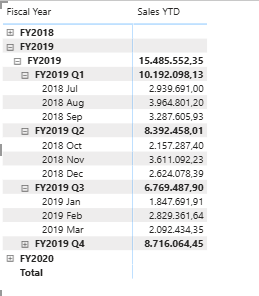
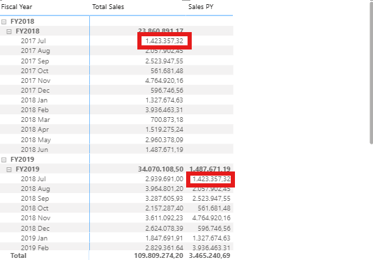
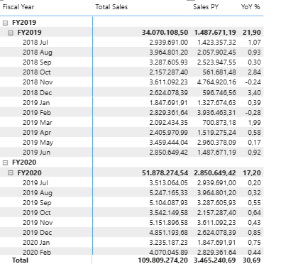

# Medidas e cálculos en DAX en Power BI

## 1. Introdución

Unha vez construído o modelo, o seguinte paso é definir medidas en DAX para responder preguntas de negocio con cálculos reutilizables.

Neste documento imos traballar cun enfoque práctico sobre o modelo do tema anterior (`FactSales`, `DimDate`, `DimProduct`, `DimReseller`), creando medidas paso a paso e validándoas en cada bloque.

---

## 2. Antes de empezar

### 2.1. Que imos usar

Neste documento asumimos que xa tes:

- relacións correctas entre `FactSales` e dimensións
- `DimDate` preparada como táboa temporal
- xerarquías creadas onde corresponda

### 2.2. Medida vs columna calculada

Antes de crear nada, lembra esta regra:

- **medida**: calcúlase en tempo de consulta e cambia segundo filtros
- **columna calculada**: calcúlase fila a fila ao cargar datos

Neste bloque imos traballar principalmente con **medidas**.

---

## 3. Sintaxe DAX esencial e funcións principais

Antes de entrar nos exercicios, convén ter unha referencia mínima de sintaxe.

Sintaxe base dunha medida:

```DAX
Nome da medida = <expresión>
```

Exemplo:

```DAX
Total Sales = SUM(FactSales[Sales Amount])
```

Funcións principais que se usan neste documento:

- `SUM`  
  Sintaxe: `SUM(<columna>)`  
  Que fai: suma os valores dunha columna numérica no contexto actual de filtros.  
  Exemplo: `SUM(FactSales[Sales Amount])`

- `DIVIDE`  
  Sintaxe: `DIVIDE(<numerador>, <denominador>[, <resultado_alternativo>])`  
  Que fai: divide dous valores controlando casos de divisor 0 ou baleiro, evitando erros.  
  Exemplo: `DIVIDE([Margin], [Total Sales], 0)`

- `CALCULATE`  
  Sintaxe: `CALCULATE(<expresión>, <filtro1>[, <filtro2>...])`  
  Que fai: recalcula unha expresión modificando o contexto de filtro (engadindo, substituíndo ou quitando filtros).  
  Exemplo: `CALCULATE([Total Sales], DimProduct[Category] = "Bikes")`

- `TOTALYTD`  
  Sintaxe: `TOTALYTD(<expresión>, <columna_data>[, <filtro>][, <fin_ano>])`  
  Que fai: devolve o acumulado no ano ata a data visible no contexto actual (natural ou fiscal, segundo `fin_ano`).  
  Exemplo: `TOTALYTD([Total Sales], DimDate[Date])`

- `FILTER`  
  Sintaxe: `FILTER(<táboa>, <expresión_lóxica>)`  
  Que fai: devolve unha táboa filtrada segundo unha condición lóxica.  
  Exemplo: `FILTER(ALL(DimDate), DimDate[MonthKey] = PrevMonthKey)`

- `ALL`  
  Sintaxe: `ALL(<táboa_ou_columna>)`  
  Que fai: elimina filtros da táboa/columna indicada para calcular totais de referencia.  
  Exemplo: `ALL(DimProduct[Category])`

Referencia oficial para ampliar:

- https://learn.microsoft.com/es-es/dax/

---

## 4. Medidas base (paso a paso)

### 4.1. Crear `Total Sales`

1. No panel de campos, selecciona `FactSales`.
2. Vai á cinta `Modelado` e preme `Nueva medida`.
3. Escribe:

```DAX
Total Sales = SUM(FactSales[Sales Amount])
```

4. Preme `Enter`.
5. Verifica que aparece coa icona de calculadora.


### 4.2. Crear `Total Cost`

1. Preme `Nueva medida`.
2. Escribe:

```DAX
Total Cost = SUM(FactSales[Total Product Cost])
```

3. Preme `Enter`.


### 4.3. Crear `Margin`

1. Preme `Nueva medida`.
2. Escribe:

```DAX
Margin = [Total Sales] - [Total Cost]
```

3. Preme `Enter`.


### 4.4. Crear `% Margin`

1. Preme `Nueva medida`.
2. Escribe:

```DAX
% Margin = DIVIDE([Margin], [Total Sales])
```

3. Coa medida `% Margin` seleccionada, vai ao panel dereito de `Propiedades` e en `Formato` escolle `Porcentaxe` (noutras versións tamén se pode facer desde a cinta).



---

## 5. Validación e contexto de filtro

O punto clave de DAX é que o resultado dunha medida depende do contexto de filtro.

Para validar as medidas base e entender este comportamento:

1. Insire unha táboa ou matriz.
2. Engade `DimDate[Fiscal Year]`, `DimProduct[Category]`, `Total Sales`, `Total Cost`, `Margin` e `% Margin`.
3. Comproba que `Margin = Total Sales - Total Cost` en cada fila.
4. No panel de filtros, limita `Fiscal Year` a un ano concreto e observa como cambian os resultados.
5. Quita o filtro e compara os totais co paso anterior.

Esta validación xa se introduciu no documento anterior; aquí reutilizamos a mesma referencia para manter continuidade.


---

## 6. `CALCULATE` paso a paso

`CALCULATE` é unha das funcións máis importantes de DAX porque permite avaliar unha expresión nun contexto de filtro modificado.

Idea práctica:

- sen `CALCULATE`, unha medida calcúlase cos filtros que xa existen no visual
- con `CALCULATE`, podes engadir, substituír ou quitar filtros para responder preguntas concretas

Sintaxe base:

```DAX
CALCULATE(<expresión>, <filtro1>, <filtro2>...)
```

No noso caso, `<expresión>` adoita ser `[Total Sales]` e os filtros poden vir de dimensións como produto ou data.

### 6.1. Vendas só de bicicletas (exemplo por categoría)

1. Crea unha nova medida.
2. Escribe:

```DAX
Sales Bikes =
CALCULATE(
    [Total Sales],
    DimProduct[Category] = "Bikes"
)
```

3. Valida a medida nunha tarxeta ou matriz.



### 6.2. Participación de vendas sobre o total

1. Crea unha nova medida:

```DAX
Sales Share % =
DIVIDE(
    [Total Sales],
    CALCULATE([Total Sales], ALL(DimProduct[Category]))
)
```

2. Formata como porcentaxe.
3. Valida por categoría e comproba que a suma se achega ao 100%.



---

## 7. Intelixencia temporal básica

Este bloque require unha boa táboa de datas.

### 7.1. Vendas acumuladas no ano (`Sales YTD`)

1. Crea unha medida:

```DAX
Sales YTD =
CALCULATE(
    [Total Sales],
    DATESYTD(DimDate[Date], "06/30")
)
```

2. Valida a medida nunha matriz con este procedemento:
   1. Nunha páxina do informe, insire o visual `Matriz` desde o panel de `Visualizaciones`.
   2. Arrastra `DimDate[Fiscal Year]` a `Filas`.
   3. Arrastra `DimDate[Month]` debaixo de `Fiscal Year` en `Filas` (para ver o detalle mensual dentro de cada ano).
   4. Arrastra a medida `Sales YTD` a `Valores`.
   5. Revisa que os importes se van acumulando mes a mes dentro de cada `Fiscal Year`.



### 7.2. Vendas do ano anterior (`Sales PY`)

Podes calcular `Sales PY` de dúas formas.

Opción A (recomendada se `DimDate` está marcada como táboa de datas):

```DAX
Sales PY =
CALCULATE(
    [Total Sales],
    SAMEPERIODLASTYEAR(DimDate[Date])
)
```

Opción B (alternativa manual con `MonthKey`, útil se aínda non tes ben pechada a táboa de datas):

```DAX
Sales PY =
SUMX(
    VALUES(DimDate[MonthKey]),
    VAR CurrMonthKey = DimDate[MonthKey]
    VAR PrevMonthKey = CurrMonthKey - 100
    RETURN
    CALCULATE(
        [Total Sales],
        FILTER(
            ALL(DimDate),
            DimDate[MonthKey] = PrevMonthKey
        )
    )
)
```

Comprobación (para calquera das dúas opcións):

1. usa unha matriz con `DimDate[Fiscal Year]` e `DimDate[Month]` en `Filas`.
2. en `Valores`, engade `Total Sales` e `Sales PY`.
3. comproba que para cada mes, `Sales PY` corresponde ao mesmo mes do ano anterior.
4. exemplo: se estás en `FY2020 - Jul`, `Sales PY` debería cadrar co `Total Sales` de `FY2019 - Jul`.
5. no primeiro ano dispoñible, é normal ver `BLANK` en `Sales PY` porque non hai ano previo.
6. revisa tamén o subtotal de `Fiscal Year` para confirmar que suma os meses equivalentes do ano anterior.



### 7.3. Variación interanual (`YoY %`)

1. Crea unha medida:

```DAX
YoY % =
DIVIDE(
    [Total Sales] - [Sales PY],
    [Sales PY]
)
```

2. Formata como porcentaxe.

3. Valida a medida nunha matriz:

   1. En `Filas`, engade `DimDate[Fiscal Year]` e `DimDate[Month]`.
   2. En `Valores`, engade `Total Sales`, `Sales PY` e `YoY %`.
   3. Comproba manualmente algunha fila coa fórmula:
      `YoY % = (Total Sales - Sales PY) / Sales PY`.
   4. Interpreta o sinal:
      - positivo: crecemento fronte ao ano anterior
      - negativo: caída fronte ao ano anterior
   5. Se `Sales PY` é baleiro ou 0, `YoY %` pode aparecer baleiro (comportamento esperado con `DIVIDE`).



---

## 8. Erros frecuentes e como evitalos

Erros típicos neste punto:

- crear `Margin` antes de crear `Total Cost`
- confundir medidas con columnas calculadas
- usar división directa en vez de `DIVIDE`
- esquecer formato de moeda/porcentaxe
- probar medidas sen contexto (sen dimensións en filas/columnas)

Se unha medida dá erro, revisa primeiro:

1. que os nomes das medidas sexan exactos
2. que os campos de columnas existen co mesmo nome
3. que estás creando unha medida (icona de calculadora)

---

## 10. Ideas clave

Ao rematar este bloque deberías quedar con estas ideas:

- DAX baséase no contexto de filtro
- as medidas son o núcleo da análise en Power BI
- `CALCULATE` permite cambiar o contexto para responder preguntas concretas
- as medidas temporais precisan unha táboa de datas consistente
