# Outras visualizacións en Power BI (6.B)

## 1. Introdución

Este documento complementa o tema con visualizacións adicionais non incluídas no documento principal.

O obxectivo é ampliar o catálogo visual para dar cobertura á maioría dos obxectos visuais de Power BI sen sobrecargar a páxina base, mantendo un enfoque práctico.

---

## 2. Preparación

Antes de crear estes visuais, comproba:

1. medidas dispoñibles: `Total Sales`, `Margin`, `% Margin`, `Sales YTD`, `Sales PY`, `YoY %`
2. relación activa para territorio: `FactSales[SalesTerritoryKey] -> DimSalesTerritory[SalesTerritoryKey]`
3. campos de `DimSalesTerritory`: `Country`, `Group`, `Region`, `SalesTerritoryKey`

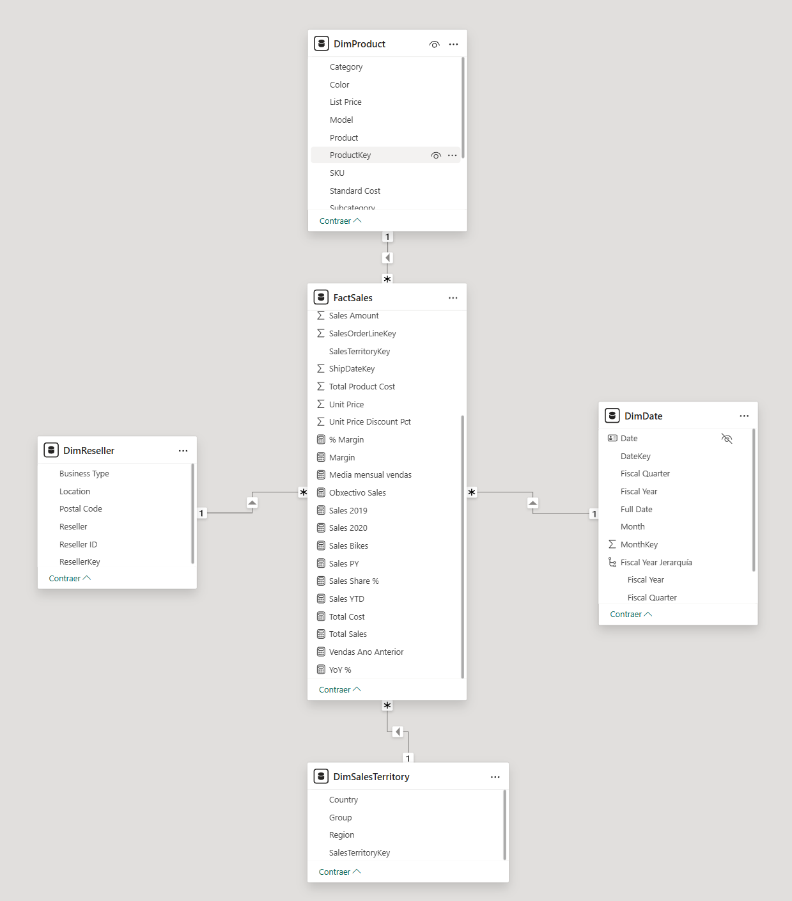

**Figura:** Preparación de campos e medidas para o bloque 6.B.

---

## 3. Mapa por país (recomendado)

Obxectivo: visualizar distribución de vendas por territorio nacional.

1. Insire o visual `Mapa` (ou `Mapa relleno`, segundo versión).
2. En `Ubicación`, engade `DimSalesTerritory[Country]`.
3. En `Tamaño`, engade `Total Sales`.
4. No formato:
   1. título: `Vendas por país`
   2. revisa cores e contraste

Comprobación:

1. verifica que aparecen países recoñecidos no mapa
2. comproba que os importes cambian ao aplicar filtros

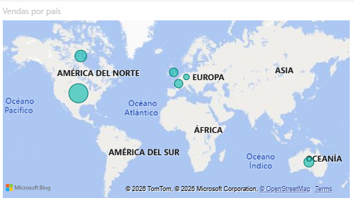

**Figura:** Mapa de vendas por país usando `DimSalesTerritory[Country]`.

Nota:

1. se o xeocodificado falla, usa categorías de datos adecuadas (`Country/Region`) no modelo.

---

## 4. Mapa por rexión comercial

Obxectivo: analizar o peso de cada rexión (`Region`) no total.

1. Duplica o mapa anterior.
2. Substitúe a localización por `DimSalesTerritory[Region]`.
3. Mantén `Total Sales` en `Valores`.
4. Se hai ambigüidade xeográfica, usa tamén `Country` en `Información sobre herramientas` para dar contexto.

Comprobación:

1. valida que `Northwest`, `Germany`, `Australia`, etc. quedan representadas de forma coherente
2. se algunha rexión non se posiciona ben, prioriza o visual de barras para comparación exacta

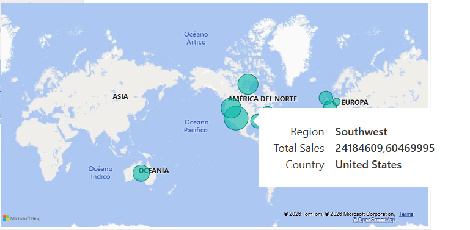

**Figura:** Mapa por rexión comercial con `DimSalesTerritory[Region]`.

---

## 5. Ribbon chart (cambio de ranking)

Obxectivo: ver como cambia a posición relativa das categorías no tempo.

1. Insire o visual `Gráfico de cintas` (`Ribbon chart`).
2. En `Eje X`, engade `DimDate[Month]`.
3. En `Leyenda`, engade `DimProduct[Category]`.
4. En `Valores`, engade `Total Sales`.

Comprobación:

1. revisa movementos de ranking entre meses
2. comproba que a lectura segue sendo clara con poucas categorías

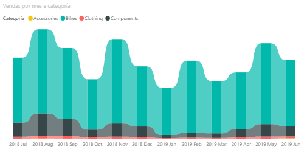

**Figura:** Cambio de ranking mensual por categoría.

---

## 6. Waterfall (composición da marxe)

Obxectivo: explicar como se constrúe a marxe entre ingresos e custo.

1. Insire o visual `Cascada` (`Waterfall`).
2. En `Categoría`, usa unha dimensión interpretativa (por exemplo `DimProduct[Category]`).
3. En `Valores`, usa `Margin`.
4. Opcional: crea unha versión por `Country` para comparar territorios.

Comprobación:

1. valida signos positivos/negativos
2. revisa que os totais cadran coa marxe agregada

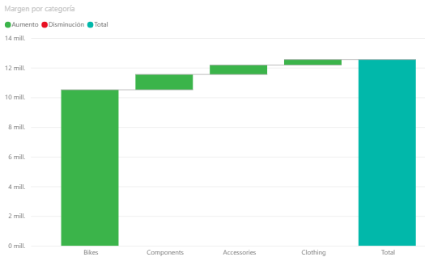

**Figura:** Visual de cascada para analizar `Margin`.

---

## 7. Scatter (relación vendas-marxe)

Obxectivo: detectar categorías/territorios con bo volume e boa rendibilidade.

1. Insire o visual `Dispersión`.
2. En `Eje X`, engade `Total Sales`.
3. En `Eje Y`, engade `Margin`.
4. En `Valores`, engade `DimProduct[Category]` (ou `DimSalesTerritory[Country]`).

Comprobación:

1. identifica puntos con altas vendas e alta marxe
2. revisa outliers con marxe baixa

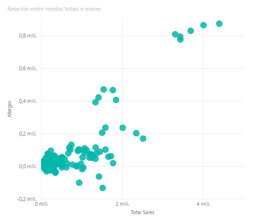

**Figura:** Relación entre `Total Sales` e `Margin`.

---

## 8. KPI de variación interanual

Obxectivo: resumir evolución co indicador `YoY %`.

1. Insire `Tarxeta` ou `KPI`.
2. Engade `YoY %` como medida principal.
3. Engade un filtro en `Filtros de esta página` para excluír o último ano dispoñible, xa que nese período non hai valores actuais e só hai referencia do ano previo.
4. Opcional: engade tendencia con `DimDate[Month]`.
5. Aplica formato porcentaxe e cores de estado.

Comprobación:

1. valida que o signo de `YoY %` coincide cos datos da matriz do tema 6
2. se aparece `-100%`, revisa que o filtro da páxina estea excluíndo o último ano incompleto

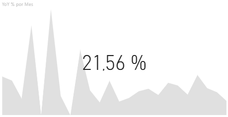

**Figura:** KPI de variación interanual (`YoY %`).

---

## 9. Gauge (cumprimento contra obxectivo)

Obxectivo: mostrar rapidamente o grao de cumprimento dun indicador fronte a unha referencia.

1. Crea estas medidas auxiliares en `Modelado -> Nueva medida`:

```DAX
Gauge Min = 0
Gauge Max = 1
Gauge Target Margin = 0.20
```

2. Insire o visual `Medidor` (`Gauge`).
3. En `Valor`, engade `% Margin`.
4. En `Valor mínimo`, engade `Gauge Min`.
5. En `Valor máximo`, engade `Gauge Max`.
6. En `Valor de destino`, engade `Gauge Target Margin`.
7. No formato:
   1. título: `Cumprimento da marxe`
   2. usa formato porcentaxe e decimais simples
   3. revisa contraste e cores de alerta

Comprobación:

1. valida que `% Margin` e o obxectivo están na mesma escala
2. se `% Margin` está modelada como porcentaxe estándar, lembra que `1 = 100%` e `0.20 = 20%`
3. comproba que o medidor cambia ao aplicar filtros por categoría ou territorio

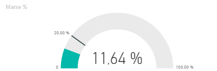

**Figura** : Gauge de `% Margin` cun obxectivo fixo.

Nota:

1. este visual é útil como resumo, pero non serve para análise detallada nin para comparar moitos elementos ao mesmo tempo
2. neste exemplo úsase unha meta fixa de `20%` por simplicidade didáctica; nun caso real, o destino podería vir dunha medida de obxectivo de negocio

---

## 10. Embudo (etapas ou caída entre categorías)

Obxectivo: representar unha secuencia descendente ou comparar categorías en orde de magnitude.

1. Insire o visual `Embudo` (`Funnel`).
2. En `Categoría`, engade unha dimensión curta, por exemplo `DimProduct[Category]`.
3. En `Valores`, engade `Total Sales`.
4. Ordena de maior a menor desde `... -> Ordenar por`.
5. No formato:
   1. título: `Embudo de vendas por categoría`
   2. activa etiquetas de datos se melloran a lectura
   3. mantén unha paleta simple

Comprobación:

1. revisa que a orde visual coincide cos importes
2. se non hai unha idea real de etapas, explica que aquí o funil se usa como recurso comparativo e non como pipeline estrito

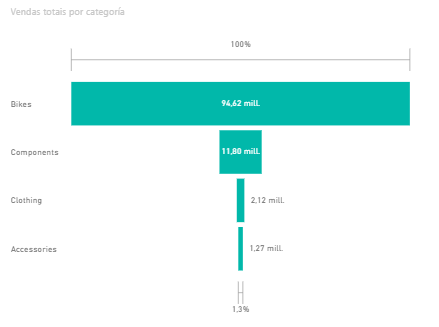

**Figura:** Embudo comparativo de `Total Sales` por categoría.

---

## 11. Gráfico de área

Obxectivo: mostrar evolución temporal destacando tamén o volume acumulado visualmente.

1. Insire o visual `Gráfico de área` (ou `Área apilada`, se queres comparar varias series).
2. En `Eje X`, engade `DimDate[Month]`.
3. En `Eje Y`, engade `Total Sales`.
4. Opcional: nunha variante apilada, engade `DimProduct[Category]` en `Leyenda`.
5. No formato:
   1. título: `Evolución de vendas en área`
   2. comproba transparencia, etiquetas e lexibilidade da área

Comprobación:

1. valida que os meses están ordenados correctamente
2. se hai moitas series, prioriza área simple ou liña para evitar ruído visual

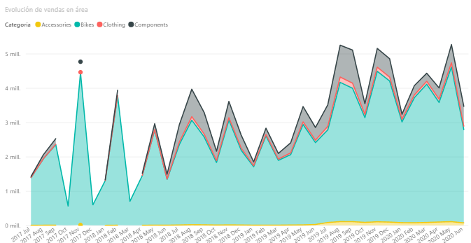

**Figura:** Evolución mensual de `Total Sales` nun gráfico de área.

---

## 12. Barras horizontais

Obxectivo: comparar categorías cando os nomes son longos ou cando interesa unha lectura máis cómoda das etiquetas.

1. Insire o visual `Gráfico de barras agrupadas`.
2. En `Eje Y`, engade `DimProduct[Category]`.
3. En `Valores`, engade `Total Sales`.
4. Ordena o visual por `Total Sales` en orde descendente.
5. No formato:
   1. título: `Vendas por categoría (barras)`
   2. activa etiquetas de datos se axudan á lectura
   3. revisa separación entre barras e tamaño de texto

Comprobación:

1. comproba que as etiquetas se len mellor ca nun gráfico de columnas cando os nomes son longos
2. verifica que responde aos mesmos filtros có resto do informe

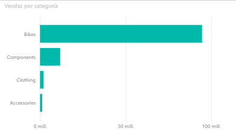

**Figura:** Barras horizontais de `Total Sales` por categoría.

---

## 13. Barras apiladas

Obxectivo: comparar magnitudes e ver ao mesmo tempo a composición de cada categoría.

1. Insire o visual `Gráfico de barras apiladas`.
2. En `Eje Y`, engade `DimProduct[Category]`.
3. En `Valores`, engade `Total Sales`.
4. En `Leyenda`, engade un campo con poucas categorías, por exemplo `DimSalesTerritory[Country]`.
5. Ordena o visual por `Total Sales` en orde descendente.
6. No formato:
   1. título: `Vendas por categoría e país`
   2. activa lenda e etiquetas só se non saturan a lectura
   3. revisa que as cores distinguen ben cada segmento

Comprobación:

1. identifica que categoría achega máis vendas totais
2. revisa se a composición por país cambia entre categorías
3. se hai demasiados valores na lenda, simplifica o campo usado ou prioriza outro visual

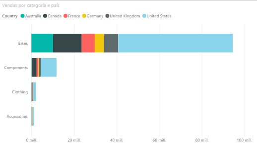

**Figura:** Barras apiladas de `Total Sales` por categoría e país.

---

## 14. Outras visualizacións dispoñibles en Power BI (descrición breve)

Estes visuais tamén forman parte do ecosistema de Power BI, pero aquí non se desenvolven paso a paso porque requiren outro tipo de preparación, dependen máis do contexto ou teñen un carácter máis avanzado.

- `Narrativa intelixente` (`Smart narrative`): xera un resumo textual automático a partir dos visuais e medidas da páxina.
- `Preguntas e respostas` (`Q&A`): permite consultar os datos con linguaxe natural e obter visuais xerados dinamicamente.
- `Visual de Python`: executa script de Python para construír gráficos personalizados ou análises específicas.
- `Visual de R`: equivalente ao anterior, pero baseado en scripts de R.
- `Influenciadores clave` (`Key influencers`): analiza que campos parecen explicar mellor un resultado.
- `Árbore de descomposición` (`Decomposition tree`): permite explorar unha medida desagregándoa por diferentes dimensións.

Neste curso chega con saber que existen e identificar para que tipo de análise poden ser útiles.

Se algunha destas opcións aparece nun proxecto ou nun panel xa feito, o importante é recoñecer a súa finalidade xeral, non memorizar a súa configuración completa.
