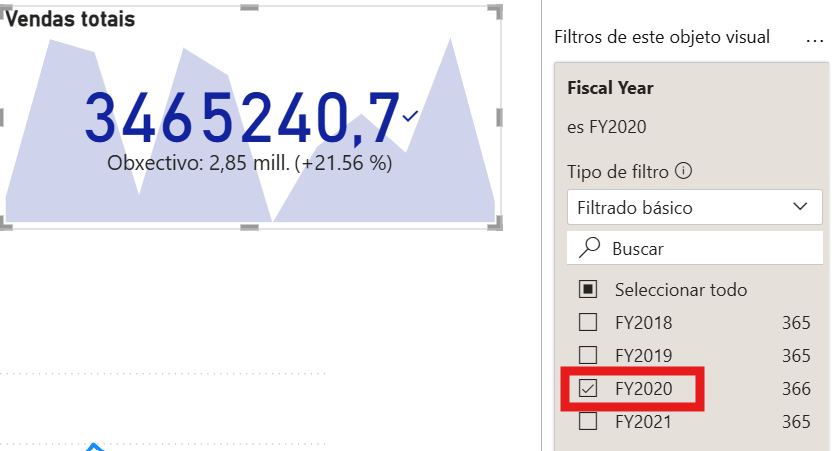
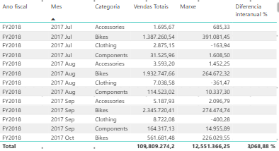
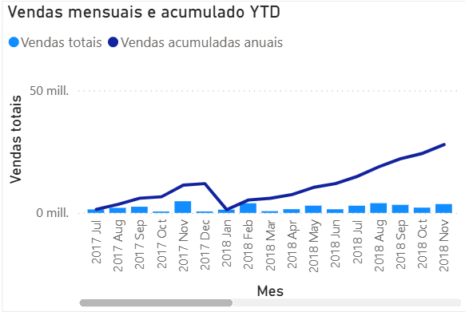
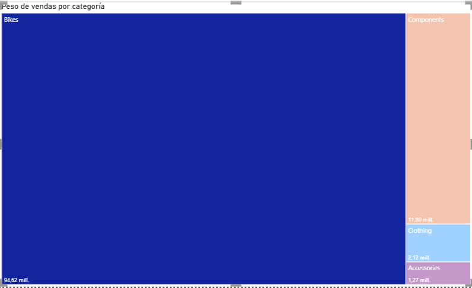
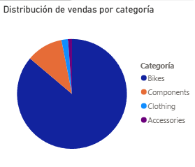

# Visualizacións e deseño de informes en Power BI

## 1. Introdución

Unha vez creadas as medidas en DAX, o seguinte paso é construír un informe visual claro, útil e fácil de interpretar.

Neste documento imos crear unha páxina de informe completa paso a paso, empregando o modelo e as medidas dos documentos anteriores.

Medidas recomendadas para este bloque:

- `Total Sales`
- `Total Cost`
- `Margin`
- `% Margin`
- `Sales YTD`
- `Sales PY`
- `YoY %`

---

## 2. Preparación da páxina

Antes de inserir visuais, prepara unha páxina en branco:

1. Crea unha nova páxina no informe.
2. Renomea a páxina como `Resumo comercial`.
3. No panel de formato da páxina (*visualizaciones* -> *icona de pincel*), define tamaño (*configuración del lienzo*) `16:9` (ou o predeterminado do teu contorno).
4. Garda o ficheiro para non perder cambios.

---

## 3. Visual 1: tarxetas

Obxectivo: mostrar indicadores principais nunha lectura rápida.

### 3.1. Tarxeta de `Total Sales`

1. Insire o visual `Tarxeta`.
2. Arrastra a medida `Total Sales` ao campo principal do visual.
3. No panel de formato do visual:
   1. activa título
   2. define título como `Vendas totais`
   3. axusta unidades (`Auto` ou `Miles/Millóns` segundo prefiras)
   4. define 0 ou 1 decimais

Comprobación:

1. comproba que a tarxeta mostra un valor numérico sen erro
2. revisa que o título aparece como `Vendas totais`

### 3.2. Tarxetas de `Margin` e `% Margin`

1. Duplica a tarxeta anterior dúas veces.
2. Na segunda, substitúe o campo por `Margin` e título `Marxe total`.
3. Na terceira, substitúe o campo por `% Margin` e título `% Marxe`.
4. Para `% Marxe`, comproba no formato da medida que se mostra en porcentaxe.

Comprobación:

1. verifica que `% Marxe` non supera valores incoherentes
2. comproba que `Margin` responde aos mesmos filtros ca `Total Sales`

---

## 4. Visual 2: KPI con tendencia temporal

Obxectivo: combinar valor actual, evolución temporal e referencia de obxectivo nun único visual.

1. Insire o visual `KPI`.
2. En `Indicador`, arrastra `Total Sales`.
3. En `Eixo de tendencia`, arrastra `DimDate[Month]` (ordenado por `MonthKey`).
4. En `Obxectivo`, engade `Sales PY`.
5. No panel de filtros do propio visual, aplica `DimDate[Fiscal Year] = 2020` para evitar períodos baleiros e manter a comparación estable.
6. No formato:
   1. define un título claro, por exemplo `KPI de vendas`
   2. comproba unidades e decimais para facilitar lectura
   3. revisa cores de estado para identificar rapidamente se está por riba/baixo do obxectivo
   4. En Formato -> Etiqueta de objetivo podes modificar o valor para que non amose "Goal".

Comprobación:

1. comproba que aparecen valor e obxectivo (sen `En blanco`)
2. revisa mes a mes que `Total Sales` e `Sales PY` teñen sentido no `FY 2020`
3. se o modelo temporal dá problemas, confirma que `DimDate` está marcada como táboa de datas

---

## 5. Visual 3: columnas por categoría

Obxectivo: comparar vendas entre categorías de produto.

1. Insire o visual `Gráfico de columnas agrupadas`.
2. En `Eixo X`, arrastra `DimProduct[Category]`.
3. En `Valores` (ou `Eixo Y`, segundo interface), arrastra `Total Sales`.
4. Ordena o visual por `Total Sales` en orde descendente (clic nos tres puntos (...) -> Ordenar eje -> `Total Sales`).
5. No formato:
   1. título: `Vendas por categoría`
   2. Modificamos as etiquetas dos eixos para que sexan máis lexibles (ex: `Categoría` e `Vendas`) indo a formato -> Eje X/Y -> Título.
   3. activa etiquetas de datos (Formato -> Etiquetas de datosq) se melloran a lectura
   4. mantén cores simples e consistentes

Comprobación:

1. fai clic nunha barra
2. verifica que o resto de visuais se filtran/realzan

---

## 6. Visual 4: evolución temporal

Obxectivo: ver a tendencia no tempo.

1. Insire o visual `Gráfico de liñas`.
2. En `Eixo X`, arrastra `DimDate[Month]`.
3. En `Valores`, arrastra `Total Sales`.
4. No panel de campos do visual, comproba que o eixe non está a usar xerarquía automática de data se non a queres.
5. No formato:
   1. título: `Evolución mensual de vendas`
   2. marca de datos opcional (Formato -> Marcadores -> Mostrar para todas las categorías)
   3. eixe X con etiquetas lexibles
6. Podemos aportar información extra incluíndo unha liña de promedio indo a análise (icona de lupa) -> Línea de promedio. 

Comprobación:

1. verifica que os meses aparecen na orde correcta
2. se non están ordenados, revisa `Month` ordenado por `MonthKey`

---

## 7. Visual 5: matriz de detalle

Obxectivo: validar e explorar detalle por período e categoría.

1. Insire o visual `Matriz`.
2. En `Filas`, engade:
   1. `DimDate[Fiscal Year]`
   2. `DimDate[Month]`
3. En `Valores`, engade:
   1. `Total Sales`
   2. `Sales PY`
   3. `YoY %`
4. No formato:
   1. Activa `Subtotais de fila` (porque `Fiscal Year` está en `Filas`; `Subtotais de columna` só se usas campos en `Columnas`)
   2. para `YoY %`, confirma formato porcentaxe na vista de modelo.

Comprobación:

1. revisa unha fila e comproba manualmente `YoY %`
2. revisa que o subtotal de `Fiscal Year` sexa coherente

---

## 8. Visual 6: táboa de detalle

Obxectivo: ofrecer un detalle tabular para revisión rápida e exportación.

1. Insire o visual `Táboa`.
2. Engade columnas relevantes para análise:
   1. `DimDate[Fiscal Year]`
   2. `DimDate[Month]`
   3. `DimProduct[Category]`
3. Engade medidas:
   1. `Total Sales`
   2. `Margin`
   3. `YoY %`
4. No formato:
   1. activa encabezados claros e ordenación por `Total Sales`
   2. aplica formato de moeda e porcentaxe segundo corresponda
   3. se a táboa é moi densa, reduce tamaño de texto e padding de filas

Comprobación:

1. ordena por `Total Sales` e comproba que cambia a orde
2. verifica que responde aos filtros de páxina e segmentadores

---

## 9. Visual 7: gráfico combinado (columnas + liña)

Obxectivo: comparar volume de vendas e evolución acumulada nun único visual.

1. Insire o visual `Liñas e columnas agrupadas`.
2. En `Eixo X`, engade `DimDate[Month]` (ordenado por `MonthKey`).
3. En `Eixo Y de columna`, engade `Total Sales`.
4. En `Eixo Y de liña`, engade `Sales YTD`.
5. No formato:
   1. título: `Vendas mensuais e acumulado YTD`
   2. en `Eixo Y secundario`, axusta `Mínimo` e `Máximo` (se é preciso) e usa `Aliñar ceros` para mellorar a comparación visual
   3. usa cores diferenciadas para columnas e liña
6. Para cambiar os nomes da lenda:
   1. en `Eixo Y de columna`/`Eixo Y de liña`, abre o menú despregable de cada medida
   2. preme `Cambiar nome deste obxecto visual`
   3. define etiquetas claras (por exemplo `Vendas mensuais` e `Acumulado YTD`)

Comprobación:

1. comproba que a liña `Sales YTD` non baixa ao avanzar os meses
2. valida que columnas e liña cambian ao aplicar filtros

---

## 10. Visual 8: treemap por categoría

Obxectivo: visualizar peso relativo de cada categoría no total de vendas.

1. Insire o visual `Mapa de árbore` (`Treemap`).
2. En `Grupo`, engade `DimProduct[Category]`.
3. En `Valores`, engade `Total Sales`.
4. No formato:
   1. título: `Peso de vendas por categoría`
   2. activa etiquetas de datos se hai poucas categorías
   3. mantén unha paleta simple para non distraer

Comprobación:

1. identifica visualmente a categoría dominante
2. comproba interacción con táboa, matriz e KPI

---

## 11. Visual 9: gráfico circular (uso controlado)

Obxectivo: mostrar distribución simple cando hai poucas categorías.

1. Insire o visual `Circular` (ou `Anel`).
2. En `Lenda`, engade `DimProduct[Category]`.
3. En `Valores`, engade `Total Sales`.
4. No formato:
   1. título: `Distribución de vendas por categoría`
   2. limita o número de categorías visibles (idealmente 4-6)
   3. activa etiquetas de porcentaxe se melloran a lectura

Comprobación:

1. revisa que as porcentaxes suman aproximadamente 100%
2. se hai demasiadas categorías, substitúe por barras/treemap

---

## 12. Filtros e interacción

### 12.1. Filtro de páxina por ano fiscal

1. No panel de filtros da páxina, engade `DimDate[Fiscal Year]`.
2. Proba a deixar só un ano.
3. Comproba que todos os visuais responden ao filtro.

### 12.2. Segmentador por categoría

O segmentador é clave para explorar o informe de forma interactiva:

1. Insire o visual `Segmentación de datos`.
2. Engade `DimProduct[Category]`.
3. En formato, proba estes estilos:
   1. `Lista vertical`: mostra valores un debaixo doutro e facilita selección múltiple.
   2. `Mosaico`: amosa botóns horizontais/grella, útil cando hai poucas categorías.
   3. `Lista despregable`: ocupa menos espazo e é recomendable cando hai moitos valores.
4. En `Configuración do segmentador -> Selección`, revisa estas opcións:
   1. `Selección única`: obriga a ter só un valor activo.
   2. `Selección múltiple con CTRL`: permite seleccionar varios valores usando `Ctrl`.
   3. `Mostrar "Seleccionar todo"`: engade unha opción para limpar/reaplicar rapidamente o filtro global.
5. Proba selección única e múltiple para validar o comportamento.

Comprobación:

1. verifica que KPIs, gráfico de columnas, liña e matriz cambian coa selección.

---

## 13. Axustes de formato recomendados

Para mellorar lectura e consistencia:

1. usa títulos curtos e orientados a negocio
2. aplica formato de moeda a importes (`Total Sales`, `Margin`)
3. aplica formato porcentaxe a `% Margin` e `YoY %`
4. define un `Tema` en `Vista -> Temas` cunha paleta consistente (cor principal, secundaria e de alerta)
5. evita máis de 5-6 cores diferentes na mesma páxina
6. usa fondo claro e bo contraste para facilitar a lectura dos valores
7. alinea visuais nunha grella limpa (`Ver -> Liñas de grade` e `Axustar a grade`)
8. mantén unha xerarquía visual estable: KPIs arriba, gráficos no centro e detalle (matriz) abaixo
9. revisa interaccións en `Formato -> Editar interaccións` para evitar filtros confusos entre visuais
10. usa `Tooltips` para engadir contexto sen recargar a páxina principal

---

## 14. Validación final do informe

Checklist antes de pechar o bloque:

- os visuais teñen título claro
- os campos están colocados correctamente en cada visual
- as medidas devolven valores coherentes
- os filtros afectan aos visuais esperados
- a páxina é lexible sen explicar nada verbalmente

---

## 15. Erros frecuentes

- usar columnas en lugar de medidas nos KPIs
- mesturar campos fiscais e non fiscais sen control
- non revisar a ordenación de `Month`
- saturar a páxina con demasiados visuais
- usar cores con pouco contraste

---

## 16. Punto de continuidade

Co informe xa deseñado, o seguinte paso natural é publicar en **Power BI Service**, configurar actualizacións e compartir o resultado.
