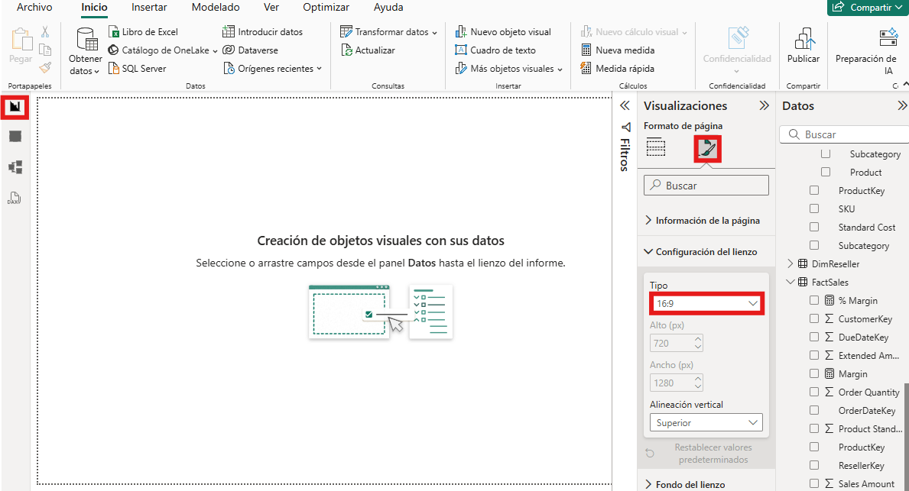
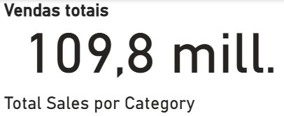
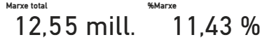
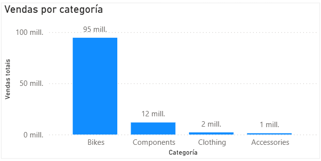
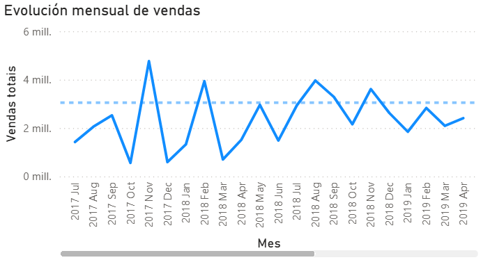
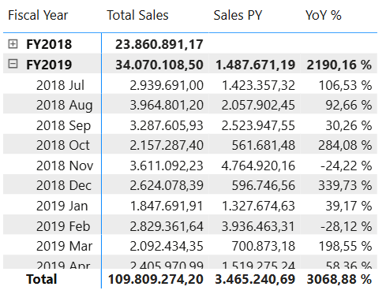
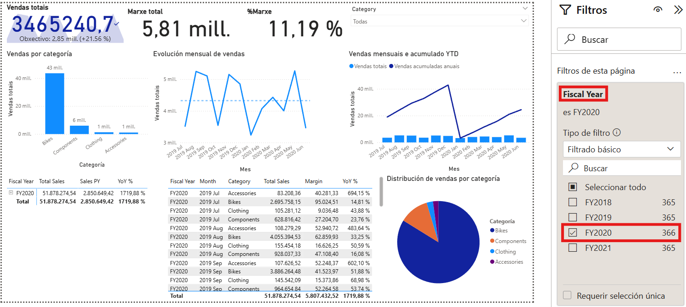
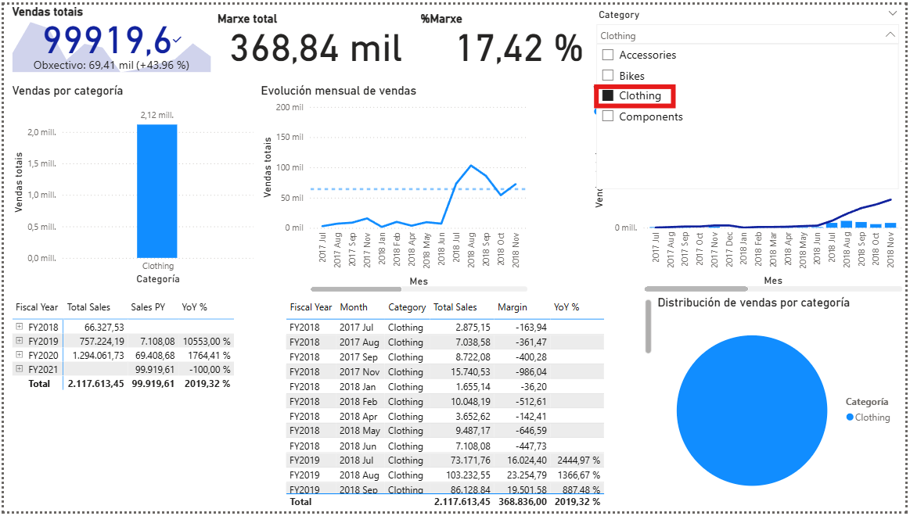
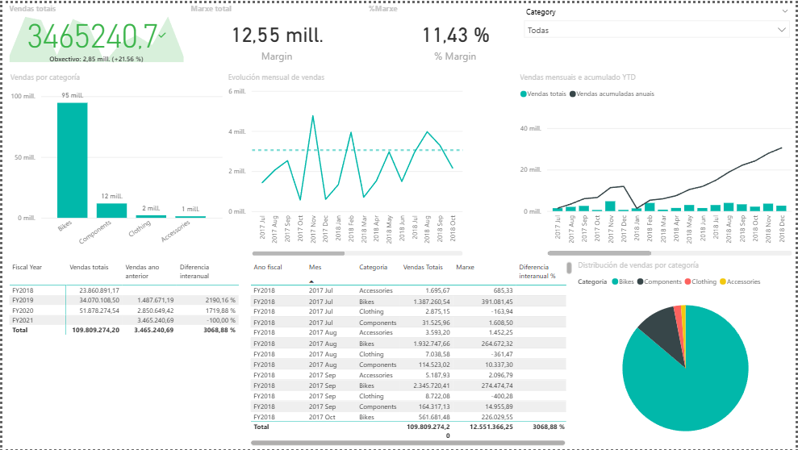

# Visualizacións e deseño de informes en Power BI

## 1. Introdución

Unha vez creadas as medidas en DAX, o seguinte paso é construír un informe visual claro, útil e fácil de interpretar.

Neste documento imos crear unha páxina de informe completa paso a paso, empregando o modelo e as medidas dos documentos anteriores.

Medidas recomendadas para este bloque:

- `Total Sales`
- `Total Cost`
- `Margin`
- `% Margin`
- `Sales YTD`
- `Sales PY`
- `YoY %`

---

## 2. Preparación da páxina

Antes de inserir visuais, prepara unha páxina en branco:

1. Crea unha nova páxina no informe.
2. Renomea a páxina como `Resumo comercial`.
3. No panel de formato da páxina, define tamaño `16:9` (ou o predeterminado do teu contorno).
4. Garda o ficheiro para non perder cambios.

---

## 3. Visual 1: tarxetas KPI

Obxectivo: mostrar indicadores principais nunha lectura rápida.

### 3.1. Tarxeta de `Total Sales`

1. Insire o visual `Tarxeta`.
2. Arrastra a medida `Total Sales` ao campo principal do visual.
3. No panel de formato do visual:
   1. activa título
   2. define título como `Vendas totais`
   3. axusta unidades (`Auto` ou `Miles/Millóns` segundo prefiras)
   4. define 0 ou 1 decimais

Comprobación:

1. comproba que a tarxeta mostra un valor numérico sen erro
2. revisa que o título aparece como `Vendas totais`

### 3.2. Tarxetas de `Margin` e `% Margin`

1. Duplica a tarxeta anterior dúas veces.
2. Na segunda, substitúe o campo por `Margin` e título `Marxe total`.
3. Na terceira, substitúe o campo por `% Margin` e título `% Marxe`.
4. Para `% Marxe`, comproba no formato da medida que se mostra en porcentaxe.

Comprobación:

1. verifica que `% Marxe` non supera valores incoherentes
2. comproba que `Margin` responde aos mesmos filtros ca `Total Sales`

---

## 4. Visual 2: columnas por categoría

Obxectivo: comparar vendas entre categorías de produto.

1. Insire o visual `Gráfico de columnas agrupadas`.
2. En `Eixo X`, arrastra `DimProduct[Category]`.
3. En `Valores` (ou `Eixo Y`, segundo interface), arrastra `Total Sales`.
4. Ordena o visual por `Total Sales` en orde descendente.
5. No formato:
   1. título: `Vendas por categoría`
   2. activa etiquetas de datos se melloran a lectura
   3. mantén cores simples e consistentes

Comprobación:

1. fai clic nunha barra
2. verifica que o resto de visuais se filtran/realzan

---

## 5. Visual 3: evolución temporal

Obxectivo: ver a tendencia no tempo.

1. Insire o visual `Gráfico de liñas`.
2. En `Eixo X`, arrastra `DimDate[Month]`.
3. En `Valores`, arrastra `Total Sales`.
4. No panel de campos do visual, comproba que o eixe non está a usar xerarquía automática de data se non a queres.
5. No formato:
   1. título: `Evolución mensual de vendas`
   2. marca de datos opcional
   3. eixe X con etiquetas lexibles

Comprobación:

1. verifica que os meses aparecen na orde correcta
2. se non están ordenados, revisa `Month` ordenado por `MonthKey`

---

## 6. Visual 4: matriz de detalle

Obxectivo: validar e explorar detalle por período e categoría.

1. Insire o visual `Matriz`.
2. En `Filas`, engade:
   1. `DimDate[Fiscal Year]`
   2. `DimDate[Month]`
3. En `Valores`, engade:
   1. `Total Sales`
   2. `Sales PY`
   3. `YoY %`
4. No formato:
   1. activa subtotais por `Fiscal Year`
   2. para `YoY %`, confirma formato porcentaxe

Comprobación:

1. revisa unha fila e comproba manualmente `YoY %`
2. revisa que o subtotal de `Fiscal Year` sexa coherente

---

## 7. Filtros e interacción

### 7.1. Filtro de páxina por ano fiscal

1. No panel de filtros da páxina, engade `DimDate[Fiscal Year]`.
2. Proba a deixar só un ano.
3. Comproba que todos os visuais responden ao filtro.

### 7.2. Segmentador básico (opcional neste punto)

Se queres introducir un selector visual simple:

1. Insire o visual `Segmentación de datos`.
2. Engade `DimProduct[Category]`.
3. Proba selección única e múltiple.

Comprobación:

1. verifica que KPIs, gráfico de columnas, liña e matriz cambian coa selección.

---

## 8. Axustes de formato recomendados

Para mellorar lectura e consistencia:

1. usa títulos curtos e orientados a negocio
2. aplica formato de moeda a importes (`Total Sales`, `Margin`)
3. aplica formato porcentaxe a `% Margin` e `YoY %`
4. evita máis de 5-6 cores diferentes na mesma páxina
5. alinea visuais nunha grella limpa

---

## 9. Validación final do informe

Checklist antes de pechar o bloque:

- os visuais teñen título claro
- os campos están colocados correctamente en cada visual
- as medidas devolven valores coherentes
- os filtros afectan aos visuais esperados
- a páxina é lexible sen explicar nada verbalmente

---

## 10. Erros frecuentes

- usar columnas en lugar de medidas nos KPIs
- mesturar campos fiscais e non fiscais sen control
- non revisar a ordenación de `Month`
- saturar a páxina con demasiados visuais
- usar cores con pouco contraste

---

## 11. Punto de continuidade

Co informe xa deseñado, o seguinte paso natural é publicar en **Power BI Service**, configurar actualizacións e compartir o resultado.
