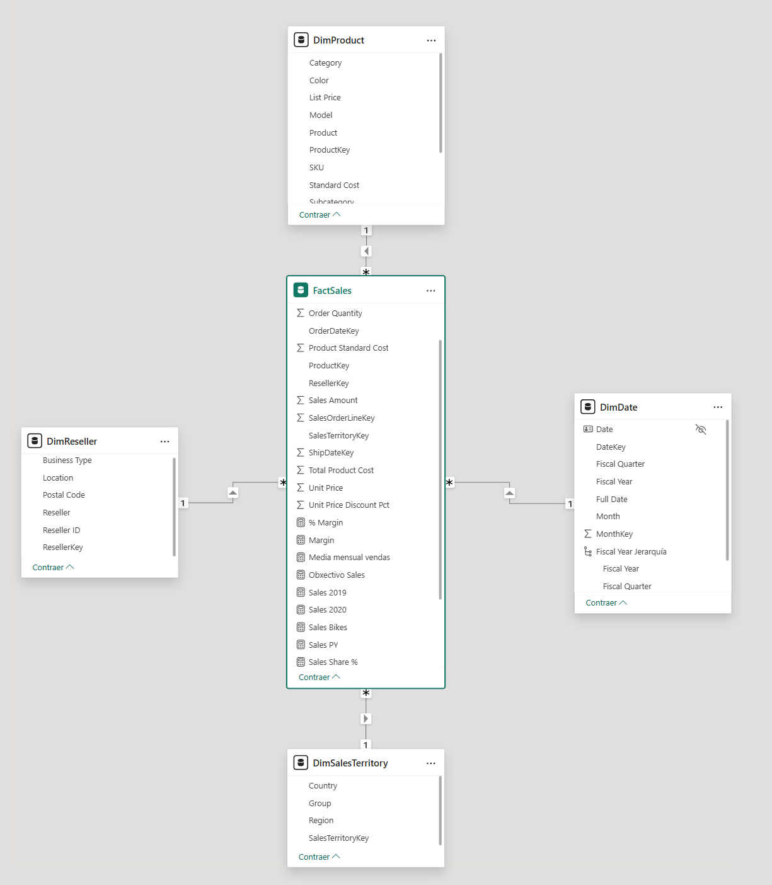
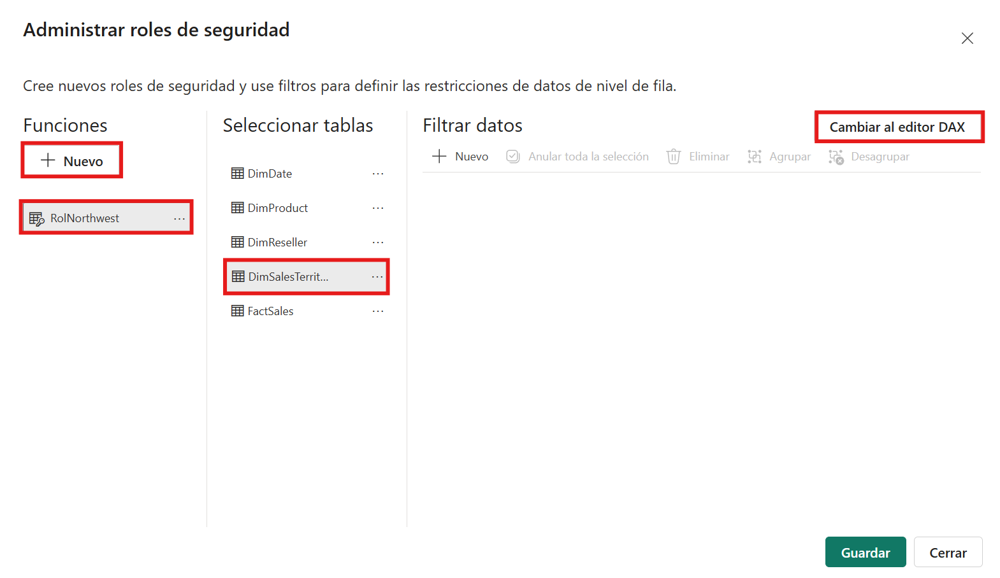
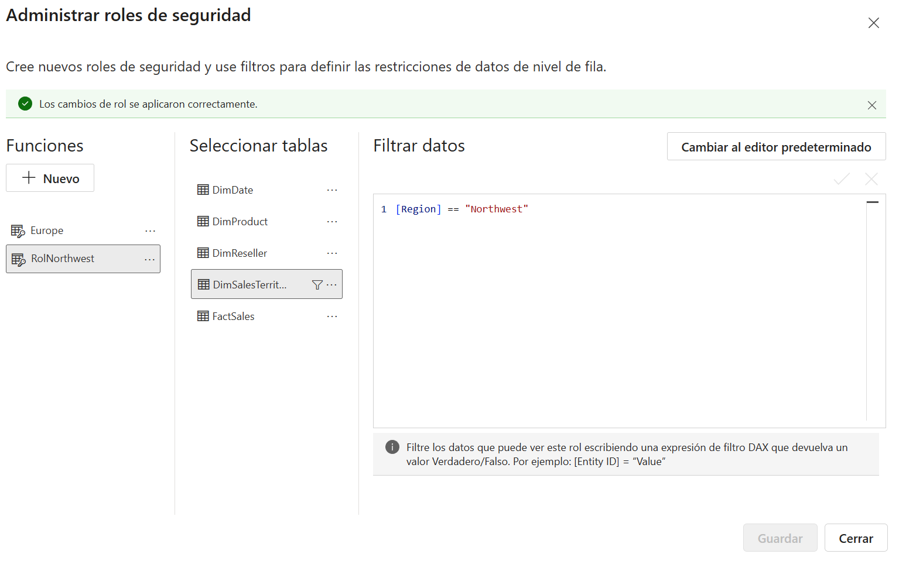
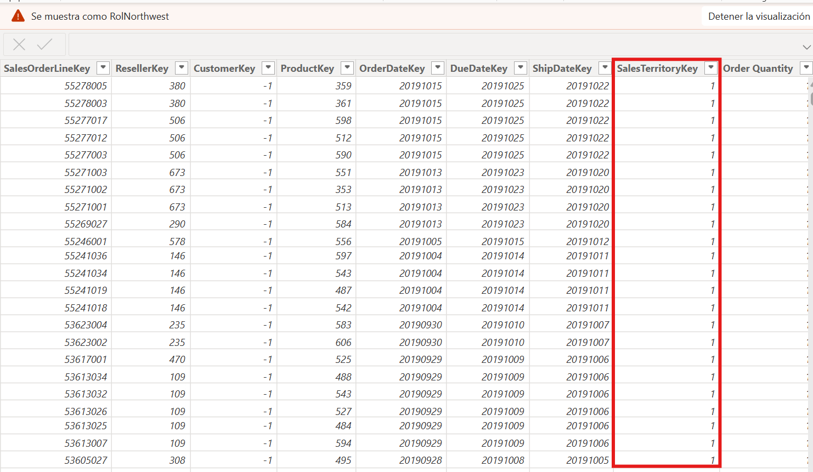

# Seguranza con RLS en Power BI

## 1. Introdución

RLS (**Row-Level Security**) permite limitar que filas pode ver cada perfil de usuario dentro do mesmo informe.

É dicir, dúas persoas poden abrir o mesmo panel e ver datos distintos segundo o rol asignado.

Neste bloque imos traballar sobre todo a parte que si podemos facer en Power BI Desktop:

1. crear roles
2. definir filtros DAX
3. validar co modo `Ver como`

---

## 2. Concepto básico de RLS

RLS funciona aplicando filtros por rol sobre táboas do modelo.

Eses filtros propáganse polas relacións, polo que normalmente se definen en táboas de dimensión (neste caso, `DimSalesTerritory`) e afectan ás medidas dos visuais.

Exemplo conceptual:

1. rol `Northwest`: ve só filas de `Region = Northwest`
2. rol `Germany`: ve só filas de `Country = Germany`

---

## 3. Preparación antes de crear roles

Antes de definir RLS, comproba:

1. o modelo ten relacións correctas (`*:1`, sentido dimensión -> feitos)
2. as táboas de dimensión teñen valores limpos (sen duplicados raros en claves)
3. tes claro que columna usarás para filtrar (rexión, país, comercial, etc.)

Relación imprescindible neste tema (aínda que xa a teñas creada):

1. `FactSales[SalesTerritoryKey]` -> `DimSalesTerritory[SalesTerritoryKey]` (activa)

No contexto desta unidade, as dimensións que estamos empregando son:

1. `DimDate`
2. `DimProduct`
3. `DimReseller`
4. `DimSalesTerritory`

Para RLS, a opción máis natural neste modelo é aplicar filtros en `DimSalesTerritory`, que ten estes campos:

1. `Country`
2. `Group`
3. `Region`
4. `SalesTerritoryKey`

Valores de `Region` no teu modelo: `Northwest`, `Northeast`, `Central`, `Southwest`, `Southeast`, `Canada`, `France`, `Germany`, `Australia`, `United Kingdom`, `Corporate HQ`.

`DimProduct` tamén se pode usar para casos didácticos (por exemplo, un rol que só vexa unha categoría), mentres que `DimDate` úsase máis para análise temporal e menos como criterio principal de seguridade.


**Figura:** Revisión previa do modelo antes de aplicar RLS.

---

## 4. Crear roles en Power BI Desktop

1. Vai á cinta `Modelado`.
2. Preme `Administrar roles`.
3. Crea un rol novo (por exemplo, `Rol_Northwest`).
4. Selecciona a táboa de dimensión onde aplicarás o filtro.
5. Escribe a expresión DAX do filtro.



**Figura:** Creación de roles en Power BI Desktop.

---

## 5. Filtros DAX de exemplo para RLS

Neste punto, cada subapartado implica crear **un rol novo**.

Fluxo recomendado en cada caso:

1. `Modelado -> Administrar roles`
2. `Crear`
3. poñer nome do rol
4. seleccionar `DimSalesTerritory`
5. pegar o filtro DAX
6. `Guardar`

### 5.1. Rol por rexión: `Rol_Northwest` (recomendado neste modelo)

```DAX
DimSalesTerritory[Region] = "Northwest"
```

Comprobación rápida:

1. en `Ver como`, selecciona `Rol_Northwest`
2. valida que só aparecen datos de `Region = Northwest`

### 5.2. Rol por país: `Rol_Germany`

```DAX
DimSalesTerritory[Country] = "Germany"
```

Comprobación rápida:

1. en `Ver como`, selecciona `Rol_Germany`
2. valida que só aparecen datos de `Country = Germany`

### 5.3. Rol por grupo comercial: `Rol_Europe`

```DAX
DimSalesTerritory[Group] = "Europe"
```

Comprobación rápida:

1. en `Ver como`, selecciona `Rol_Europe`
2. valida que só aparecen datos do grupo `Europe`

Nota importante:

1. neste bloque, os exemplos de RLS van sobre `DimSalesTerritory` para manter coherencia co criterio territorial
2. se nalgún exercicio non tes esa dimensión cargada, usa `DimReseller` como alternativa temporal

Recomendación:

1. empezar con filtros simples e verificables
2. evitar lóxica complexa ata validar o comportamento básico



**Figura:** Definición dun filtro DAX para un rol RLS.

---

## 6. Validar roles con `Ver como`

1. Vai a `Modelado -> Ver como`.
2. Marca un rol (por exemplo `Rol_Northwest`).
3. Revisa o informe completo:
   1. tarxetas
   2. gráficos
   3. táboas/matrizes
4. Repite con outros roles.

Comprobación:

1. cada rol debe ver só o subconxunto esperado
2. os totais deben cambiar de forma coherente
3. non deberían aparecer datos “fóra de rol”



**Figura:** Proba de roles usando Ver como.

---

## 7. RLS estático vs dinámico

### 7.1. RLS estático

Cada rol leva un filtro fixo (por exemplo, `"Northwest"`).  
É fácil de entender e ideal para comezar.

### 7.2. RLS dinámico

A lóxica de filtro depende do usuario conectado (por exemplo, con `USERPRINCIPALNAME()`), normalmente apoiada nunha táboa de seguridade.

Nota práctica:

1. pódese modelar en Desktop
2. a validación final de asignación por usuario real faise en Service

---

## 8. Parte que require Power BI Service

En Desktop podes crear e probar roles, pero para produción fan falta estes pasos no Service:

1. publicar o modelo/informe
2. abrir seguridade do modelo semántico
3. asignar usuarios ou grupos a cada rol

Se non hai acceso/licenza de Service, a unidade pode avaliarse ata a validación en Desktop.

---

## 9. Erros frecuentes en RLS

- aplicar filtro na táboa equivocada
- relacións mal configuradas que non propagan o filtro
- usar columnas con valores inconsistentes
- non probar todos os roles con `Ver como`
- asumir que RLS oculta obxectos (RLS filtra filas, non estrutura do modelo)

---

## 10. Ideas clave

Ao rematar este documento deberías quedar con estas ideas:

- RLS serve para limitar que filas ve cada perfil de usuario dentro do mesmo informe
- o máis habitual é definir os filtros en táboas de dimensión e deixar que se propaguen polas relacións
- convén manter os filtros DAX de RLS simples, claros e fáciles de validar
- `Ver como` é fundamental para comprobar que cada rol ve exactamente o que corresponde
- en Power BI Desktop pódense crear e probar roles, pero a asignación real de usuarios faise no Service

---

## 11. Referencias oficiais (Microsoft Learn)

- Row-level security (RLS) con Power BI:  
  https://learn.microsoft.com/en-us/fabric/security/service-admin-row-level-security
- Configurar roles e regras en Desktop:  
  https://learn.microsoft.com/en-us/power-bi/enterprise/service-admin-rls
